# Alfred Workflow 制作一个调用 Shell 命令的 Workflow

之前的博客里，我与各位一起学习了如何创建我们的第一个 Workflow，其实感觉就像搭积木一般简单。之后我又尝试了其他几种示例，终于摸索到如何更进一步，调用 terminal 执行 Shell 命令完成一些操作。今天就与各位在此分享一番。

首先，我们回顾一下昨天的相关内容：一个 Workflow 至少包含两个部分，即命令块和功能块，命令块用于从 Alfred 命令框里获得用户发送的命令，功能块用于执行相关操作。要形成一个完整的 Workflow，命令块与功能块必须建立绑定关系，这样一来命令块才知道呼叫哪些功能块执行操作。

好了，目前我们所了解到的关于 Workflow 的相关内容就是这些，今天的知识点其实也是在这个范围内的，只是我们今天要做的是自己来写一点 Shell 命令放到功能块里，并通过调用该 Workflow 执行。

之前的创建什么的就不再赘述，我们直接进入重点。不明白的朋友可以看看昨天的博客学习一下。

如下图，我现在已经创建了一个 Workflow，目前里面没有任何东西，是一个完全的空 Workflow，无法接受任何命令和完成任何操作。


我们点击右上角的 ⊕ 号，出现如下图所示的菜单，我们在菜单里选择 Keyword 作为命令块

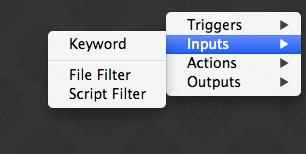

接着弹出下拉框，我们配置这个命令块的相关内容——因为我们后续会对此命令块有所修改，所以，先按照下图进行配置：

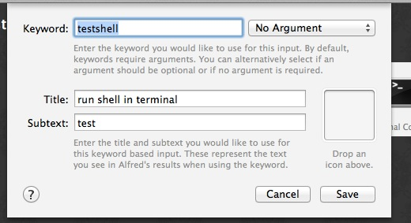

接着我们创建功能块，依旧点击右上角的 ⊕ 符号，在如下图的菜单里选择 Terminal Command，这就是创建执行 Shell 命令的功能块的方法。

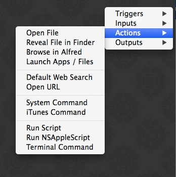

创建好的功能块，在弹出的下拉框里，我们在文本输入区域输入一句简单的 Shell 命令，如下图：

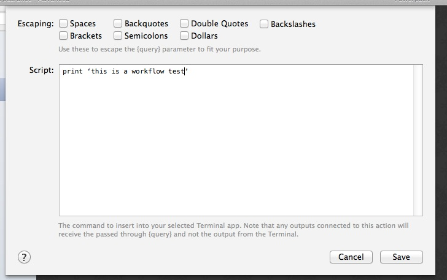

接下来自然是建立绑定关系了，昨天有介绍过如何建立命令块和功能块的绑定关系，在此不多赘述，直接看图：

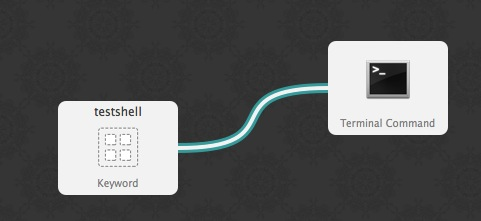

下面我们来试一下这个简单的在 terminal 里打印一句话的 Workflow 到底是否能如我们所愿的运行起来呢？呼出 Alfred 命令框，输入设置的 Keywork，点击 Return 键运行。如果之前都是跟着我的步骤一步步来的，那么你应该看到如下的画面：

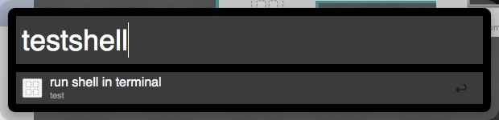 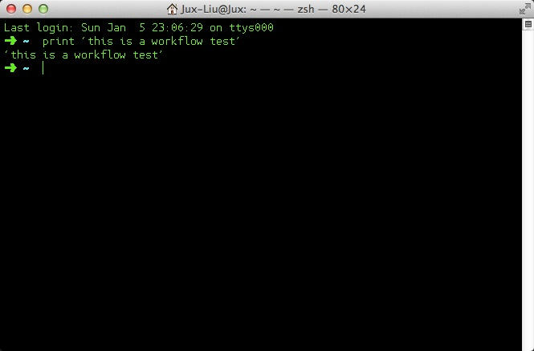

```
我是用的 Shell 环境是 zsh，是用其他 Shell 环境的朋友看到的可能样子跟我这个环境不太一样，不过，输出内容应该是没有问题的。

```

那么，Workflow 难道只有这么笨吗？不能干更加高级的事情了吗？这样的话，还不如直接呼出 terminal 输入命令执行。别急，Workflow 自然有更强大的功能待我们挖掘，下面我们就讲讲怎样执行更高级的命令。

双击命令块，在 Keyword 右边的下拉框里选择 Argument Required，然后在Title 部分添加{query} 关键字到合适的位置，方便阅读。如下图：

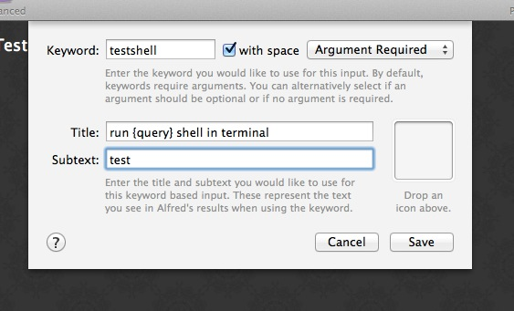

然后，保存，双击功能块，在文本输入区域，我们输入 {query} ，如下图：

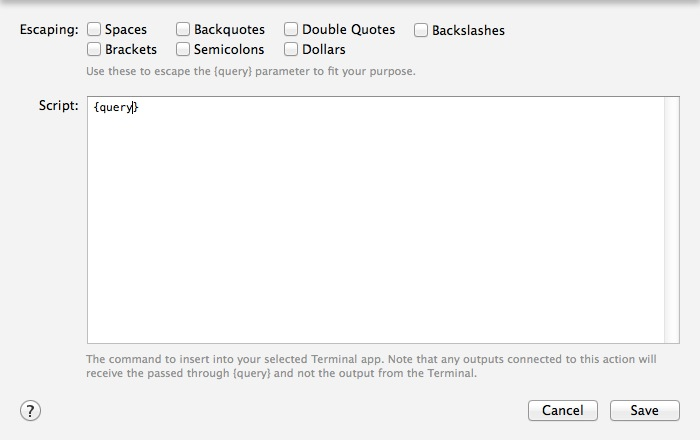

保存之后，我们再次呼出 Alfred 的命令框，输入下图的命令并点击 Return 执行：

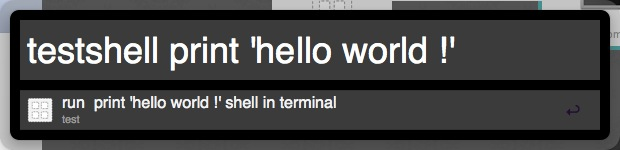

执行结果应该是这样的：

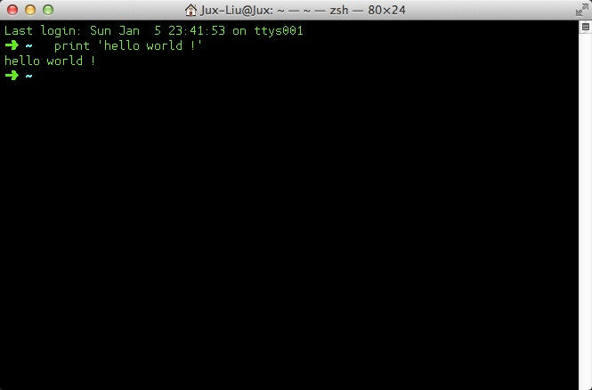

看到了吗？原来 {query} 就是执行命令块接收到的命令参数的关键字。那么自然的，举一反三，我们可以将现有的 Shell 命令和{query} 搭配组合，创造出适合自己的 Terminal Command Workflow。另外，大家可以摸索一下，在功能块的文本输入区域，输入多行 Shell 命令后执行是怎样的结果，出人意料的强大哦~！


http://pycode.cc/alfred-2-workflow-part-2/