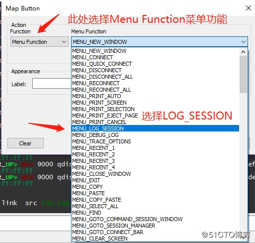

[TOC]

# 10个提升工作效率的Secure CRT小窍门

神龙斗士 2019-07-19 08:25:40

SecureCRT，相信不用我过多介绍了吧，一款通过telnet，ssh登录远端设备的终端软件。

无论是搞网络的，做系统的甚至写程序的，连接设备必用软件，容易上手，稳定性高，功能强大。

但是，面对SecureCRT密密麻麻的功能菜单，大家熟悉几个？

## 别把SecureCRT用成Putty

让我猜猜你平时怎么使用SecureCRT。

第一步：打开软件。

第二步：点开左边的会话管理栏，选择你要连接的设备。

第三步：双击连接，走你！

第四步：开始弹键盘协奏曲。

这应该是大家日常工作中，最频繁的SecureCRT使用习惯和方法吧。

但是，要光这样用，可能就屈了才了。SecureCRT的功能强大得让人受不了。

从基本的连接设备，到高级的运行脚本和python程序等，它都支持。

**而今天，我就同你一起分享10个非常简单，但是又能让你的工作事半功倍的SecureCRT小窍门。**

**让你不再把SecureCRT用成Putty。**

> 注：什么是Putty？
>
> Putty也是一款telnet和ssh的终端免费小软件。
>
> 功能单一，界面不是太友好，工作效率相比SecureCRT低很多。

## 窍门一：自动记录系统日志

配置网络或者系统设备，日志记录必可不少。

一方面记录设备的交互信息，方便后续追溯问题，在某些关键时候绝对能够帮你大忙。

例如配置过程中出现故障，你需要自证清白：老板，我可没有重启设备，它自己挂了啊。

这时候要是没有日志记录，百口莫辩。

**如何让SecureCRT在每次开始会话时自动记录日志？**

方法很简单：

**通过修改全局默认设置，让每一个会话都自动记录日志。**

如下所示：

**选项->全局属性**

**全局属性里面选择 常规->编辑默认设置**

**打开的对话框中，选择日志文件，最后选择日志文件的目录。**

默认情况下，日志文件的名字为session.log。但是我们可以更加灵活，采用通配符的形式。

例如上面的例子中，我定义了采用**月-日-小时-会话名称.log**的文件名称形式，具体参数可以参阅图中长方形内的参数表。

定义完成以后，保存配置并应用到所有会话。

下一次你连接一个会话，它就自动在指定目录下新建一个基于以上格式的log文件了。

PS：在选项部分，个人建议最好选择覆盖文件，例如当在短时间之内重复登录会话，由于会话的日志文件名称相同。

如你选择覆盖，则后续文件会覆盖之前的同名文件。

而追加的话，则相同文件名称的情况下，时间靠后的文件内容直接追加到第一个文件内。

## 窍门二：修改会话缓存大小

你或许遇到过此类问题：某一次登陆设备查看配置。

可是因为配置太多，SecureCRT窗口一直持续输出翻页，等你想往回看之前的内容，把窗口滚动条拖到最顶上时，发现之前的配置都已经看不见了，只有最近的一部分配置还在。

这是因为SecureCRT默认情况下只实时显示最多500行内容，超过500行就丢弃最上面的内容。

修改很简单，若你希望全局修改所有会话的回滚行数，就在：

**选项->全局属性**

**全局属性里面选择 常规->编辑默认设置**

**默认设置内选择 终端->仿真**

若你仅仅想修改一个会话。

**就在会话管理器里面右击需要修改的会话，点击属性。**

无论哪一个，最终都把你带到这个界面，如下所示：

上图中，修改回滚缓冲器的值从500到其他值即可，我一般设定为5万就够用了。

## 窍门三：多窗口同时输入

有时候，你需要在多个会话窗口内容输出重复的内容，或者你需要同时重启好几个设备。

对于前者，你可以选择手工一个个的粘贴配置，但是对于需要同时重启某些设备这种时间敏感型的工作，你的手再快也有时间差。

而SecureCRT就给你提供了一个相当人性化的工具，让你可以选择**同时给多个窗口输入内容**。

**首先开启命令行窗口**

**点击 查看（View） -> 命令行窗口**

**完成以后，SecureCRT下面就出现一个横框，在框里面点击右键，选择发送命令到 - > 所有会话。**

如下图：

完成以后，让我们做一个演示，我目前开启了4台路由器，通过show clock同时查看四台路由器的时间：

**注意：平时使用时，务必清楚你要应用配置的设备范围。例如你若选择发送命令到所有会话，然后执行reboot，你心想就执行一台，可是因为这个原因，导致目前所有SecureCRT里面的会话设备都重启了，请务必小心使用。**

## 窍门四：反空闲

这个很好理解，某些设备在一段时间没有接收到输入以后，就会自动断开连接。

此时我们可以设置反空闲，让SecureCRT定期发送一个反空闲信号，或者最直白的，发送一个自定义键给系统。

一般情况下，此自定义键我们采用空格键。同时我们可以设定一个时间，默认是300秒，5分钟。

配置方法如下：

**打开会话属性框，选择终端，终端右侧的窗口会有一个Anti-idle的配置。**

如下图所示：

上述配置中， 我设定每隔5分钟SecureCRT会给这个叫做“EVE-NG 03”的会话发送一个空格键，防止此会话被远端设备断开。

## 窍门五： 自带SFTP - 传输文件分分钟搞定

传文件不用说了，家常便饭，但是你知道不知道，SecureCRT是最方便的传文件的软件。

首先你得有一个会话，例如某个远端Linux服务器，而且必须是SSH连接。（我觉得现在绝大部分情况下都是使用ssh了，telnet已经过时了，而且不安全。）

为什么需要是SSH，因为SecureCRT传输文件是基于SFTP。

**当你连接了此会话以后，你所需要做的，就是右击此会话的标签栏，选择“连接SFTP会话”，大功告成。**

如下所示：

## 窍门六：强大的按钮栏

SecureCRT窗口集成了一个特殊功能：按钮栏。

此按钮栏能够自定义各种按钮，并赋以某些功能。

例如，你希望每一次打开设备后，执行一个基本的命令。

以前你是一个个的手动输入，但是现在你可以顶一个按钮，点一下，就执行完毕。

按钮内容可以包含输出回车，空格，或者等待一段时间等。

配置方法：

**点击查看（view）-> 按钮栏（Button Bar）**

此时SecureCRT窗户底下会出现一条横杠。右击它，会出现“新建按钮”的选项。

6.1 发送字符串功能

**首先选择“Send String”发送字符串功能，然后在窗口右侧添加你需要发送的内容。**

例如我想查看查看Linux的IP地址，路由。我们可以定义如下内容：

上图中，我定义了两条命令：

**ip address 和 ip route。其中的\r \p的含义在上面的红色框内有定义，即发送回车以及停顿一秒钟。**

同时，在Label一栏中我们可以给此按钮栏取名为Linux-Check。

完成以后， 点击OK保存。

回到SecureCRT页面，左键单击此按钮就可以执行，如下所示：

6.2 定义菜单功能

按钮栏除了自定义字符串以外，还能定义很多日常使用的菜单功能，例如连接一个新主机，记录会话等。

此处我仅仅演示如何做一个记录会话的按钮。

如下图所示：

首先在功能部分，选择“Menu Function 菜单功能”。

其次，在右侧的下拉菜单中选择你需要的功能，本例中我选择了“MENU_LOG_SESSION”记录会话日志。

然后给一个名字，点击保存。

完成以后，左键点击新建的“Log-Session”按钮，就会蹦出一个窗口告知你在哪里存这个新的日志文件，如上图所示。

## 窍门七：自动登录会话

日常工作中，你可能需要每天对某些设备做巡检工作，若我们能够设置让SecureCRT软件开启后马上就自动连接某些会话，岂不是很方便？

没错，很简单就能搞定，配置方法如下：

**在 选项 -> 全局选项 ->常规 ->默认会话 中，你可以选择“使用自动会话“，然后添加你希望软件启动时自动连接的项目即可。**

如下所示：

## 窍门八： 常用会话，做一个快捷方式放桌面吧

你的电脑桌面上肯定有各种软件图标，用于启动各种软件。

那同样的，我们可以不可以把经常需要连接的设备也做一个快捷方式放到桌面上呢？

**答案是肯定的，方法如下：**

**在SecureCRT的左侧会话管理栏里面，选择你想做成快捷方式的会话，然后点击右上角的箭头即可。**

若下图所示：

## 窍门九：告别无聊的颜色，让字符鲜活起来

是不是厌倦了单调的色彩？

是不是很希望输出的字符能够标识上特殊的颜色，例如IP地址，数字等？

其实这些都可以搞定，你只需要编写一个匹配特定内容的正则表达式，并赋予颜色即可。

什么？我还得自己写一个，还是正则表达式？

就知道你会是这个反应，为此我特地找了现成的配置，链接如下：

https://forums.vandyke.com/attachment.php?attachmentid=1527&d=1524582386

上述连接中，包含了一个Cisco words.ini的文件，大家放心下载下来，并放到此文件夹内（以windows 10 为例）：

C:\Users\你的用户名\Documents\SecureCRT\Keywords 下。

完成以后，让我们回到SecureCRT加载此颜色配置，步骤如下：

1. **选项->全局属性**
2. **全局属性里面选择 常规->编辑默认设置**
3. **打开的窗口内，选择终端->外观，并在关键字部分，选择Cisco Words。**
4. **最后选择加粗，颜色（color）即可**
5. **若需要自定义颜色，点击编辑即可按照自己的喜好修改。**

如下所示：

## 窍门十：堡垒机跳跳跳

在某些公司网络内部，为了保证设备网管的安全，在登陆设备之前需要先登陆堡垒机，然后从堡垒机登陆设备。

往往大家的做法，就是在SecureCRT里面建立堡垒机的会话连接堡垒机，然后在堡垒机内部在手动连接特定设备。

其实，SecureCRT早就想到了这个问题，有一个功能叫做“firewall”防火墙的功能，其实就是用来跳过堡垒机。

**演示案例：**

例如我有一台设备叫做Jekyll-Server，堡垒机称为EVE-NG-MGMT。

**演示拓扑：**

我的PC-------EVE-NG-MGMT堡垒机------Jekyll-Server。

我的最终目的是SSH 登录到Jekyll-Server。而通过SecureCRT的firewall功能，可以很轻松的搞定此事，如下所示：

**以上10个小窍门，你熟悉几个？是否对你有用呢？请给我留言!**

<https://www.toutiao.com/a6715163932027257351/?tt_from=android_share&utm_campaign=client_share×tamp=1563581068&app=news_article&utm_medium=toutiao_android&req_id=201907200804270101520380458579309&group_id=6715163932027257351>