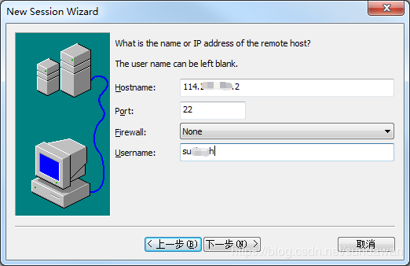
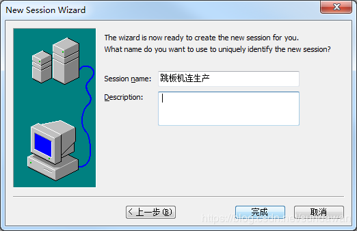
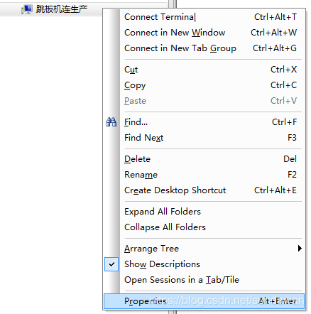
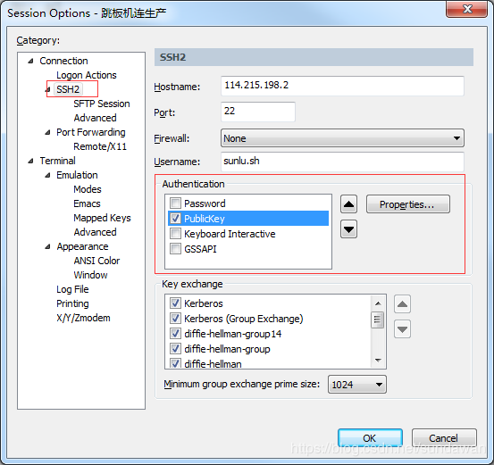
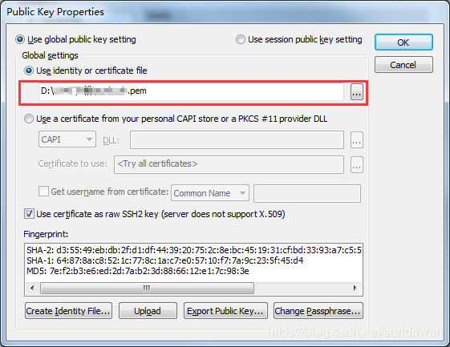
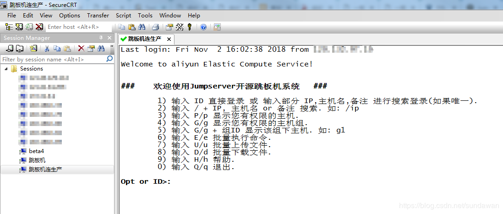

# SecureCRT配置通过密钥登录跳板机

2018年11月02日 16:25:58 [逗丶号](https://me.csdn.net/sundawan) 阅读数：446

第一步，新建连接

第二步、添加完成后，右键配置属性

认证方式中至保留【PublicKey】（这里是坑，只能保留这一项，不然始终会走密码登录，而不是用key），选中后点击【Properties...】进入配置key

进入Public Key Properties中配置key的路径 .pem格式文件，选择完成，保存即可

第三步，点击连接，输入您的ssh密钥文件密码，连接成功

<https://blog.csdn.net/sundawan/article/details/83657236>