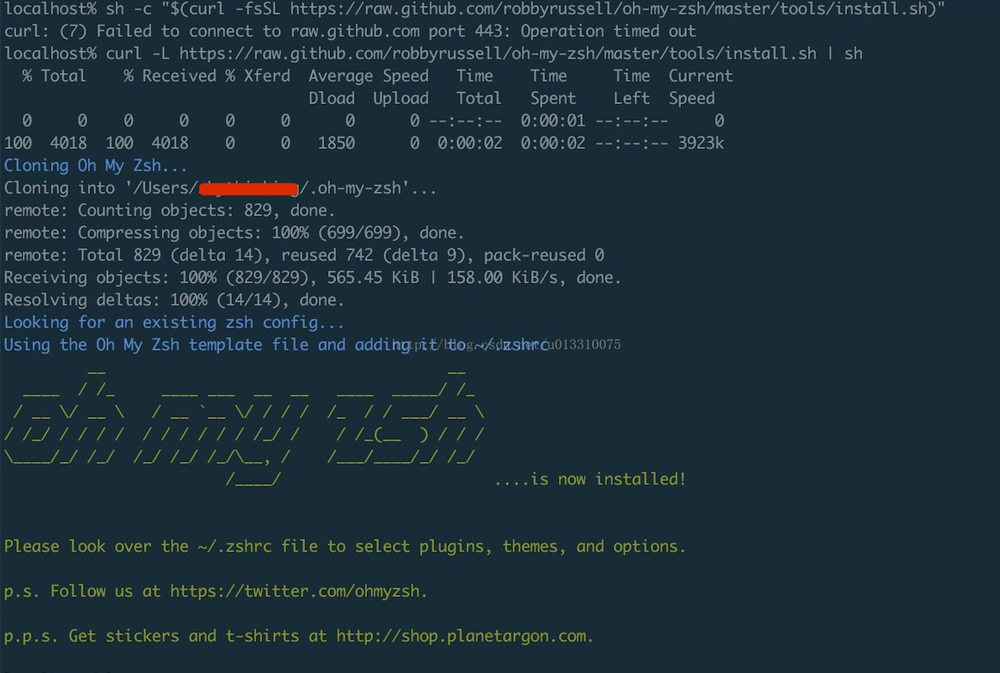

[TOC]


# Mac OSX终端安装主题(oh my zsh)

## 一.安装Oh My Zsh

写在前面 

Mac OSX默认使用bash shell,在耍命令的时候,文件的显示没有带颜色.而使用zsh shell+Oh My Zsh主题,就能让我们的终端瞬间高大上.

bash shell默认读取的是当前用户下的.bash_profile文件,而zsh shell默认读取的是当前用户下的.zshrc文件

1.Oh My Zsh官网地址:http://ohmyz.sh/

2.Mac OSX默认使用的是bash shell,我们需要切换到zsh ,使用右侧命令来进行切换 chsh -s /bin/zsh 

3.按照官网的安装方法总是提示连接超时,可以在终端中使用如下命令来安装  curl -L https://raw.github.com/robbyrussell/oh-my-zsh/master/tools/install.sh | sh



4.安装成功以后,如上图所示.

## 二.配置Oh My Zsh

1.使用右侧命令来打开Oh My Zsh的配置文件 vi ~/.zshrc

2.搜索ZSH_THEME找到主题配置,如下图所示


3.可打开Oh My Zsh主题展示网站https://github.com/robbyrussell/oh-my-zsh/wiki/Themes ,选择喜欢的注意进行更改.这里使用的是vim来打开的配置文件,所以需要按字母i进行插入,然后把光标移动到ZSH_THEME这行,更改主题键值对,例如: ZSH_THEME="agnoster"  ,按ESC键后, 键入:wq 

保存退出.

4.关闭终端,重新打开,键入ls,效果如下


## 三.终端主题的安装

1.solarized主题下载地址:https://github.com/altercation/solarized

2.找到对应的主题,比如我们用的是Terminal终端(Mac OSX自带),就找到[osx-terminal.app-colors-solarized](https://github.com/altercation/solarized/tree/master/osx-terminal.app-colors-solarized)下的三个文件,双击安装即可.

## 四.配色方案的切换

1.打开终端-->偏好设置-->描述文件-->选择喜欢的配色方案-->点击默认


## 五,效果展示


## 六.Oh My Zsh的升级

1.输入右侧命令,回车即可 upgrade_oh_my_zsh


## 七.Oh My Zsh的卸载

1.输入右侧命令,回车即可 uninstall_oh_my_zsh

## 八.默认终端的替代方案

1.如果觉得Mac OSX的终端不够强大,可以考虑安装iTerm2

2.iTerm2官方下载地址 <http://www.iterm2.com/downloads.html>

3.主题的安装及Oh My Zsh的安装,与上面都是一样的,只是主题的选择有点区别,但都是在Preference里进行设置

## 九.**Powerline字体下载安装**

**效果展示**

****

**1.powerline字体的安装**

```
## clone 先克隆


git clone https://github.com/powerline/fonts.git


## install 后安装


cd fonts


./install.sh
```

2.安装完powerline的字体,设置Items2的字体,打开Items2-->Preferences-->Profiles-->Text-->Font

说明:实现上面的效果,还需要更改Items2的字体为powerline的字体(因为有些图标,比如上面的箭头图标,是要用powerline字体来实现的)


3.为Oh My Zsh安装命令高亮 地址: [https://github.com/zsh-users/zsh-syntax-highlighting/blob/master/INSTALL.md](https://github.com/zsh-users/zsh-syntax-highlighting),找到Oh My Zsh的说明,并按说明操作(无论当前处于什么目录下都可,因为该命令是将命令高亮插件安装到当前用户的.oh-my-zsh/custom/plugins目录下)


 [Oh-my-zsh](https://github.com/robbyrussell/oh-my-zsh)

1.Clone this repository in oh-my-zsh's plugins directory:

```
git clone https://github.com/zsh-users/zsh-syntax-highlighting.git ${ZSH_CUSTOM:-~/.oh-my-zsh/custom}/plugins/zsh-syntax-highlighting
```

2.Activate the plugin in `~/.zshrc`:

```
 plugins=( [plugins...] zsh-syntax-highlighting)
```

3.Source `~/.zshrc` to take changes into account:

```
 source ~/.zshrc
```

注意:步骤2中,配置插件的时候打开.zshrc文件,找到plugins,按如下配置

```
vi ~/.zshrc
```


效果图


## 十,给vim安装solarized配色方案

Note: I recommend using Tim Pope's pathogen plugin to install this 
colorscheme. See https://github.com/tpope/vim-pathogen . If you've installed 
pathogen properly you can install Solarized with the following commands, 
followed by the .vimrc configuration below.
1.打开中端,执行下面的命令,如果~/.vim下没有bundle文件夹,则cd ~./vim 然后mkdir bundle文件夹
$ cd ~/.vim/bundle
$ git clone https://github.com/altercation/vim-colors-solarized.git

2.执行下面的拷贝命令

​    cp ~/.vim/bundle/vim-colors-solarized/colors/solarized.vim ~/.vim/colors/

3.执行如下命令

vi ~/.vimrc 按i键,然后拷贝下面的配置到这个文件

set nu
syntax enable
set background=dark
colorscheme solarized

参考文档:<https://github.com/altercation/solarized>


vim的效果最后是这样的


Info.plist


十一.vim插件管理

其实现在在github上已经出现了很多vim的插件管理项目,比如vundle和vim-plug,基于这种开源项目,可以基于它来安装我们项目要的vim插件,从此不用手动去安装插件.好处就是可以避免繁琐和出错.

关于vim的包管理器可以参考这篇博文

<https://ssarcandy.tw/2016/08/17/vim-plugin-manager/>

目前我在用的就是vim-plug,官网地址

<https://github.com/junegunn/vim-plug>

IDEA(Intellij)修改字体为powerline


https://blog.csdn.net/u013310075/article/details/62585826