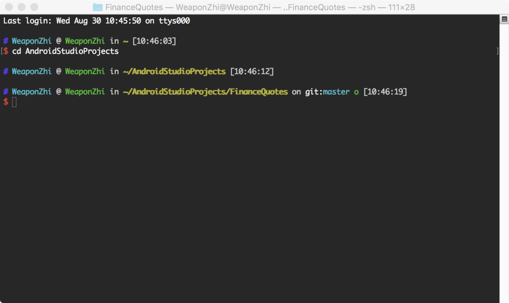
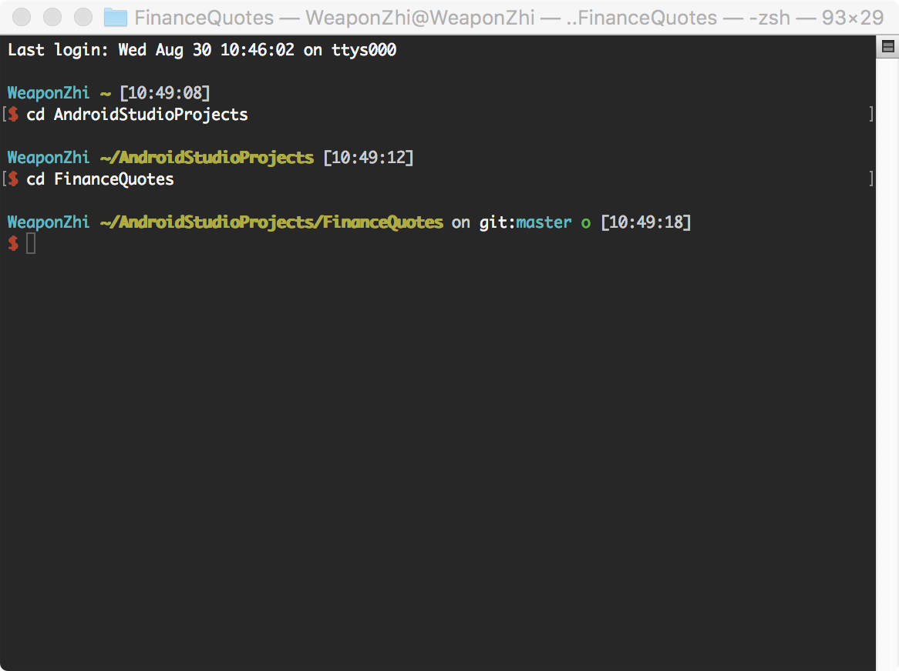

# oh-my-zsh ys 主题去除命令行前面计算机名

 我们为了好用(zhuangbi)的终端，可能会选择 zsh，我选择了 ys 这个非常好看的主题



配置的方法大家自己到网上查一下，教程还是非常多的。

不过，样式虽然很美丽，但前面各种计算机名太长了，所以想通过配置文件修改一下，网上查了查，发现不同的主题配置文件设置不一样，没查到 ys 的，所以自己瞎摸索了下，总算去掉了。现在是这样。


是不是清爽了挺多了呢，当然这里所有默认显示的样式都可以通过配置文件进行配置。现在说下简单的配置过程。

首先，因为 oh-my-zsh 更新比较频繁，为了防止出问题，我们在`.oh-my-zsh/themes`中把`ys.zsh-theme`复制一个副本，命名为`myys.zsh-theme`，然后在`.zshrc`中配置

```
ZSH_THEME=myys1
```

这样我们以后就在 myys 这个文件中配置就好了。 
打开`myys`文件，拖到最下面。

```
PROMPT="
%{$terminfo[bold]$fg[blue]%}#%{$reset_color%} \
%(#,%{$bg[yellow]%}%{$fg[black]%}%n%{$reset_color%},%{$fg[cyan]%}%n) \
%{$fg[white]%}@ \
%{$fg[green]%}%m \
%{$fg[white]%}in \
%{$terminfo[bold]$fg[yellow]%}%~%{$reset_color%}\
${hg_info}\
${git_info}\
 \
%{$fg[white]%}[%*] $exit_code
%{$terminfo[bold]$fg[red]%}$ %{$reset_color%}"123456789101112
```

这几行代码就是配置命令行前面的信息的，把你需要的保留，不需要的去掉就行，也可以在这里更改颜色，添加别的想显示的样式。我这里把1，3，4，5行去掉后，就成了上面的样式，最终的代码为

```
ZSH_THEME=myys1
```

这样我们以后就在 myys 这个文件中配置就好了。 
打开`myys`文件，拖到最下面。

```
PROMPT="
%{$terminfo[bold]$fg[blue]%}#%{$reset_color%} \
%(#,%{$bg[yellow]%}%{$fg[black]%}%n%{$reset_color%},%{$fg[cyan]%}%n) \
%{$fg[white]%}@ \
%{$fg[green]%}%m \
%{$fg[white]%}in \
%{$terminfo[bold]$fg[yellow]%}%~%{$reset_color%}\
${hg_info}\
${git_info}\
 \
%{$fg[white]%}[%*] $exit_code
%{$terminfo[bold]$fg[red]%}$ %{$reset_color%}"123456789101112
```

这几行代码就是配置命令行前面的信息的，把你需要的保留，不需要的去掉就行，也可以在这里更改颜色，添加别的想显示的样式。我这里把1，3，4，5行去掉后，就成了上面的样式，最终的代码为

```
PROMPT="
%(#,%{$bg[yellow]%}%{$fg[black]%}%n%{$reset_color%},%{$fg[cyan]%}%n) \
%{$terminfo[bold]$fg[yellow]%}%~%{$reset_color%}\
${hg_info}\
${git_info}\
 \
%{$fg[white]%}[%*] $exit_code
%{$terminfo[bold]$fg[red]%}$ %{$reset_color%}"12345678
```

注意，在`PROMPT="`后面多一个空格都会最终显示在最终的样式中。


https://blog.csdn.net/qq_34795285/article/details/77711814