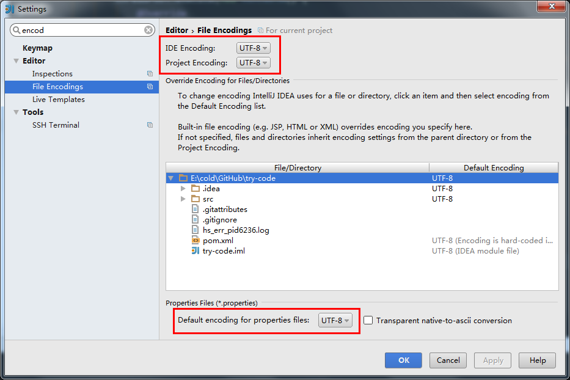
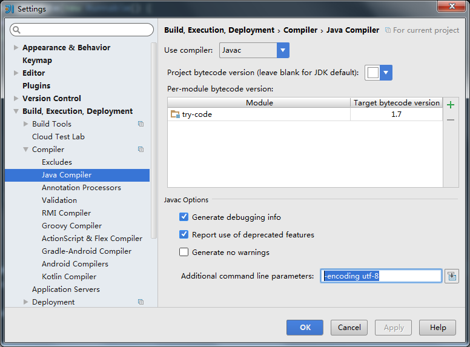
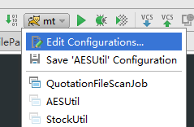
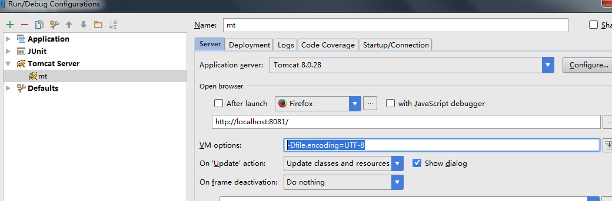

[TOC]

# IntelliJ IDEA 乱码解决方案 （项目代码、控制台等）

最近IDE从eclipse改成IntelliJ IDEA 了，原因是公司大部分人都在用这个IDE，而且一直推荐用，所以尝尝鲜。换的第一天，就遇到了哪个IDE都会遇到的乱码问题，耗费了好多时间最终解决了，因此在这边记录一下解决方案，以供后面参考。

总共有下面几种乱码的解决方案：

1. 工程乱码
2. 执行main函数时，控制台乱码
3. 运行tomcat时，控制台乱码

 

**PS: 如果下面方案不生效时**，打开IDEA安装目录找到 **idea.exe.vmoptions**（64位为**idea64.exe.vmoptions**）文件， 在文件末尾加上 **-Dfile.encoding=UTF-8**

**可以先做这一步，加上这个基本上很多都不会乱码了**

## 1.工程乱码

打开File-Setting, 找到File Encodings这个选项，把encoding设置成你工程的编码即可，一般是UTF-8，如下图（红框的地方），然后重新rebuild一下，基本就行了

## 2.执行main函数时，控制台乱码

同样是打开setting，找到 Build,Execution,Deployment > Compiler > Java Compiler， 设置 Additional command line parameters选项为 -encoding utf-8，然后rebuild下，重新运行

## 3.运行tomcat时，控制台乱码

1） 打开Run/Debug Configuration,选择你的tomcat

2) 然后在  Server > VM options 设置为 -Dfile.encoding=UTF-8 ，重启tomcat

好了，三种解决乱码的方案大概就是这样，有问题大家留言

https://www.cnblogs.com/vhua/p/idea_1.html