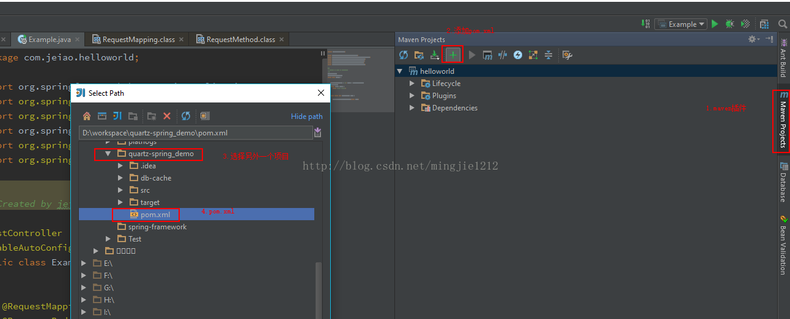
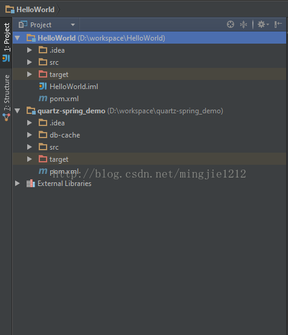

 

# Intellij IDEA 单窗口多项目支持

众所周知，Intellij IDEA的 Project概念类似于eclipse的workspace.

所以Intellij IDEA 每打开一个项目就是一个窗口。

这样就存在一个问题，当一个项目有很多子项目，而项目之间的关系不是单纯maven中的module，而是jar之间的引用依赖。

那么要打开一个完整的项目，有可能要打开十多个项目。也就是十多个idea窗口,来回切换。极其痛苦。

找了很久，没有找到办法。今天终于发现一种很好的方式。在这记录一下。

针对于MAVEN项目，多项目在一个窗口显示。可以使用如下方式：

稍等等待一会maven处理加载依赖.

然后：

然后就会很舒服很愉快的看代码了。

bingo.

 源： https://blog.csdn.net/mingjie1212/article/details/72758131