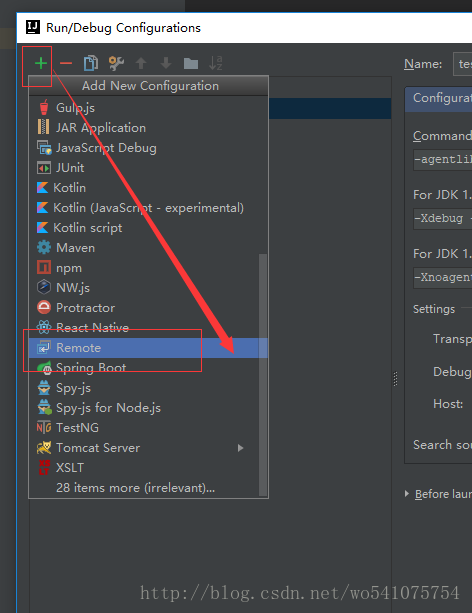
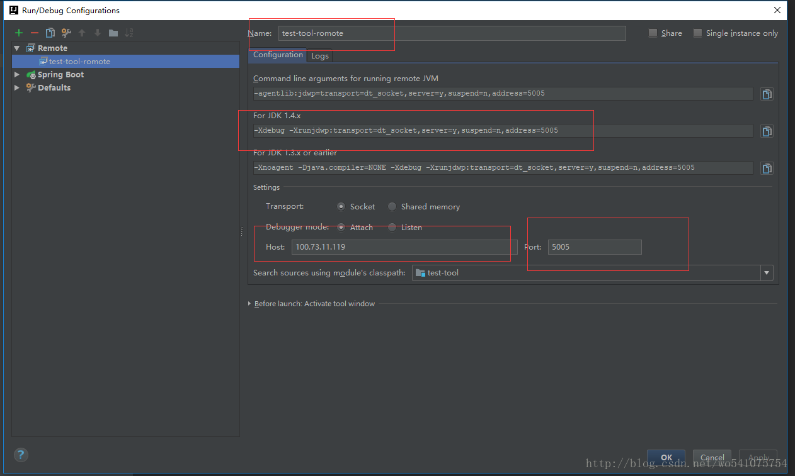

 

[TOC]


# Intellij IDEA基于Springboot的远程调试

 

## 简介

本篇博客介绍一下在Intellij IDEA下对Springboot类型的项目的远程调试功能。所谓的远程调试就是服务端程序运行在一台远程服务器上，我们可以在本地服务端的代码（前提是本地的代码必须和远程服务器运行的代码一致）中设置断点，每当有请求到远程服务器时时能够在本地知道远程服务端的此时的内部状态。

## 方法

首先，打开Edit configurations，点击+号，创建一个Remote应用。 


填写name，配置Host地址（远程服务器地址）和端口（选一个未被占用的端口）。然后复制For JDK1.4.x下面的参数，示例配置的端口为5005：

```
-Xdebug -Xrunjdwp:transport=dt_socket,server=y,suspend=n,address=5005
```



经过以上步骤，已经获得了启动远程服务器的参数。在启动springboot时默认使用java命令来启动。 
比如，示例项目启动命令为：

```
java -jar test-tool.jar1
```

那么此时在启动命令上添加上面获得的参数：

```
java -jar -Xdebug -Xrunjdwp:transport=dt_socket,server=y,suspend=n,address=5005 test-tool.jar1
```

这样服务端就监听在5005端口了。可以通过以下命令来检查是否监听成功：

```
netstat -anp | grep 50051
```

通过以上步骤已经完成了服务器端参数的添加。下面启动刚才配置的Remote服务，即test-tool-remote。在启动时候我们会发现此项启动程序只有debug启动模式。

启动完成，对需要debug的代码打上断点，剩下的操作步骤就是访问远程服务器对应的业务请求，本地就会同步debug。其余的操作与本地debug相同，此处就不再赘述了。


版权声明：本文为博主原创文章，转载请写明出处。 https://blog.csdn.net/wo541075754/article/details/75008617

  