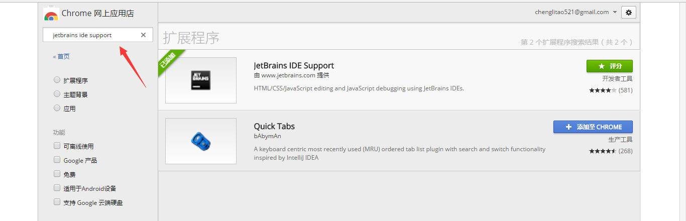
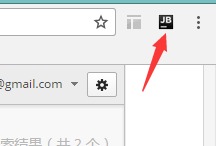
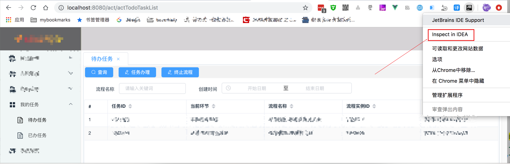
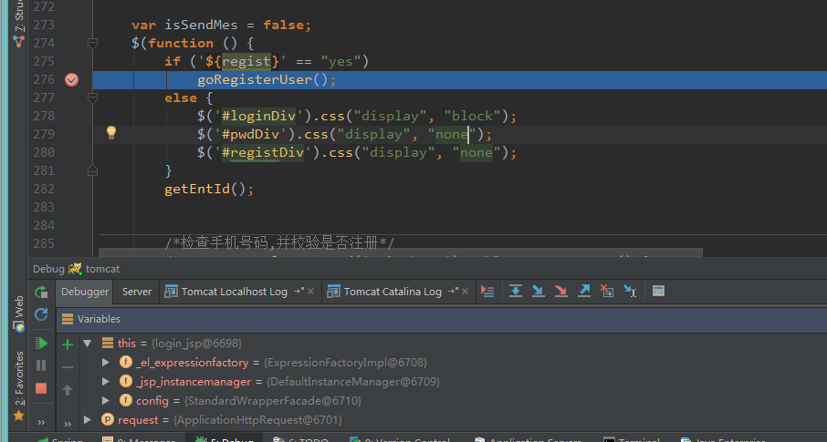
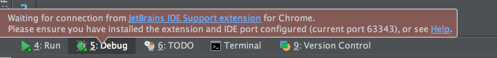
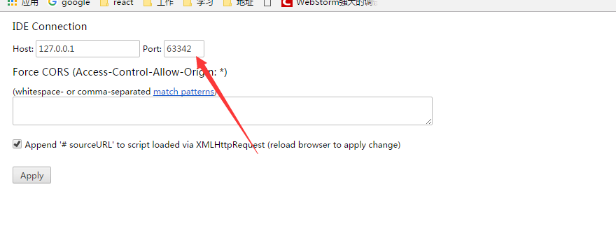
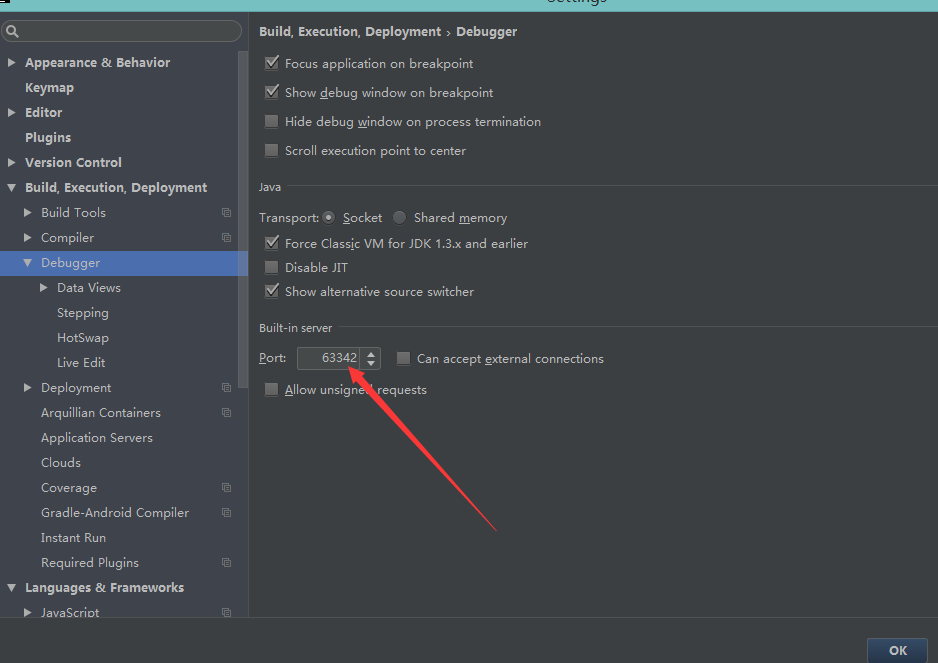

[TOC]

# IntelliJ IDEA 配置chrome插件调试js代码

调试js代码，每次都在要在代码中写debugger，或者在chrome中打断点，而且chrome的断点信息不人性化。偶然发现idea竟然有这个功能，简直神器啊。研究了半天终于搞定了，哈哈，开心。下面是详细步骤：

## 1.在chrome应用商店搜索"jetbrains ide support"插件

，可能需要翻墙（不会百度，老D google host），如下图，这里是我安装好的。这里我试过找下载好的插件，安装但是没有连接成功，总是提示错误，下文会提到。所以别偷懒，老老实实翻墙下载。

安装成功后如右上角会出现此图标

## 2.在idea中启动JavaScript(vue等)项目

在浏览器访问项目,按照如下图点击 inspect in IDEA,就会跳到idea中打断点调试了

 

  

## 注意

注意：当然如果真的是这么顺利，也就没必要在这里写博客了。

 需要注意的是，不要找下载好的插件安装，一是安装后不起作用，二是chrome不信任未知来源的插件，重启后会自动停用插件，所以还是翻墙在线安装靠谱，

 离线安装一直提示这个信息，怎么配置都不成功。哭脸。

 

还有在插件图标上右键，选项，如下图，可以配置端口，这里要和idea里的一致才行；

 

 

 

 

 

<https://www.cnblogs.com/chenglt/p/6591583.html>

