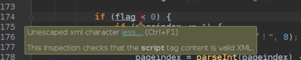
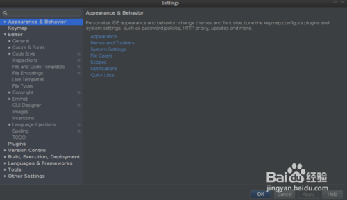
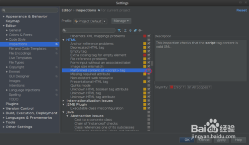
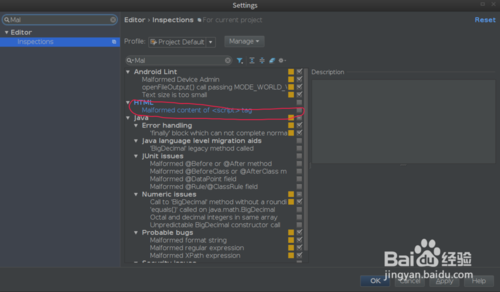

# IDEA Unescaped xml character报错的解决办法

在IntelliJ IDEA编写jsp时，会在\<script>标签内对一些正确的javascript代码报Unescaped xml character错，虽然不影响代码的执行，但看着IDE报自己代码有错是很不开心的一件事，这里分享解决该问题的办法。

## 工具/原料

- IntelliJ IDEA

## 方法/步骤

- 鼠标点击IDEA左上角File， 进入Settings（快捷键Ctrl + Alt + S）

  

- 选择Editor - Inspections，并在右边找到HTML下的Malformed content  of <script> tag， 取消勾选，点击OK 即可

  

- 或者直接搜索Malformed content  of <script> tag, 并取消勾选即可

  

https://jingyan.baidu.com/article/8cdccae97f2026315513cd5d.html