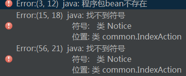
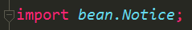

[TOC]


# idea 项目突然提示找不到符号或程序包不存在

 

## 问题

项目之前运行正常, 我新建了一个项目, 然后把原来的代码全部拷贝过去后, 就无法编译啦.

结构如图: 


错误提示:



代码:



已经试过了Invalidate/Restart, 但是没有作用


## 答案

今天也遇到同样的问题，搞了好久。
最后发现终端运行：

```
mvn idea:idea
```

完美解决 


<https://segmentfault.com/q/1010000007088655>