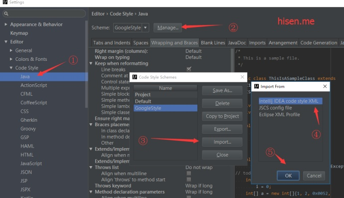

## IDEA设置intellij-java-google-style idea格式化代码

一直想弄个格式化代码，后来发现很多人用谷歌的，于是也来整一份

保存一份google code的xml，链接有最新的
[intellij-java-google-style.xml](https://github.com/google/styleguide/blob/gh-pages/intellij-java-google-style.xml)
设置方法如下：Setting -> Editor -> Code Stytle -> Java
[](http://wx3.sinaimg.cn/mw690/b2e389b6ly1fe713rpzl2j20tq0h30v7.jpg)
最后一步就选择你存放之前保存的xml

然后就大功告成，来个对比
前

```
package com.hisen.json;

import com.alibaba.fastjson.JSON;
import com.alibaba.fastjson.JSONObject;

/**
 * Created by hisenyuan on 2017/3/23 at 18:02.
 */
public class test {
    public static void main(String[] args) {String s = "{'A':'a'}";
        JSONObject obj= JSON.parseObject(s);
        System.out.println(obj.get("A"));
    }
}
```

后

```
package com.hisen.json;

import com.alibaba.fastjson.JSON;
import com.alibaba.fastjson.JSONObject;

/**
 * Created by hisenyuan on 2017/3/23 at 18:02.
 */
public class test {

  public static void main(String[] args) {
    String s = "{'A':'a'}";
    JSONObject obj = JSON.parseObject(s);
    System.out.println(obj.get("A"));
  }
}
```


http://hisen.me/20170401-IDEA%E8%AE%BE%E7%BD%AEintellij-java-google-style/