[TOC]

# IDEA最好用插件推荐

2019.11.26 22:56 7885浏览

# [1 背景 ](https://www.imooc.com/read/55?mc_marking=12eb0f83bc39e211b256c8d7a9959490&mc_channel=shouji)

俗话说：“工欲善其事必先利其器”，本问介绍几款强大实用的 IDEA 插件，助力大家开发。

**希望大家做一个聪明又努力的人，而不只是一个努力的人。**

以下插件大都可以通过[ IDEA ](https://www.imooc.com/read/55?mc_marking=12eb0f83bc39e211b256c8d7a9959490&mc_channel=shouji)自带的插件管理中心安装，如果搜不到可以去 IDEA 插件官网下载本地导入。

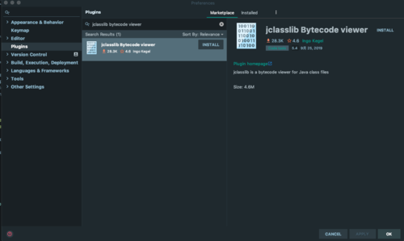

具体安装界面不同版本 IDEA略有差异，请自行研究。

如果连插件安装都不愿意学、学不会的话，很难成为一名合格的 Java 开发工程师。

# [2 插件推荐 ](https://www.imooc.com/read/55?mc_marking=12eb0f83bc39e211b256c8d7a9959490&mc_channel=shouji)

## 2.1 Alibaba Java Coding Guidelines

首先要推荐的是和《手册》配套的[阿里巴巴 Java代码规范插件](https://plugins.jetbrains.com/plugin/10046-alibaba-java-coding-guidelines)。

安装该插件后，代码超过 80 行、手动创建线程池等，这些和《手册》中的规约不符时，IDEA中会给出警告提示。

建议大家一定一定一定要安装该插件，它会帮助你检查出很多隐患，督促你写更规范的代码。

## 2.2 jclasslib bytecode viewer

下面要隆重介绍的是一款可视化的字节码查看插件：[jclasslib](https://plugins.jetbrains.com/plugin/9248-jclasslib-bytecode-viewer) 。

大家可以直接在 IDEA 插件管理中安装（安装步骤略）。

**使用方法**：

1. 在 IDEA 打开想研究的类。
2. 编译该类或者直接编译整个项目（ 如果想研究的类在 jar 包中，此步可略过）。
3. 打开“view” 菜单，选择“Show Bytecode With jclasslib” 选项。
4. 选择上述菜单项后 IDEA 中会弹出 jclasslib 工具窗口。

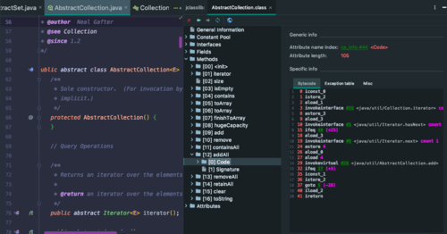

那么有自带的强大的反汇编工具  javap 还有必要用这个插件吗？

这个插件的**强大之处**在于：

1. 不需要敲命令，简单直接，在右侧方便和源代码进行对比学习。
2. 字节码命令支持超链接，**点击其中的虚拟机指令即可跳转到 jvms 相关章节**，超级方便。

该插件对我们学习虚拟机指令有极大的帮助。

详细安装和介绍参考另外一篇手记：https://www.imooc.com/article/296257

## 2.3 Codota

另外一个不得不说的就是专栏中提到的辅助开发神器: [Codota](https://www.codota.com/code)。

可以点击下图所示“Add Codota to you IDEA” 了解安装步骤。

该插件的强大之处在于：

1. 支持智能代码自动提示，该功能可以增强 IDEA 的代码提示功能。
2. 支持 JDK 和知名第三方库的函数的使用方法搜索，可以看到其他知名开源项目对该函数的用法。

当我们第一次使用某个类，对某个函数不够熟悉时，可以通过该插件搜索相关用法，快速模仿学习。

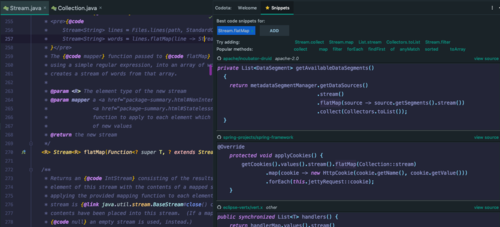

如上图所示，我们想了解 `Stream` 类中  `flatMap` 函数的用法，可以使用该插件查看知名开源项目的用法。

插件窗口顶部还给出了该类最常用的函数，可以点击查看相关用法案例，每个案例右侧的 "view source"可以跳转到该片段对应的开源项目的源码中。

## 2.4 Auto filling Java call arguments

开发中，我们通常会调用其他已经编写好的函数，调用后需要填充参数，但是绝大多数情况下，传入的变量名称和该函数的参数名一致，当参数较多时，手动单个填充参数非常浪费时间。

该插件就可以帮你解决这个问题。

安装完该插件以后，调用一个函数，使用 Alt+Enter 组合键，调出 "Auto fill call parameters" 自动使用该函数定义的参数名填充。

## 2.5  GenerateO2O、**GenerateAllSetter**

我们定义好从 A 类转换到 B 类的函数转换函数后，使用这两个插件可以自动调用 Getter 和 Setter 函数实行自动转换。

实际开发中还有一个非常常见的场景： 我们创建一个对象后，想依次调用 Setter 函数对属性赋值，如果属性较多很容易遗漏或者重复。

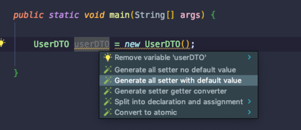

可以使用这 GenerateAllSetter 提供的功能，自动调用所有 Setter 函数（可填充默认值），然后自己再跟进实际需求设置属性值。

## 2.6 Material Theme UI

对于很多人而言，写代码时略显枯燥的，如果能够安装自己喜欢的主题将为开发工作带来些许乐趣。

IDEA 支持各种主题插件，其中最出名的当属 Material Theme UI。

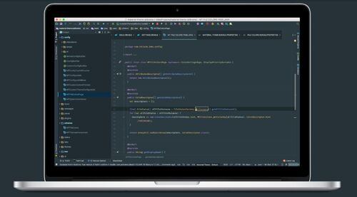

安装后，可以从该插件内置的各种风格个选择自己最喜欢的一种。

## 2.7 Rainbow Brackets

由于很多人没有养成好的编码风格，没有随手 format 代码的习惯，甚至有些同事会写代码超过几百行，阅读起来将非常痛苦。

痛苦的原因之一就是找到上下文，由于括号太多，不确定当前代码行是否属于某个代码块，此时这个插件就会帮上大忙。

插件 github 地址：https://github.com/izhangzhihao/intellij-rainbow-brackets

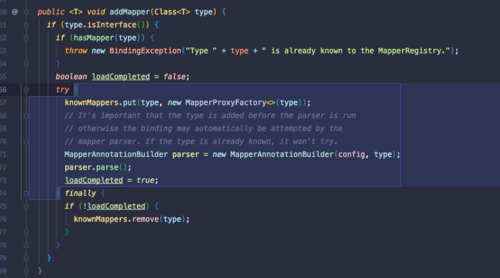

大家可以观看其 github 首页的动图体会和学习其强大功能。

## 2.8 Maven Helper

现在 Java 项目通常会使用 maven 或者 gradle 构建，对于maven 项目来说， jar 包冲突非常常见。

那么如何更容易地查看和解决 jar 包冲突呢？

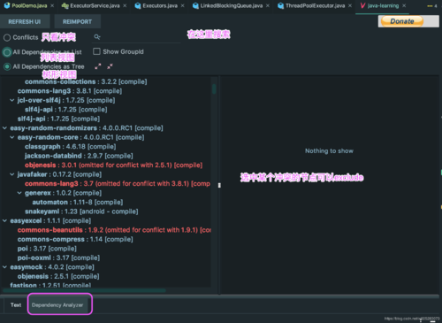

大家可以安装该插件，安装后 IDEA 中打开 pom.xml 文件时，就会多出一个 "Dependency Analyzer" 选项卡。

如上图所示，该插件支持值插件冲突的 jar 包，可以选择冲突的 jar 包将其 exclude 掉。

## 2.9 FindBugs

程序员总是想尽可能地避免写 BUG， [FindBugs](https://plugins.jetbrains.com/plugin/3847-findbugs-idea) 作为静态代码检查插件，可以检查你代码中的隐患，并给出原因。

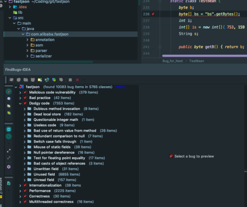

当然还有很多类似的静态代码检查插件，大家可以自行了解安装。

## 2.10 SequenceDiagram

[SequenceDiagram ](https://plugins.jetbrains.com/plugin/8286-sequencediagram/)可以根据代码调用链路自动生成时序图，超级赞，超级推荐！

这对研究源码，梳理工作中的业务代码有极大的帮助，堪称神器。

安装完成后，在某个类的某个函数中，右键 --> Sequence Diagaram 即可调出。

如下图是 Netty 的源码，可以通过该插件绘制出当前函数的调用链路。

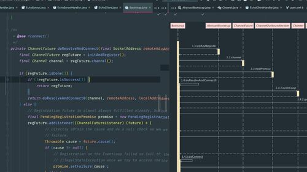

双击顶部的类名可以跳转到对应类的源码中，双击调用的函数名可以直接调入某个函数的源码，总之非常强大。

## 2.11 Stack trace to UML

[Stack trace to UML](https://plugins.jetbrains.com/plugin/10749-stack-trace-to-uml/) 支持根据 JVM 异常堆栈画 UML时序图和通信图。

打开方式 *Analyze > Open Stack trace to UML plugin* + Generate UML diagrams from stacktrace from debug

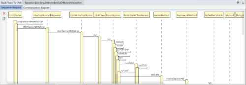

## 2.12 Java Stream Debugger

Stream 非常好用，可以灵活对数据进行操作，但是对很多刚接触的人来说，不好理解。

那么 [Java Stream Debugger](https://plugins.jetbrains.com/plugin/9696-java-stream-debugger/) 这款神器的 IDEA 就可以帮到你。它可以将 Stream 的操作步骤可视化，非常有助于我们的学习。

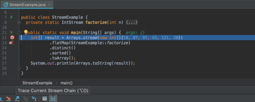

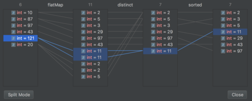

## 2.13 JOL Java Object Layout

https://plugins.jetbrains.com/plugin/10953-jol-java-object-layout

查看对象布局和大小的插件，非常赞。

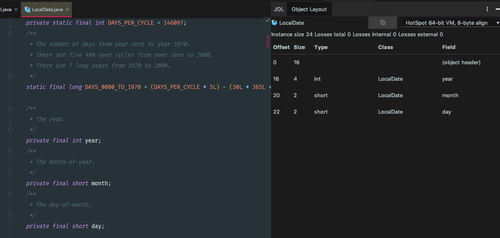

## 2.14 其他

IDEA 的插件浩如烟海，好的IDEA 插件欢迎留言交流。

另外大家可以通过[ IDEA插件官网](https://plugins.jetbrains.com/)进行搜索，有海量插件供你选择。

\------------------------------------------------------------

**想学习开发中比较有帮助的插件，更多开发和避坑技巧，少走弯路，请关注**[**《阿里巴巴Java 开发手册》详解专栏**](https://www.imooc.com/read/55?mc_marking=12eb0f83bc39e211b256c8d7a9959490&mc_channel=shouji)**。**