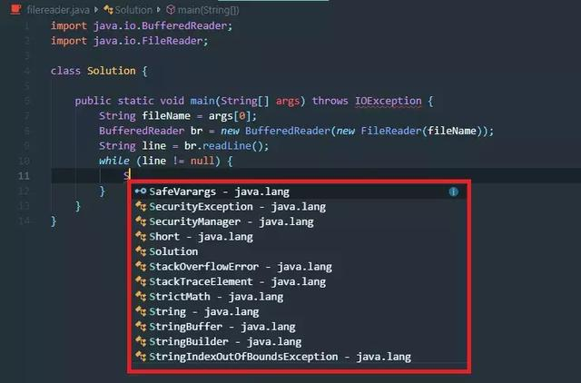
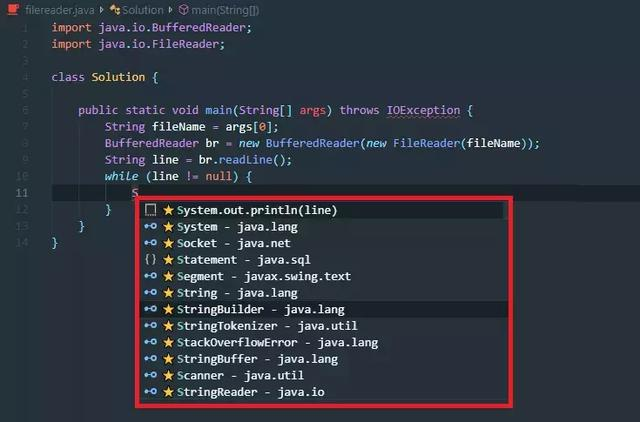

[TOC]

# IDEA配上这款AI插件，撸码效率提升10倍+

原创 儒雅程序员 2019-09-21 08:32:00

平时写代码的时候多少会依赖编辑器里面的代码补全，敲几个字母就能补全一整个词。可是这么多年过去了，为什么代码补全还是像最开始那样，只能限定于一个词，而且毫无意义地按照字典表顺序排列呢？

传统的代码补全，一大篇毫无意义的推荐

想象一下，如果用【AI】来做代码提示会怎样，把更常用的结果放在前面，给出更长的推荐，甚至一行！

AI做代码补全，根据使用情况智能排序，甚至补完整个语句

## **【知名媒体纷纷报道】**

近日我在浏览网页时，看到了**机器之心**、**36Kr**、**猎云网**等知名媒体对AI辅助编程产品-**「aiXcoder」**(**www.aixcoder.com**)的报道，这一款用人工智能技术辅助开发者编程的产品，主要包含了**智能代码补全**和**代码推荐**。

aiXcoder安装和使用起来很简单，能够有效提高开发者编程效率。aiXcoder是基于深度学习技术，具备学习、优化的能力，像你的私人编程助手，在你使用过程中边学边用，随着使用时间越长，推荐的代码长度越长、越准确。

aiXcoder支持**Java、Python、JavaScript、TypeScript、PHP、C++**等多种编程语言。

支持很多常用IDE：**intelliJ IDEA、Pycharm、Ecplise、Sublime、PhpStorm、WebStorm、VS Code、Android Studio**等等。

## **【测试AI编程】**

于是我测试了一下这个可以**【帮助程序员节省时间】**的工具，看看AI编程发展到什么程度，是否真正帮助程序员节省时间。

本着**独立、客观、第三方**的原则，挑选第三方的代码进行测试。

既然说可以节省编程时间，从**【键盘按键】**数量的角度进行统计与比较，因为敲击键盘数量越少，越节省开发时间。

### 【Round One：Tensorflow】

选择的第一个测试程序是Google官方的tensorflow示例程序：

测试代码地址：

https://github.com/aymericdamien/TensorFlow-Examples/blob/master/examples/3_NeuralNetworks/recurrent_network.py

选择如下的代码片段进行测试：

选择的原因是这部分代码包含内容比较全面，包含：

●自定义函数

●函数变量、实参

●API

●变量名

这四个方面，基本可以看出aiXcoder推荐准确度，以及判定是否对编程有帮助。

**测试结果：**

●IDE自带推荐：

使用IDE自带代码提示功能，需要的按键次数：**311**

●aiXcoder智能推荐

使用aiXcoder智能推荐提示功能，需要的的按键次数：**56**

**测试结论：**

选择tensorflow社区版本【aiXcoder智能推荐是IDE自带推荐近**5倍**的编程效率】

**使用录制的动图如下：**

### 【 Round Two：Java】

选择钟述林老师的Java实战的经典例子。

测试代码地址：https://github.com/zsl131/spring-boot-test/tree/master/study12

选择如下的代码片段进行测试，例子里面的字符串不作为统计的指标：

**测试结果如下：**

●IDE自带推荐：

使用IDE自带代码提示功能，需要的按键次数：**236**

●aiXcoder智能推荐-Java版本模型

使用aiXcoder智能推荐提示功能，需要的的按键次数：**105**

**测试结论：**

选择Java社区版本【aiXcoder智能推荐是IDE自带推荐**2.25倍**的编码效率】

**使用录制的动图如下：**

### 【Round Three：C++语言】

由于C++语言不熟悉，所以选择简单的文件读取的例子进行测试：

**结果如下：**

●IDE自带推荐：

IDE自带代码提示功能，需要的按键次数：**98**

●aiXcoder代码推荐-C++版本模型

aiXcode智能推荐提示功能，需要的按键次数：**49**

**测试结论：**

选择C++社区版本【aiXcoder智能推荐是IDE自带推荐**2倍**的编码效率】

**使用录制的动图如下：**

aiXcoder和使用IDE编译器自带提示使用方式一致，无需学习成本即可上手使用，是一个面向程序员的好产品，在实际的使用中对提高编程效率很有帮助。

**【更多为程序员量身定制的功能】**

除了上面的测试功能，aiXcoder还会分析你潜在的推荐需要，对系统默认推荐位置进行排序优化，把你想用的推荐结果排序前置，方便编程过程中的选择。

**「代码搜索功能」**是aiXcoder的另一个节省时间的功能：把搜索代码实现具体功能的搜索引擎做到了IDE中，节省来回切换浏览器的时间成本。

## **【总结一下】**

aiXcoder和使用IDE编译器自带的短提示使用方式一致，没有学习成本即可上手使用，是一个面向程序员的好产品，在实际的使用中确实提升了编程的效率。

对于一个创新性产品，本身也会有不足的地方，根据官网和以往的用户评论，目前aiXcoder还有三点需要注意的地方：

**1、部分城市反馈速度延迟**

由于网络延迟原因，部分地区的用户，推荐内容返回不及时，可能要超过200ms才有推荐结果。目前aiXcoder正在全国各地部署服务器，解决卡顿、推荐慢的问题。

**2、某些IDE未支持**

目前aiXcoder支持常见的IDE，部分小众IDE未支持，用户可以在官网反馈或者在群里反馈，官方也会优先支持用户提议多的IDE。

**3、时间长、效果好**

安装之后，并不能起到立竿见影的效果，学习到反馈需要过程，根本还是深度学习的问题。一个用户安装并使用1周之后，推荐准确率要比刚装上好太多，而且推荐的长度也更长。

虽然aiXcoder还有部分的不足，作为一个纯国产的技术性产品，我作为一个程序员还是很期待，相信aiXcoder能够在编程领域掀起波浪，让我们拭目以待！

<https://www.toutiao.com/a6738390002356453900/?tt_from=android_share&utm_campaign=client_share×tamp=1569041674&app=news_article&utm_medium=toutiao_android&req_id=201909211254330100140481312B05C64B&group_id=6738390002356453900>