[TOC]


# IntelliJ IDEA18个常用插件，动图演示，让你效率翻倍

JavaLeader 2019-08-25 16:56:13

   


二、市场插件

- **阿里代码规约检测**
- **快捷键提示工具：Key promoter X**
- **代码注解插件： Lombok**
- **代码生成工具：CodeMaker**
- **单元测试测试生成工具：JUnitGenerator**
- **Mybatis 工具：Free Mybatis plugin**
- **Maven辅助神器：Maven Helper**
- **JSON转领域对象工具：GsonFormat**
- **领域对象转JSON工具：POJO to JSON**
- **时序图生成工具：SequenceDiagram**
- **字符串工具：String Manipulation**
- **代码作色工具：Rainbow Brackets**
- **RESTful 服务开发辅助工具集: RestfulToolkit**
- **日志工具：Grep Console**
- **生成对象set方法：GenerateAllSetter**
- **Redis可视化：Iedis**
- **K8s工具：Kubernetes**
- **

## 1. 阿里代码规约检测

《阿里巴巴 Java 开发手册》是阿里巴巴集团技术团队的集体智慧结晶和经验总结， 经历了多次大规模一线实战的检验及不断完善， 系统化地整理成册。当然，规范只能提供参考，我们还需要工具来帮忙我们实现了实时检测。目前，Alibaba Java Code Guidelines 插件实现了开发手册中的的 53 条规则，大部分基于 PMD 实现，其中有 4 条规则基于 IDEA 实现，并且基于 IDEA Inspection 实现了实时检测功能。部分规则实现了 Quick Fix 功能。目前，插件检测有两种模式：实时检测、手动触发。详细使用文档，参考：https://github.com/alibaba/p3c/blob/master/idea-plugin/README_cn.md

- 阿里巴巴 Java 开发手册（详尽版）： https://github.com/alibaba/p3c/blob/master/阿里巴巴Java开发手册（详尽版）.pdf
- GitHub : https://github.com/alibaba/p3c
- IDEA 插件地址：https://plugins.jetbrains.com/plugin/10046-alibaba-java-coding-guidelines

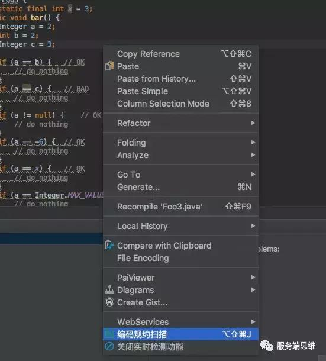


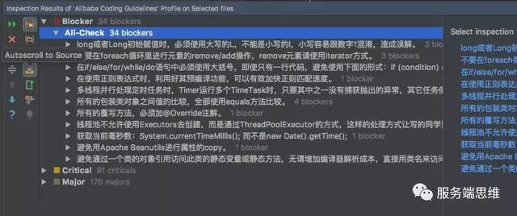


此外，类似的插件还有 FindBugs 和 CheckStyle。

## 2. 快捷键提示工具：Key promoter X

Key Promoter X 是一个快捷键提示插件，如果鼠标操作是能够用快捷键替代，Key Promoter X 会提示可以用什么快捷键替代。详细使用文档，参考：https://plugins.jetbrains.com/plugin/9792-key-promoter-x

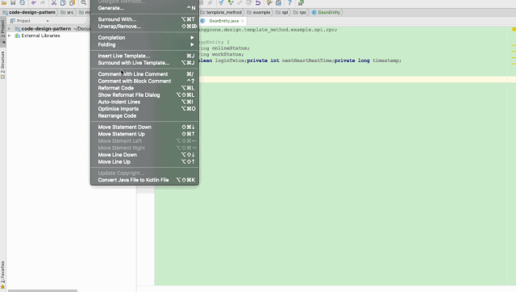


## 3. 代码注解插件： Lombok

lombok 的使用，参考 ：https://projectlombok.org/。我们需要在代码中引入二方库，然后安装 lombok 插件即可。

```
<dependency>
 
<groupId>
org.projectlombok
</groupId>
 
<artifactId>
lombok
</artifactId>
 
<version>
最新版本号
</version>
</dependency>
```

## 4. 代码生成工具：CodeMaker

开发过程中，经常手工编写重复代码。现在，可以通过 CodeMaker 来定义 Velocity 模版来支持自定义代码模板来生成代码。目前，CodeMaker 自带两个模板。Model：根据当前类生成一个与其拥有类似属性的类，用于自动生成持久类对应的领域类。Converter：该模板需要两个类作为输入的上下文，用于自动生成领域类与持久类的转化类。详细使用文档，参考：https://github.com/x-hansong/CodeMaker

## 5. 单元测试测试生成工具：JUnitGenerator

单元测试是必不可少的！我们可以使用 JUnitGenerator 插件来自动创建了单元测试。我们可以使用提供的 velocity 模板定制单元测试输出代码。如果在已经存在单元测试的地方创建了单元测试，则会提示用户进行覆盖或合并操作。合并操作允许用户有选择地创建目标文件内容。详细使用文档，参考：https://plugins.jetbrains.com/plugin/3064-junitgenerator-v2-0

## 6. Mybatis 工具：Free Mybatis plugin

现在，MyBatis 框架已占领半壁江山。因此，围绕着 MyBatis 的插件和工具越来越多。Free Mybatis plugin 非常方便进行 Mapper 接口和 XML 文件之间跳转。详细使用文档，参考：

https://plugins.jetbrains.com/plugin/8321-free-mybatis-plugin。此外，收费版的还有 Mybatis plugin。


对于 Mybatis 的工具还有很多，比如 mybatis-log-plugin、codehelper.generator。此外，非 IDEA的工具有： Mybatis 分页插件 Mybatis-PageHelper、Mybatis 代码生成工具 mybatis-generator 等。地址：http://www.mybatis.org/generator/

## 7. Maven辅助神器：Maven Helper

如果 Maven 引入的 jar 包有冲突，可以使用 Maven Helper 插件来帮助分析。详细使用文档，参考：https://plugins.jetbrains.com/plugin/7179-maven-helper

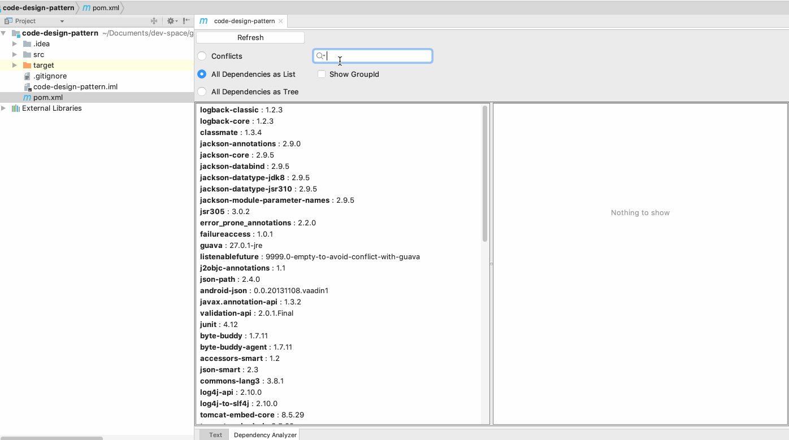


## 8. JSON转领域对象工具：GsonFormat

在开发过程中，我们可能会遇到 json 格式的字符串转换成实体类参数的场景，这个插件可以根据 JSONObject 格式的字符串，自动生成实体类参数。详细使用文档，参考：https://github.com/zzz40500/GsonFormat

那么，如何使用呢？我们可以使用 GsonFommat 的快捷键，默认 option + s (mac), alt + s (win) 通过以下方式修改快捷键。或者点击工具栏的 Generate 来唤起生成工具。

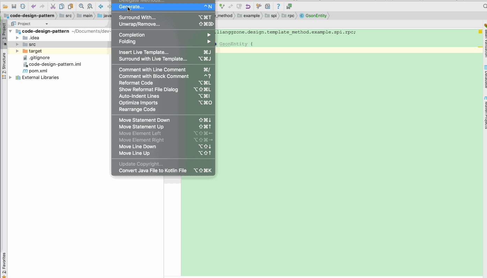


## 9. 领域对象转JSON工具：POJO to JSON

为了测试需要，我们需要将简单 Java 领域对象转成 JSON 字符串方便用 postman 或者 curl 模拟数据。详细使用文档，参考：https://plugins.jetbrains.com/plugin/9686-pojo-to-json


## 10. 时序图生成工具：SequenceDiagram

有的时候，我们需要梳理业务逻辑或者阅读源码。从中，我们需要了解整个调用链路，反向生成 UML 的时序图是强需求。其中，SequenceDiagram 插件是一个非常棒的插件。详细使用文档，参考：https://plugins.jetbrains.com/plugin/8286-sequencediagram

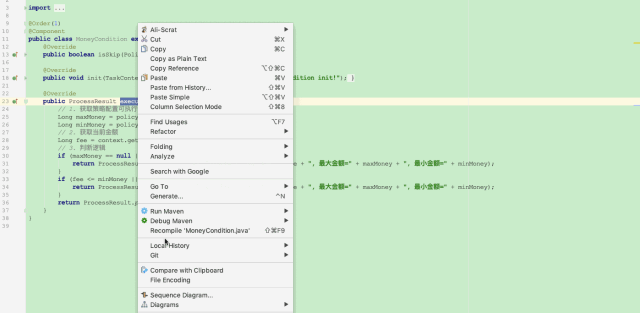


## 11. 字符串工具：String Manipulation

String Manipulation 插件提供了非常丰富字符串工具，例如命名替换（ (camelCase, kebab-lowercase, KEBAB-UPPERCASE, snakecase, SCREAMINGSNAKE_CASE, dot.case, words lowercase, Words Capitalized, PascalCase）等。详细使用文档，参考：https://plugins.jetbrains.com/plugin/2162-string-manipulation

## 12. 代码作色工具：Rainbow Brackets

Rainbow Brackets 插件可以实现配对括号相同颜色，并且实现选中区域代码高亮的功能。详细使用文档，参考：https://plugins.jetbrains.com/plugin/10080-rainbow-brackets

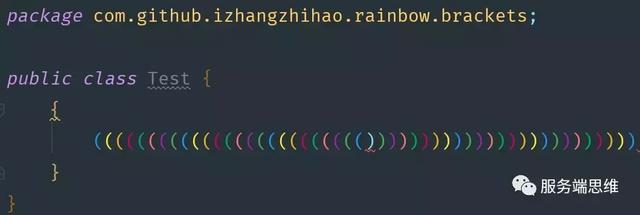


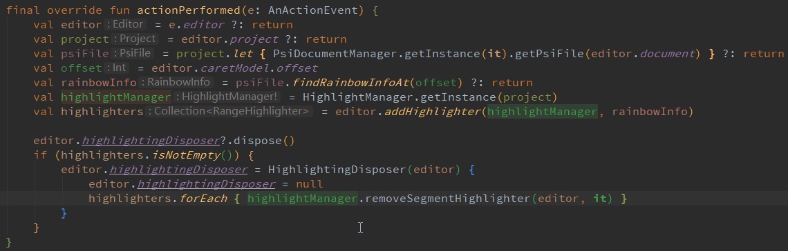


事实上，代码作色之后，可以非常方便我们阅读。类似的工具还有：Grep Console 来自定义设置控制台输出颜色等。

## 13. RESTful 服务开发辅助工具集: RestfulToolkit

开发中，经过会根据 URI 的部分信息来查找对应的 Controller 中方法，RestfulToolkit 提供了一套 RESTful 服务开发辅助工具集，提供了如下功能：

根据 URL 直接跳转到对应的方法定义 ( Ctrl \ or Ctrl Alt N ); 提供了一个 Services tree 的显示窗口; 一个简单的 http 请求工具; 在请求方法上添加了有用功能: 复制生成 URL;,复制方法参数... 其他功能: java 类上添加 Convert to JSON 功能，格式化 json 数据 ( Windows: Ctrl + Enter; Mac: Command + Enter )。

详细使用文档，参考：https://plugins.jetbrains.com/plugin/10292-restfultoolkit

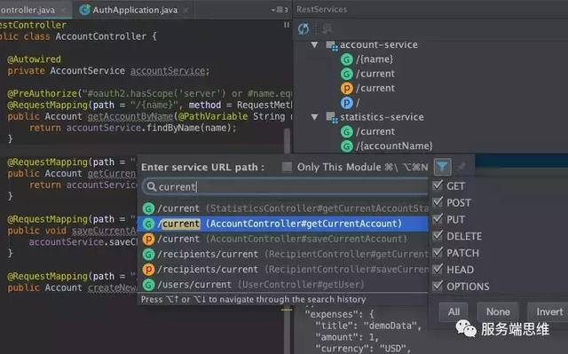


## 14. 日志工具：Grep Console

参考：https://plugins.jetbrains.com/plugin/7125-grep-console

不同级别日志通过颜色区分，一路了然

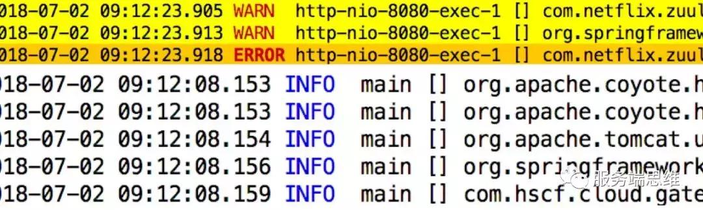


高亮日志

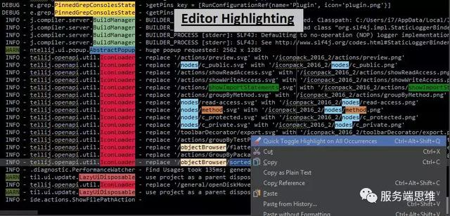


便捷检索日志

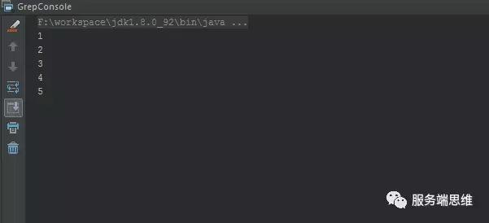


## 15. 生成对象set方法：GenerateAllSetter

开发中，有时可以通过BeanUtil等工具类进行对象之间的属性拷贝，但有时候也需要手工进行赋值。通过GenerateAllSetter，可以一键生成对象的所有set语句。

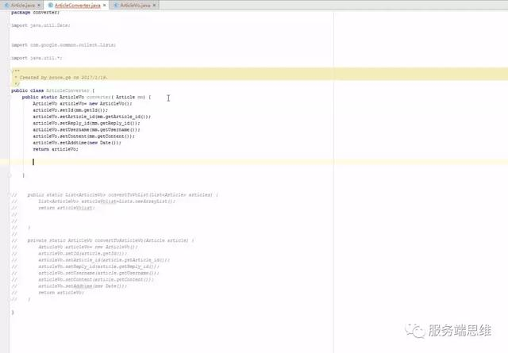


## 16. Redis可视化：Iedis

参考：https://plugins.jetbrains.com/plugin/9228-iedis 使用参考：https://codesmagic.com/iedis/userguide/getting-started 可方便的执行增删查改及使用命令行进行操作。

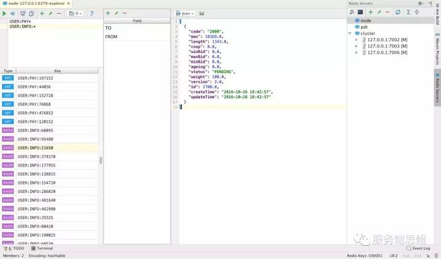


## 17. K8s工具：Kubernetes

参考 https://plugins.jetbrains.com/plugin/10485-kubernetes 支持编辑 Kubernetes 资源文件，如下： 可以比较方便的查看yaml中的各项 placeholder 的默认值，且可以方便的链接到value位置。

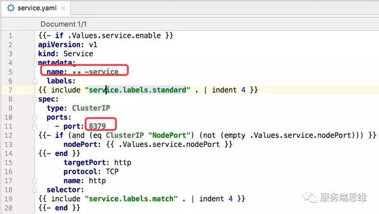


## 18. 中英文翻译工具：Translation

最骚的操作是什么？帆哥在群里分享了一套「半中文编程」：说到了变量命名，先用中文写好，然后用 Translation 插件的 translate and replace 一键替换为英文，这样效率高而且准确。详细使用文档，参考：https://plugins.jetbrains.com/plugin/8579-translation

来源:http://suo.im/5nhyYF

作者:梁桂钊、陈同学、张帆、刁政欣

点击**了解更多**一起学习java和交流经验


https://www.toutiao.com/a6729025651413615107/?tt_from=android_share&utm_campaign=client_share&timestamp=1566864807&app=news_article&utm_medium=toutiao_android&req_id=20190827081326049007048007AD45D73A&group_id=6729025651413615107