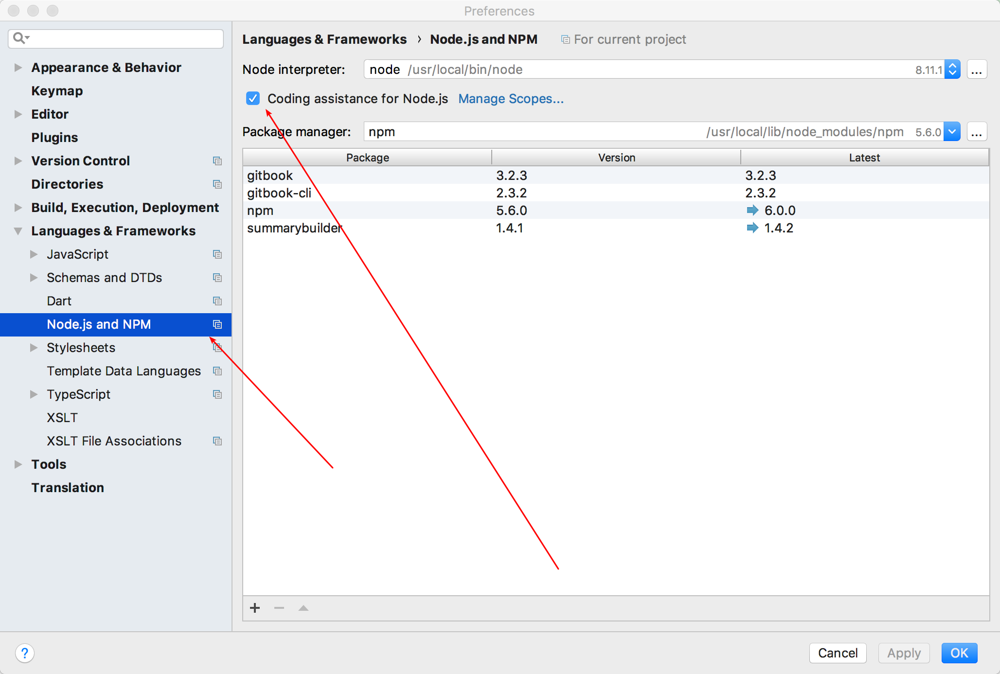

# Webstorm设置Node.js智能提示

这两天在学习Node.js，在Webstorm上进行编辑时发现竟然没有智能提示！所以斜这篇文章来帮助大家度过这个坑！

File -> Settings -> Languages&Frameworks找到Node.js and npm

然后，再点击coding assistance for node.js，代码提示功能就完成了

 

https://blog.csdn.net/zzzzlei123123123/article/details/70445460