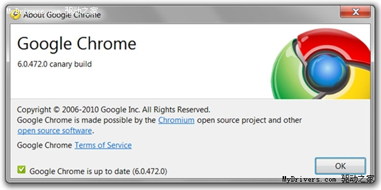

# Google发布新版Chrome 支持双版本同时运行

2010-07-27 09:29:21  出处：快科技 作者：[萧萧](https://passport.mydrivers.com/t/index.aspx?id=746167) 编辑：萧萧   人气： 5199 次    

猜你想看：[亚马逊](https://news.mydrivers.com/tags/65.htm)

为了让更多人参与到Chrome的测试中来，Google日前推出了一个特别版Chrome：金丝雀（Canary）版本。你可以同时安装/运行两个Chrome版本，比如，安装Chrome稳定版/Beta测试版/开发者版本，同时安装使用Chrome金丝雀版本（目前仅支持Windows XP、Vista、Windows 7平台）。

Chrome金丝雀版会以不同的路径安装，采用专有的图标、快捷键等，单独获得升级，并且与现有的Chrome互不干扰地运行。通常情况下，金丝雀版就像开发者版本一样，不过Google会在必要情况下推送额外的升级，所以其版本号将高于开发者版本。

Chrome和Chrome金丝雀版图标

Google建议广大技术爱好者与开发人员安装Chrome金丝雀版本，它会为你提供最新的Chrome功能和升级。Chrome开发团队Mark Larson指出：“金丝雀版将比开发者版本的升级频繁很多，我们在努力使它像每日开发版本那样获得更新。从金丝雀版本用户那里获得的数据（尤其是崩溃数据）将帮助我们更快得发现并修复问题。”

官方下载Chrome金丝雀版本：

<http://tools.google.com/dlpage/chromesxs>

 

 

https://news.mydrivers.com/1/170/170556.htm