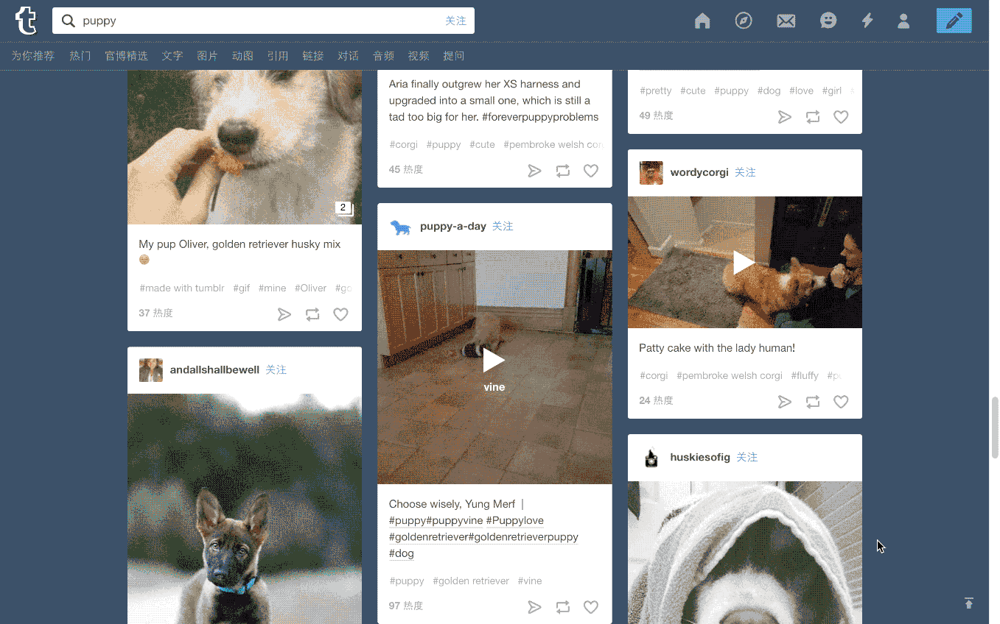
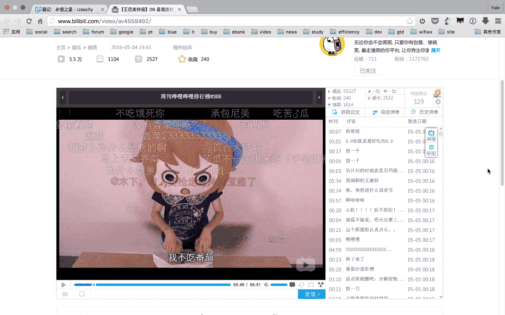

# 如何下载网页上的视频

2016.05.06 13:24* 字数 1374 阅读 8719评论 6喜欢 28

如今随着流媒体和云端存储越来越成熟，版权内容越来越丰富，我们已经愈发不需要下载视频了。只要有网络，想看什么内容，基本都能找到在线播放。但总有些时候，是你特别想把视频下载下来的——比如网速不给力或者没有网络的时候，再比如想反复揣摩学习某些动作片视频资料的时候。

然而，这时候你会绝望地发现，绝大多数网页上的视频，都无法通过右键直接下载。本文介绍一些简单的方法和工具，能帮你轻松搞定99%的网页视频内容下载。

## 一、利用Chrome浏览器

先介绍一种使用没那么简单直接、但很Geek的下载方法，只需要借助Chrome浏览器即可完成（如果没有耐心装——哔，请跳过直接看第二部分）。

### 1.1用开发者工具查找视频源

使用Chrome开发者工具查找视频源很简单，只需要在网页上视频处鼠标右击，点击`检查`或`审查元素`来打开`开发者工具`。然后在窗口左半边`HTML`源码中，找到`<video>`的标签，拷贝`src=`之后的链接地址。

这个地址就是视频的链接地址了，可以直接复制到下载工具中下载，也可以在浏览器中`粘贴并转到`，再右击另存为之。下图是利用这种方法下载[Tumblr](https://link.jianshu.com/?t=https://www.tumblr.com)视频的示意。

用开发者工具查找tumblr视频源

### 1.2用开发者工具录制网络请求

其实上述方法能应对的网站相当有限，尤其是如今热门的视频类网站，都不太会以这种方式在网页上呈现视频。于是就要用到下面这种进阶办法了。

首先，依然是打开Chrome开发者工具，在最上方的标签栏中选择`Network`标签。这个标签下的窗口会记录页面上所有的网络请求。换句话说，你点击网页上的播放键，服务器响应你的请求，把视频内容传输过来，这个过程会完全被此窗口录制下来（如果没有任何内容请刷新页面）。

接下来，你只要在所有请求文件的列表中，找到`Type`为`video/...`的那一项，右击文件名选择`Open link in new tab`，就可以在新标签页打开视频并另存为了。下图为利用此方法下载[哔哩哔哩](https://link.jianshu.com/?t=www.bilibili.com)视频的示意。

用开发者工具录制哔哩哔哩网络请求

## 二、其他便捷工具

虽然上述方法逼格够高，但毕竟要自己点击完成一系列操作，还是挺费事的。于是，下面这几种工具就有了用武之地。

### 2.1Chrome扩展应用——Video Downloader Professional

[Video Downloader Professional](https://link.jianshu.com/?t=https://chrome.google.com/webstore/detail/video-downloader-professi/elicpjhcidhpjomhibiffojpinpmmpil)是一款Chrome扩展应用。它实现视频下载的原理，和1.2中用开发者工具录制网络请求一样。只不过，开发者将这一功能做成了一个直观方便的插件工具。注意使用的时候，需要先点击播放视频，录制到请求后，就可以直接点击插件下载视频了。

### 2.2YouTube专用下载器——Softorino YouTube Converter

[Softorino YouTube Converter](https://link.jianshu.com/?t=https://softorino.com/youtube-converter) 是一款体验非常好的YouTube/�Vimeo视频下载工具，不过目前只有Mac OS版。你只要在浏览器中复制视频页面链接，它就可以直接获取视频并下载。

另外，它还提供360p、720p、1080p、4k四种清晰度选择，也可以只下载音频。将iPhone通过数据线连接mac后，下载的视频还可以不通过iTunes，直接转码传输到iPhone上。

### 2.3硕鼠FLVCD

[硕鼠](https://link.jianshu.com/?t=http://www.flvcd.com/)是一个传统的视频下载软件，有点类似于[Video Downloader Professional](https://link.jianshu.com/?t=https://chrome.google.com/webstore/detail/video-downloader-professi/elicpjhcidhpjomhibiffojpinpmmpil)。但相比后者，它提供了一个比较实用的功能——合并分段视频。

说它实用是因为，视频网站通常会分段传输较长的视频，这会导致——如果你使用Video Downloader Professional，需要下载好几个被切割的视频段。而硕鼠则比较贴心地提供了`下载并合并分段视频`的功能，由此省去了一个自行合并视频的操作。

### 2.4 专破优酷等网站的 Video-Downloader

[Video-Downloader](https://link.jianshu.com/?t=https://github.com/EvilCult/Video-Downloader) 是 @EvilCult 同学在 Github 发布的一款可以获取优酷、乐视、爱奇艺等视频源文件地址的工具，有 Mac、Linux 以及 Windows 客户端。最大的优势在于破解了优酷等网站的加密规则。

使用时，只需要把视频网站的地址贴进应用，就可以获得下载链接，但一些网站（比如优酷）仍然只能获取到分段视频。此外，作者自己也忍不住吐槽自己了：「就是丑！！！界面巨丑，不能再丑。不过就是单纯的娱乐一下，有兴趣就更新下……」

[**原文地址**](https://link.jianshu.com/?t=https://zoomyale.com/2016/how_to_download_video/)