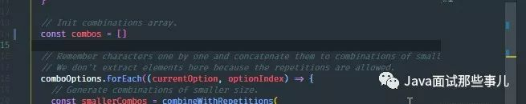

[TOC]

# 我收藏的几个更快搬砖的vscode快捷键

[爱玩IDEA的码农](https://www.zhihu.com/people/yrzx404)

微信公众号「Java面试那些事儿」。

本专栏的目的是收集全网最优秀的文章，供Java程序员成长，若有侵权，请联系我们删除。

作者：漓漾li

来源：[20个帮你更快搬砖的vscode快捷键](https://link.zhihu.com/?target=https%3A//www.jianshu.com/p/03d34539a745)?

这篇文章旨在帮助使用 VS Code 的人能够更快速的开发，不是每个人都有时间去研究每一个提示和技巧，去发现帮助他们更快开发的那一个 - 因为太多了。所以我会列出我最喜欢用的可以使我快速开发的快捷键。

let's start！

## **# 合并为一行**

Join line

1.On Mac: Ctrl + J

2.在 Ubuntu、Windows：在File > Preferences > Keyvoard shortcuts 打开快捷键设置，并将选择的快捷键绑定在edtior.action.joinLines上.

## **# 格式化代码**

这个快捷键会根据编辑器的配置去缩进代码

提示：在开发前或者开发完成后使用它。我更喜欢在我完成了文件中的代码后使用它。

1.On Windows: Shift + Alt + F

2.On Mac: Shift + Option + F

3.On Ubuntu: Ctrl + Shift + I

## **# 清除行尾的空格**

这个命令帮助你删除行首和行尾的多余空白，并且把你从各式各样的严格代码检查中脱离出来。

提示：在你完成文件中的代码的最后，使用它

或者，你可以在设置中启用空格清除设置：

1.打开用户设置（Preperences > Settings > User Settings tab）。

2.点击窗口右上角的`{}``图标，会打开一个文档。

3.如果这里没有的话，添加一个新的设置"files.trimTrailingWhitespace": true。这样一来，你就可以添加一个设置，而不是直接修改默认设置。

4.保存用户设置文件。

我们也可以绑定一个快捷键去手动触发空格清除(快捷键面板里的Trim Trailing Whitespace)。

如果你使用了新版本的 VS Code ，那么按照步骤一，然后看下面的图片。

## **# 折叠代码**

有时候如果代码很多，并且你只想整体了解下，那么折叠代码就会很有用。

1.收起光标处里边未折叠区域的代码

- On Windows /Ubuntu: Ctrl + Shift + [
- On Mac: Command+ Option + [

2.打开光标处折叠区域的代码

- On Windows /Ubuntu: Ctrl + Shift + ]
- On Mac: Command+ Option + ]

## **# 向上/向下复制代码**

- On Windows: Shift + Alt + Up/Down
- On Mac: Shift + Option + Up/Down
- On Ubuntu: Ctrl + Shift + Alt + Up/Down

而且，你可以通过File > Preferences > Keyboard Shortcuts查看绑定的快捷键，然后绑定到你喜欢的快捷键上

## **# 拆分编辑器**

- On Windows: Shift + Alt + \ or 2,3,4
- On Mac: Command + \ or 2,3,4
- On Ubuntu: Shift + Alt + \ or 2,3,4

你可以使用split editor命令拆分编辑器。原始的快捷键是1 2 3。多个文件并行开发时很有用。

而且，你可以通过File > Preferences > Keyboard Shortcuts查看绑定的快捷键，然后绑定到你喜欢的快捷键上

## **# 栅格编辑器布局**

默认情况下，编辑器组是按照垂直列布局的。你可以很轻松的把编辑器组整理成任何你喜欢的布局，横向竖向都可以。

为了支持灵活的布局，你可以创建空的编辑器组。默认情况下，关闭编辑器组中的最后一个编辑器，同样会关掉这个编辑器组，但是你可以通过设置修改这个行为：workbench.editor.closeEmptyGroups: false

在View > Editor Layout有预先定义的编辑器布局：

## **# 选中单词**

- On Windows: Ctrl+ d
- On Mac: Command + d
- On Ubuntu: Ctrl+ d

如果你点击多次Command + d, 将会添加另一个相同关键词的选中。

## **# 打开/关闭侧边栏**

- On Windows: Ctrl+ b
- On Mac: Command + b
- On Ubuntu: Ctrl+ b

## **# 导航到一个特定的行**

想要到文件的某一行，你可以使用ctrl + g快捷键，然后输入行数。

你也可以使用ctrl + p快捷键打开go-to file菜单，先输入:,在输入行号即可。

- On Windows: Ctrl + g
- On Mac: Ctrl + g or Ctrl + p
- On Ubuntu: Ctrl + g

## **# 导航到某个标志**

- On Windows: Ctrl + Shift + o
- On Mac: Command + Shift+ o
- On Ubuntu: Ctrl + Shift + o

你可以输入一个冒号给这些标志根据类型分组，@:。

## **# 导航到工作区中的某个标志**

- On Windows: Ctrl + t
- On Mac: Command + t
- On Ubuntu: Ctrl + t

## **# 删除前一个单词**

- On Windows: Ctrl + backspace
- On Mac: Command + delete
- On Ubuntu: Ctrl + backspace

这在某种情况下是很有用的，比如当你在打错字了，不想长按删除键去删除你想删除的那部分。

## **# 选中单词**

- On Windows: Ctrl + Shift + Right arrow / Left arrow
- On Mac: Command + Shift + Right arrow / Left arrow
- On Ubuntu: Ctrl + Shift + Right arrow / Left arrow

这对于快速选择单词和按需编辑是非常有用的。

## **# 复制行**

- On Windows: Ctrl + Shift + d
- On Mac: Command + Shift +d
- On Ubuntu: Ctrl + Shift + d

一个强大的众所周知的功能就是可以复制行。

## **# 删除行**

- On Windows: Ctrl + x
- On Mac: Command + x
- On Ubuntu: Ctrl + x

## **# 向上/向下添加光标**

- On Windows: Ctrl + Alt + Up arrow / Down arrow
- On Mac: Command + Alt + Up arrow / Down arrow
- On Ubuntu: Ctrl + Alt + Up arrow / Down arrow

复制光标可能是VS code中能节省最多时间的功能。在写TS的时候会它变得更有用。

## **# 重命名变量**

- On Windows: F2
- On Mac: F2
- On Ubuntu: F2

选中一个变量， 然后输入F2，或者也可以使用上下文菜单。

## **# 列区域选中**

- On Windows: Shift + Alt
- On Mac: Shift + Option
- On Ubuntu: Shift + Alt

当你使用上述快捷键并拖动你的鼠标时，你就可以选中一个区域的文本。在选中的每一行尾部将会被添加单独的光标。

## **# 命令面板**

- On Windows: Ctrl + p
- On Mac: Command + p
- On Ubuntu: Ctrl + p

可看到你当前上下文所有可用的命令。

其一些经常用到的：

### 1. 打开一个文件

想要转到某个文件，可以使用上述快捷键，然后输入你正在找的文件的名字，他将帮你很快的定位到文件。

### 2. 查看键盘绑定的命令

所有的命令以及绑定的快捷键都在命令面板里。如你忘记了某个快捷键，它可以帮助到你。

 

## **# 总结**

因为有很多的快捷键可能满足您的需要，所以我列出了PDF的链接，里边有不同系统中所有的vscode快捷键。

<https://zhuanlan.zhihu.com/p/95073721>