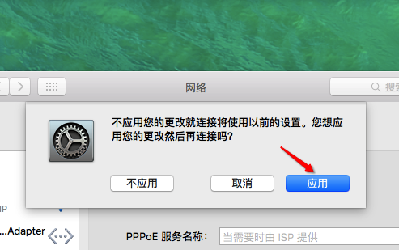
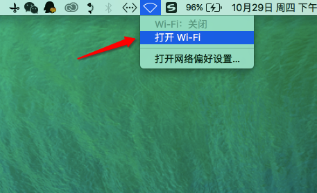

[TOC]

# Mac如何连接有线网络以及如何共享WiFi

## Mac连接有线网络：

苹果笔记本实现有线网络连接需要转换器。

MacBook Air、MacBook Pro只需一个转换器：Apple USB 以太网转接器

Apple USB 以太网转接器

Apple USB 以太网转接器

MacBook则需要两个转换器：Apple USB 以太网转接器和以下任一 USB-C 转接器

●  USB-C to USB 转接器

● USB-C Digital AV Multiport 转接器

●  USB-C to VGA Multiport 转接器

*USB-C Digital AV Multiport 转接器和 USB-C VGA Multiport 转接器有电源，推荐使用这些转接器以便可以在连接到以太网或其他设备的同时为电脑充电。

将以太网线缆通过转换器连接到电脑之后，就可以根据以下步骤连接以太网了：

1.在DOCK栏中单击【系统偏好设置】；

2.找到【网络】，单击进行设置；

3.点击“+”图标新建一个连接，如果设置被锁，请先解锁；

4.根据实际选择接口，本篇经验主要说的是PPPoE的接入方式，所以我们就在【接口】中选择PPPoE;

5.下面的【以太网】选择“Apple USB Ethernet Adapter（苹果USB网卡驱动）”，一般默认的就可以了，继续输入【服务名称】，其实什么名称都可以的，根据自己喜好来吧，我就把它命名为了PPPoE，然后点击【创建】；

6.然后写好【服务名称】（可以忽略不写），填好你的宽带【账户名称】（账号）和【密码】就行了，如果不知道你的宽带账号和密码了， 可以看看你原来的拨号记录，实在找不到，可以联系网络运营商；

7.根据提示，要想更改设置，别忘了选择【应用】；

8.连接刚创建的拨号连接，出现如图所示，就可以正常的上网了。

## Mac共享WiFi：

苹果电脑在已经连接了有线网络的情况下，无需下载安装其他WiFi共享软件即可实现WiFi共享，但如果连接的是无线网络时则不能共享WiFi，即连着WiFi时不能共享WiFi。

WiFi共享步骤如下:

1.在DOCK栏中单击【系统偏好设置】；

2.单击【网络】进行设置；

3.单击左边【Wi-Fi】，然后单击右下角【高级】；

4.勾选【创建电脑对电脑网络】，然后单击【好】；

5.在顶部菜单栏击WiFi图标，如果WiFi未打开，则单击打开，如果已经打开，则进行下一步；

6.单击【创建网络】；

7.随便取个网络名称，频段选“11”，单击【创建】；

8.再次进入【系统偏好设置】，单击【共享】；

9.单击右下角【Wi-Fi选项】；

10.设置安全性为“WPA2个人级”,然后设置密码，当然如果你想让附近的人都可以无限制连接，那就可以将安全性设置为“无”填写完毕，点击【好】；

11.单击左边【互联网共享】→【启动】；

12.等待几秒之后，菜单栏WiFi图标如图所示，说明WiFi共享成功，其他设备即可搜索连接。

