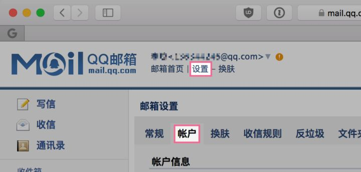
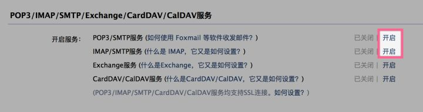
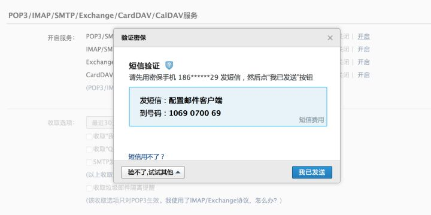
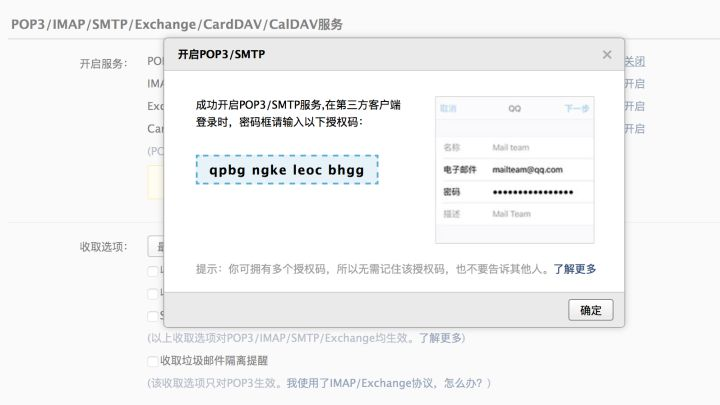
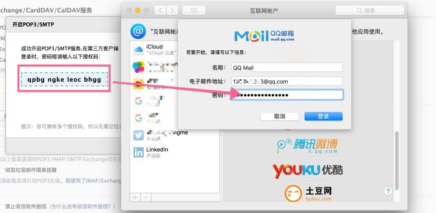
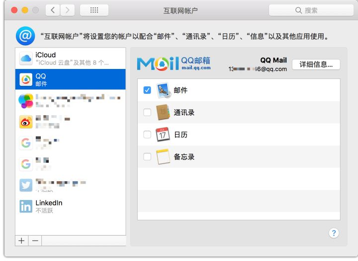
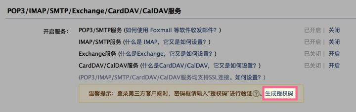

[TOC]

# 如何在mac苹果邮箱 App 里设置 QQ 邮箱账号？

[黄杨ME](https://www.zhihu.com/people/huangyangyang)

我的数字生活

42 人赞同了该文章

想直接在 Mac 和 iPhone 的「邮件」App 收发 QQ 邮箱。这样就不用另外安装一个邮箱客户端了。但是直接添加邮箱账户输入 QQ 邮箱的账号密码是不行的，你需要这样设置。

先在浏览器登录 QQ 邮箱，然后在「**设置-账户**」下**开启「POP3/SMTP服务」和「IMAP/SMTP服务」**（见下图）。

设置-账户

开启服务

此时需要短信验证。用?发送指定内容到指定号码后，再点击「我已发送」按钮。

验证密保

开启服务后会生成授权码，**这个授权码就是在第三方客户端登录时的密码**。

授权码

在「系统偏好设置-互联网账户」设置里，点击「QQ 邮箱」，输入电子邮件地址为你的 QQ 邮箱地址，密码为上一步获取的**授权码**。然后点登录按钮。

也可以在邮箱 App 的「偏好设置… ⌘,」-「账户」里添加。

添加QQ邮箱账户

设置成功！

QQ邮箱设置

如果忘了授权码，可以再次点击「生成授权码」重新生成。

生成授权码

如果你在 Mac 账户设置了邮箱账户，iOS 也会自动同步设置。

https://zhuanlan.zhihu.com/p/30980246