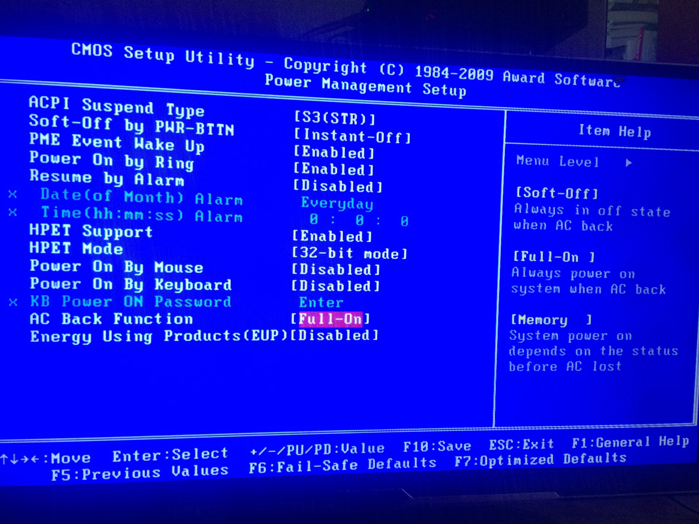

[TOC]

# 普通主板设置BIOS实现电脑插电自动启动

## **说明：**

1、为什么要实现这种功能，很多时候在民间都基本用普通PC来做小型服务器，公司的私服等等，而这些普通PC在民用电环境中经常会停电，一停就会导致服务器不能自动来电重启，所以这个功能来点开机是必须的。

2、普通PC基本都是以下这些配置方式，但不要和服务器主板做比较，服务器主板有专业的配置选项以及专业的来电自动启动设备。

## **一般设置：**

1. 进入BIOS设置，Del
2. 进入Advanced菜单
3. 进入Power Management Setup
4. 进入Restore On AC Power Loss，选择Power ON
5. 按F10保存退出

## **典型设置样例：**

## **总结：**

1、可以看出上面两个设置都不一样，但关键字主要是AC和Power，所以在设置时只要找到这两个，然后翻译一下这些选项的意思即可。

2、每张普通PC主板都不一样，关键入口是电源Pwoer。现在09年出厂的BIOS基本都具备插电源自动开机的功能，09年以前的不一样有，毕竟太老了。

https://www.cnblogs.com/EasonJim/p/8460138.html