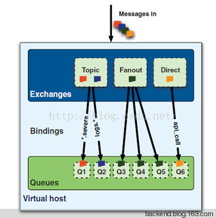
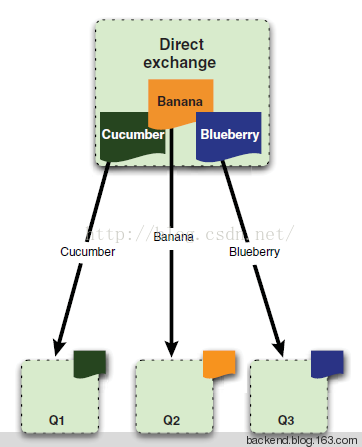
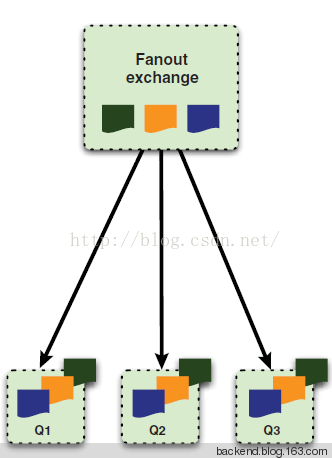
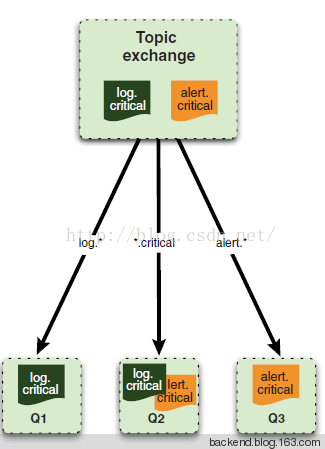

[TOC]

# rabbitMQ 整理 exchange、route、queue关系

从AMQP协议可以看出，MessageQueue、Exchange和Binding构成了AMQP协议的核心，下面我们就围绕这三个主要组件    从应用使用的角度全面的介绍如何利用Rabbit MQ构建消息队列以及使用过程中的注意事项。

 

 

## 1.声明MessageQueue

​      在Rabbit MQ中，无论是生产者发送消息还是消费者接受消息，都首先需要声明一个MessageQueue。这就存在一个问题，是生产者声明还是消费者声明呢？要解决这个问题，首先需要明确：

a)消费者是无法订阅或者获取不存在的MessageQueue中信息。

b)消息被Exchange接受以后，如果没有匹配的Queue，则会被丢弃。

在明白了上述两点以后，就容易理解如果是消费者去声明Queue，就有可能会出现在声明Queue之前，生产者已发送的消息被丢弃的隐患。如果应用能够通过消息重发的机制允许消息丢失，则使用此方案没有任何问题。但是如果不能接受该方案，这就需要无论是生产者还是消费者，在发送或者接受消息前，都需要去尝试建立消息队列。这里有一点需要明确，如果客户端尝试建立一个已经存在的消息队列，Rabbit MQ不会做任何事情，并返回客户端建立成功的。

如果一个消费者在一个信道中正在监听某一个队列的消息，Rabbit MQ是不允许该消费者在同一个channel去声明其他队列的。Rabbit MQ中，可以通过queue.declare命令声明一个队列，可以设置该队列以下属性:

a) Exclusive：排他队列，如果一个队列被声明为排他队列，该队列仅对首次声明它的连接可见，并在连接断开时自动删除。这里需要注意三点：其一，排他队列是基于连接可见的，同一连接的不同信道是可以同时访问同一个连接创建的排他队列的。其二，“首次”，如果一个连接已经声明了一个排他队列，其他连接是不允许建立同名的排他队列的，这个与普通队列不同。其三，即使该队列是持久化的，一旦连接关闭或者客户端退出，该排他队列都会被自动删除的。这种队列适用于只限于一个客户端发送读取消息的应用场景。

b)   Auto-delete:自动删除，如果该队列没有任何订阅的消费者的话，该队列会被自动删除。这种队列适用于临时队列。

 c)   Durable:持久化，这个会在后面作为专门一个章节讨论。

d)  其他选项，例如如果用户仅仅想查询某一个队列是否已存在，如果不存在，不想建立该队列，仍然可以调用queue.declare，只不过需要将参数passive设为true，传给queue.declare，如果该队列已存在，则会返回true；如果不存在，则会返回Error，但是不会创建新的队列。

## 2.生产者发送消息

在AMQP模型中，Exchange是接受生产者消息并将消息路由到消息队列的关键组件。ExchangeType和Binding决定了消息的路由规则。所以生产者想要发送消息，首先必须要声明一个Exchange和该Exchange对应的Binding。可以通过 ExchangeDeclare和BindingDeclare完成。在Rabbit MQ中，声明一个Exchange需要三个参数：ExchangeName，ExchangeType和Durable。ExchangeName是该Exchange的名字，该属性在创建Binding和生产者通过publish推送消息时需要指定。ExchangeType，指Exchange的类型，在RabbitMQ中，有三种类型的Exchange：direct ，fanout和topic，不同的Exchange会表现出不同路由行为。Durable是该Exchange的持久化属性，这个会在消息持久化章节讨论。声明一个Binding需要提供一个QueueName，ExchangeName和BindingKey。下面我们就分析一下不同的ExchangeType表现出的不同路由规则。

生产者在发送消息时，都需要指定一个RoutingKey和Exchange，Exchange在接到该RoutingKey以后，会判断该ExchangeType:

### a) 如果是Direct类型

，则会将消息中的RoutingKey与该Exchange关联的所有Binding中的BindingKey进行比较，如果相等，则发送到该Binding对应的Queue中。

 

### b)   如果是  Fanout  类型

，则会将消息发送给所有与该  Exchange  定义过  Binding  的所有  Queues  中去，其实是一种广播行为。

 

### c)如果是Topic类型

，则会按照正则表达式，对RoutingKey与BindingKey进行匹配，如果匹配成功，则发送到对应的Queue中。

​             

## 3.消费者订阅消息    

​    在RabbitMQ中消费者有2种方式获取队列中的消息:

​       a)  一种是通过basic.consume命令，订阅某一个队列中的消息,channel会自动在处理完上一条消息之后，接收下一条消息。（同一个channel消息处理是串行的）。除非关闭channel或者取消订阅，否则客户端将会一直接收队列的消息。

​       b)  另外一种方式是通过basic.get命令主动获取队列中的消息，但是绝对不可以通过循环调用basic.get来代替basic.consume，这是因为basic.get RabbitMQ在实际执行的时候，是首先consume某一个队列，然后检索第一条消息，然后再取消订阅。如果是高吞吐率的消费者，最好还是建议使用basic.consume。

如果有多个消费者同时订阅同一个队列的话，RabbitMQ是采用循环的方式分发消息的，每一条消息只能被一个订阅者接收。例如，有队列Queue，其中ClientA和ClientB都Consume了该队列，MessageA到达队列后，被分派到ClientA，ClientA回复服务器收到响应，服务器删除MessageA；再有一条消息MessageB抵达队列，服务器根据“循环推送”原则，将消息会发给ClientB，然后收到ClientB的确认后，删除MessageB；等到再下一条消息时，服务器会再将消息发送给ClientA。

这里我们可以看出，消费者再接到消息以后，都需要给服务器发送一条确认命令，这个即可以在handleDelivery里显示的调用basic.ack实现，也可以在Consume某个队列的时候，设置autoACK属性为true实现。这个ACK仅仅是通知服务器可以安全的删除该消息，而不是通知生产者，与RPC不同。 如果消费者在接到消息以后还没来得及返回ACK就断开了连接，消息服务器会重传该消息给下一个订阅者，如果没有订阅者就会存储该消息。

既然RabbitMQ提供了ACK某一个消息的命令，当然也提供了Reject某一个消息的命令。当客户端发生错误，调用basic.reject命令拒绝某一个消息时，可以设置一个requeue的属性，如果为true，则消息服务器会重传该消息给下一个订阅者；如果为false，则会直接删除该消息。当然，也可以通过ack，让消息服务器直接删除该消息并且不会重传。

## 4.持久化：

​        Rabbit MQ默认是不持久队列、Exchange、Binding以及队列中的消息的，这意味着一旦消息服务器重启，所有已声明的队列，Exchange，Binding以及队列中的消息都会丢失。通过设置Exchange和MessageQueue的durable属性为true，可以使得队列和Exchange持久化，但是这还不能使得队列中的消息持久化，这需要生产者在发送消息的时候，将delivery mode设置为2，只有这3个全部设置完成后，才能保证服务器重启不会对现有的队列造成影响。这里需要注意的是，只有durable为true的Exchange和durable为ture的Queues才能绑定，否则在绑定时，RabbitMQ都会抛错的。持久化会对RabbitMQ的性能造成比较大的影响，可能会下降10倍不止。

## 5.事务：

对事务的支持是AMQP协议的一个重要特性。假设当生产者将一个持久化消息发送给服务器时，因为consume命令本身没有任何Response返回，所以即使服务器崩溃，没有持久化该消息，生产者也无法获知该消息已经丢失。如果此时使用事务，即通过txSelect()开启一个事务，然后发送消息给服务器，然后通过txCommit()提交该事务，即可以保证，如果txCommit()提交了，则该消息一定会持久化，如果txCommit()还未提交即服务器崩溃，则该消息不会服务器就收。当然Rabbit MQ也提供了txRollback()命令用于回滚某一个事务。

## 6.Confirm机制：

​      使用事务固然可以保证只有提交的事务，才会被服务器执行。但是这样同时也将客户端与消息服务器同步起来，这背离了消息队列解耦的本质。Rabbit MQ提供了一个更加轻量级的机制来保证生产者可以感知服务器消息是否已被路由到正确的队列中——Confirm。如果设置channel为confirm状态，则通过该channel发送的消息都会被分配一个唯一的ID，然后一旦该消息被正确的路由到匹配的队列中后，服务器会返回给生产者一个Confirm，该Confirm包含该消息的ID，这样生产者就会知道该消息已被正确分发。对于持久化消息，只有该消息被持久化后，才会返回Confirm。Confirm机制的最大优点在于异步，生产者在发送消息以后，即可继续执行其他任务。而服务器返回Confirm后，会触发生产者的回调函数，生产者在回调函数中处理Confirm信息。如果消息服务器发生异常，导致该消息丢失，会返回给生产者一个nack，表示消息已经丢失，这样生产者就可以通过重发消息，保证消息不丢失。Confirm机制在性能上要比事务优越很多。但是Confirm机制，无法进行回滚，就是一旦服务器崩溃，生产者无法得到Confirm信息，生产者其实本身也不知道该消息吃否已经被持久化，只有继续重发来保证消息不丢失，但是如果原先已经持久化的消息，并不会被回滚，这样队列中就会存在两条相同的消息，系统需要支持去重。

## 其他：

Broker：简单来说就是消息队列服务器实体。
Exchange：消息交换机，它指定消息按什么规则，路由到哪个队列。
Queue：消息队列载体，每个消息都会被投入到一个或多个队列。
Binding：绑定，它的作用就是把exchange和queue按照路由规则绑定起来。
Routing Key：路由关键字，exchange根据这个关键字进行消息投递。
vhost：虚拟主机，一个broker里可以开设多个vhost，用作不同用户的权限分离。
producer：消息生产者，就是投递消息的程序。
consumer：消息消费者，就是接受消息的程序。
channel：消息通道，在客户端的每个连接里，可建立多个channel，每个channel代表一个会话任务。

消息队列的使用过程大概如下：

（1）客户端连接到消息队列服务器，打开一个channel。
（2）客户端声明一个exchange，并设置相关属性。
（3）客户端声明一个queue，并设置相关属性。
（4）客户端使用routing key，在exchange和queue之间建立好绑定关系。
（5）客户端投递消息到exchange。

 