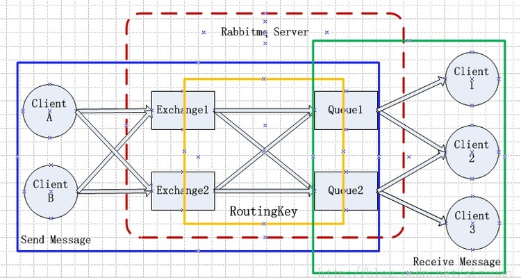

[TOC]

# rabbitMQ 消息队列- 详细介绍 Detailed Introduction

# 1. 历史

​    RabbitMQ是一个由erlang开发的AMQP（Advanced Message Queue ）的开源实现。AMQP 的出现其实也是应了广大人民群众的需求，虽然在同步消息通讯的世界里有很多公开标准（如 COBAR的 IIOP ，或者是 SOAP 等），但是在异步消息处理中却不是这样，只有大企业有一些商业实现（如微软的 MSMQ ，IBM 的 Websphere MQ 等），因此，在 2006 年的 6 月，Cisco 、Redhat、iMatix 等联合制定了 AMQP 的公开标准。

​    RabbitMQ是由RabbitMQ Technologies Ltd开发并且提供商业支持的。该公司在2010年4月被SpringSource（VMWare的一个部门）收购。在2013年5月被并入Pivotal。其实VMWare，Pivotal和EMC本质上是一家的。不同的是VMWare是独立上市子公司，而Pivotal是整合了EMC的某些资源，现在并没有上市。

​    RabbitMQ的官网是http://www.rabbitmq.com

# 2. 应用场景   

​     言归正传。RabbitMQ，或者说AMQP解决了什么问题，或者说它的应用场景是什么？

​     对于一个大型的软件系统来说，它会有很多的组件或者说模块或者说子系统或者（subsystem or Component or submodule）。那么这些模块的如何通信？这和传统的IPC有很大的区别。传统的IPC很多都是在单一系统上的，模块耦合性很大，不适合扩展（Scalability）；如果使用socket那么不同的模块的确可以部署到不同的机器上，但是还是有很多问题需要解决。比如：

 1）信息的发送者和接收者如何维持这个连接，如果一方的连接中断，这期间的数据如何方式丢失？

 2）如何降低发送者和接收者的耦合度？

 3）如何让Priority高的接收者先接到数据？

 4）如何做到load balance？有效均衡接收者的负载？

 5）如何有效的将数据发送到相关的接收者？也就是说将接收者subscribe 不同的数据，如何做有效的filter。

 6）如何做到可扩展，甚至将这个通信模块发到cluster上？

 7）如何保证接收者接收到了完整，正确的数据？

  AMDQ协议解决了以上的问题，而RabbitMQ实现了AMQP。

# 3. 系统架构

​      成为系统[架构](http://lib.csdn.net/base/16)可能不太合适，可能叫应用场景的系统架构更合适。

  

​    这个系统架构图版权属于sunjun041640。

​    **RabbitMQ Server**： 也叫broker server，它不是运送食物的卡车，而是一种传输服务。原话是**RabbitMQ**isn’t a food truck, it’s a delivery service. 他的角色就是维护一条从Producer到Consumer的路线，保证数据能够按照指定的方式进行传输。但是这个保证也不是100%的保证，但是对于普通的应用来说这已经足够了。当然对于商业系统来说，可以再做一层数据一致性的guard，就可以彻底保证系统的一致性了。

​    **Client A & B**： 也叫Producer，数据的发送方。createmessages and publish (send) them to a broker server (RabbitMQ).一个Message有两个部分：payload（有效载荷）和label（标签）。payload顾名思义就是传输的数据。label是exchange的名字或者说是一个tag，它描述了payload，而且RabbitMQ也是通过这个label来决定把这个Message发给哪个Consumer。AMQP仅仅描述了label，而RabbitMQ决定了如何使用这个label的规则。

​    **Client 1，2，3**：也叫Consumer，数据的接收方。Consumersattach to a broker server (RabbitMQ) and subscribe to a queue。把queue比作是一个有名字的邮箱。当有Message到达某个邮箱后，RabbitMQ把它发送给它的某个订阅者即Consumer。当然可能会把同一个Message发送给很多的Consumer。在这个Message中，只有payload，label已经被删掉了。对于Consumer来说，它是不知道谁发送的这个信息的。就是协议本身不支持。但是当然了如果Producer发送的payload包含了Producer的信息就另当别论了。

​     对于一个数据从Producer到Consumer的正确传递，还有三个概念需要明确：exchanges, queues and bindings。

​        **Exchanges** are where producers publish their messages.

**        Queues**are where the messages end up and are received by consumers

**        Bindings** are how the messages get routed from the exchange to particular queues.

   还有几个概念是上述图中没有标明的，那就是Connection（连接），Channel（通道，频道）。

**   Connection**： 就是一个TCP的连接。Producer和Consumer都是通过TCP连接到RabbitMQ Server的。以后我们可以看到，程序的起始处就是建立这个TCP连接。

**   Channels： **虚拟连接。它建立在上述的TCP连接中。数据流动都是在Channel中进行的。也就是说，一般情况是程序起始建立TCP连接，第二步就是建立这个Channel。

​    **那么，为什么使用Channel，而不是直接使用TCP连接？**

​    对于OS来说，建立和关闭TCP连接是有代价的，频繁的建立关闭TCP连接对于系统的性能有很大的影响，而且TCP的连接数也有限制，这也限制了系统处理高并发的能力。但是，在TCP连接中建立Channel是没有上述代价的。对于Producer或者Consumer来说，可以并发的使用多个Channel进行Publish或者Receive。有实验表明，1s的数据可以Publish10K的数据包。当然对于不同的硬件环境，不同的数据包大小这个数据肯定不一样，但是我只想说明，对于普通的Consumer或者Producer来说，这已经足够了。如果不够用，你考虑的应该是如何细化split你的设计。

# 4. 进一步的细节阐明

## 4.1 使用ack确认Message的正确传递 

   默认情况下，如果Message 已经被某个Consumer正确的接收到了，那么该Message就会被从queue中移除。当然也可以让同一个Message发送到很多的Consumer。

​    如果一个queue没被任何的Consumer Subscribe（订阅），那么，如果这个queue有数据到达，那么这个数据会被cache，不会被丢弃。当有Consumer时，这个数据会被立即发送到这个Consumer，这个数据被Consumer正确收到时，这个数据就被从queue中删除。

​     那么什么是正确收到呢？通过ack。每个Message都要被**acknowledged**（确认，ack）。我们可以显示的在程序中去ack，也可以自动的ack。如果有数据没有被ack，那么：

​     RabbitMQ Server会把这个信息发送到下一个Consumer。

​    如果这个app有bug，忘记了ack，那么RabbitMQ Server不会再发送数据给它，因为Server认为这个Consumer处理能力有限。

   而且ack的机制可以起到限流的作用（**Benefitto throttling**）：在Consumer处理完成数据后发送ack，甚至在额外的延时后发送ack，将有效的balance Consumer的load。

   当然对于实际的例子，比如我们可能会对某些数据进行merge，比如merge 4s内的数据，然后sleep 4s后再获取数据。特别是在监听系统的state，我们不希望所有的state实时的传递上去，而是希望有一定的延时。这样可以减少某些IO，而且终端用户也不会感觉到。

## 4.2 Reject a message

   有两种方式，第一种的Reject可以让RabbitMQ Server将该Message 发送到下一个Consumer。第二种是从queue中立即删除该Message。

## 4.3  Creating a queue

**      **Consumer和Procuder都可以通过 **queue.declare** 创建queue。对于某个Channel来说，Consumer不能declare一个queue，却订阅其他的queue。当然也可以创建私有的queue。这样只有app本身才可以使用这个queue。queue也可以自动删除，被标为auto-delete的queue在最后一个Consumer unsubscribe后就会被自动删除。那么如果是创建一个已经存在的queue呢？那么不会有任何的影响。需要注意的是没有任何的影响，也就是说第二次创建如果参数和第一次不一样，那么该操作虽然成功，但是queue的属性并不会被修改。

​    **那么谁应该负责创建这个queue呢？是Consumer，还是Producer？**

如果queue不存在，当然Consumer不会得到任何的Message。但是如果queue不存在，那么Producer Publish的Message会被丢弃。所以，还是为了数据不丢失，Consumer和Producer都try to create the queue！反正不管怎么样，这个接口都不会出问题。

   queue对load balance的处理是完美的。对于多个Consumer来说，RabbitMQ 使用循环的方式（round-robin）的方式均衡的发送给不同的Consumer。

## 4.4 Exchanges   

​    从架构图可以看出，Procuder Publish的Message进入了Exchange。接着通过“routing keys”， RabbitMQ会找到应该把这个Message放到哪个queue里。queue也是通过这个routing keys来做的绑定。

​     有三种类型的Exchanges：direct, fanout,topic。 每个实现了不同的路由算法（routing algorithm）。

·        **Direct exchange**: 如果 routing key 匹配, 那么Message就会被传递到相应的queue中。其实在queue创建时，它会自动的以queue的名字作为routing key来绑定那个exchange。

·        **Fanout exchange**: 会向响应的queue广播。

·        **Topic exchange**: 对key进行模式匹配，比如ab*可以传递到所有ab*的queue。

## 4.5 Virtual hosts

   每个virtual host本质上都是一个RabbitMQ Server，拥有它自己的queue，exchagne，和bings rule等等。这保证了你可以在多个不同的application中使用RabbitMQ。

   接下来我会使用[Python](http://lib.csdn.net/base/11)来说明RabbitMQ的使用方法。

请移步[ RabbitMQ消息队列（二）：”Hello, World“ ](http://blog.csdn.net/anzhsoft/article/details/19570187)

   尊重原创，转载请注明出处 anzhsoft http://blog.csdn.net/anzhsoft/article/details/19563091。