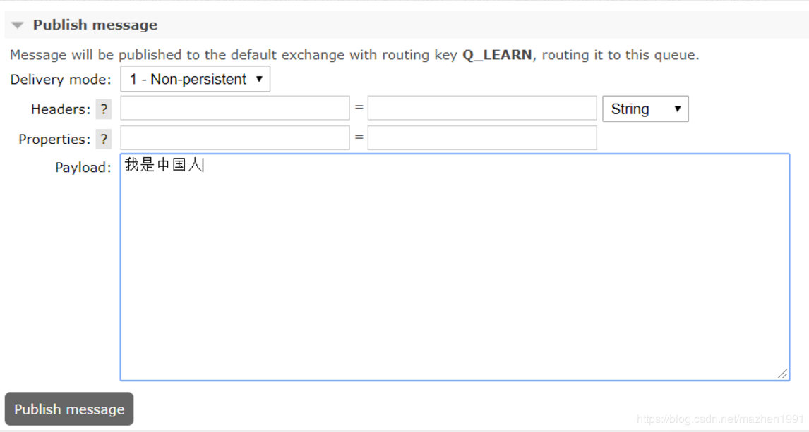
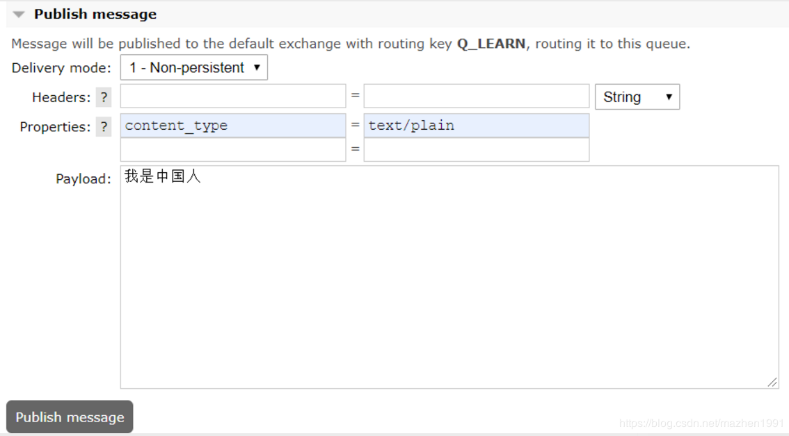

# rabbitmq 接收控制台发送的消息为一个字节字符串的问题

原创mazhen1991 发布于2019-09-03 09:18:37

rabbitmq的控制台可以直接向指定队列发送消息，很方便我们在开发消费者的过程中进行调试，当我们在rabbitmq指定的queue中发送一条消息时：



而我们的接收端收到的消息却不是“我是中国人这段字符串”，而是它的字节字符串：

```
-26,-120,-111,-26,-104,-81,-28,-72,-83,-27,-101,-67,-28,-70,-70
```

这明显是不符合我们的预期的，经过查看生产者的api，发现发送消息时有两个方法：

 ```
1. send
2. convertAndSend
 ```

我发现通过send方法发送的消息，我们接收的也是字节字符串，而通过convertAndSend发送的消息，接收的就是我们想要的结果，通过跟踪代码，我们发现，convertAndSend方法中会添加一些Properties，其中一个就是content_type=text/plain ，我们在控制台上也添加这个参数：



再次发送，我们发现接收到的就是“我是中国人”了。


原文链接：https://blog.csdn.net/mazhen1991/article/details/100509672