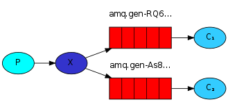

# 【3】RabbitMQ入门教程 Publish/Subscribe 发布/订阅

 源码地址 
<https://github.com/chwshuang/rabbitmq.git>

 在上一章中，我们学习创建了一个消息队列，她的每个任务消息只发送给一个工人。这一章，我们会将同一个任务消息发送给多个工人。这种模式就是“发布/订阅”。

为了说明这种模式，我们将以一个日志系统进行讲解：一个日志发送者，两个日志接收者，接收者1可以把这条日志写入到磁盘上，另外一个接收者2可以将这条日志打印到控制台中。

“发布/订阅”模式的基础是将消息广播到所有的接收器上。

### 交换器

在之前的教程中，我们都是直接在消息队列中进行发送和接收消息，现在开始要介绍RabbitMQ完整的消息模型了。 
首先，我们先来回顾一下之前学到关于RabbitMQ的内容：

- 生产者是发送消息的应用程序
- 队列是存储消息的缓冲区
- 消费者是接收消息的应用程序

实际上，RabbitMQ中消息传递模型的核心思想是：生产者不直接发送消息到队列。实际的运行环境中，生产者是不知道消息会发送到那个队列上，她只会将消息发送到一个交换器，交换器也像一个生产线，她一边接收生产者发来的消息，另外一边则根据交换规则，将消息放到队列中。交换器必须知道她所接收的消息是什么？它应该被放到那个队列中？它应该被添加到多个队列吗？还是应该丢弃？这些规则都是按照交换器的规则来确定的。 


#### **交换器的规则有：**

- direct （直连）
- topic （主题）
- headers （标题）
- fanout （分发）也有翻译为扇出的。

我们将使用【fanout】类型创建一个名称为 logs的交换器，

```
channel.exchangeDeclare("logs", "fanout");
```

分发交换器很简单，你通过名称也能想到，她是广播所有的消息，

> 交换器列表 
> 通过rabbitmqctl list_exchanges指令列出服务器上所有可用的交换器

```
$ sudo rabbitmqctl list_exchanges
Listing exchanges ...
        direct
amq.direct      direct
amq.fanout      fanout
amq.headers     headers
amq.match       headers
amq.rabbitmq.log        topic
amq.rabbitmq.trace      topic
amq.topic       topic
logs    fanout
...done.
```

> 这个列表里面所有以【amq.*】开头的交换器都是RabbitMQ默认创建的。在生产环境中，可以自己定义。
>
> **匿名交换器** 
> 在之前的教程中，我们知道，发送消息到队列时根本没有使用交换器，但是消息也能发送到队列。这是因为RabbitMQ选择了一个空“”字符串的默认交换器。 
> 来看看我们之前的代码：

```
channel.basicPublish("", "hello", null, message.getBytes());
```

> 第一个参数就是交换器的名称。如果输入“”空字符串，表示使用默认的匿名交换器。 
> 第二个参数是【routingKey】路由线索 
> **匿名交换器规则：** 
> 发送到routingKey名称对应的队列。

现在，我们可以发送消息到交换器中：

```
channel.basicPublish( "logs", "", null, message.getBytes());
```

### 临时队列

记得前两章中使用的队列指定的名称吗？（Hello World和task_queue）. 
如果要在生产者和消费者之间创建一个新的队列，又不想使用原来的队列，临时队列就是为这个场景而生的：

1. 首先，每当我们连接到RabbitMQ，我们需要一个新的空队列，我们可以用一个随机名称来创建，或者说让服务器选择一个随机队列名称给我们。
2. 一旦我们断开消费者，队列应该立即被删除。

在Java客户端，提供queuedeclare()为我们创建一个非持久化、独立、自动删除的队列名称。

```
String queueName = channel.queueDeclare().getQueue();
```

通过上面的代码就能获取到一个随机队列名称。 
例如：它可能是：amq.gen-jzty20brgko-hjmujj0wlg。

### 绑定


如果我们已经创建了一个分发交换器和队列，现在我们就可以就将我们的队列跟交换器进行绑定。

```
channel.queueBind(queueName, "logs", "");
```

执行完这段代码后，日志交换器会将消息添加到我们的队列中。

> **绑定列表** 
> 如果要查看绑定列表，可以执行【rabbitmqctl list_bindings】命令

### 全部代码



### 目录


生产者程序，他负责发送日志消息，与之前不同的是它不是将消息发送到匿名交换器中，而是发送到一个名为【logs】的交换器中。我们提供一个空字符串的routingkey，它的功能被交换器的分发类型代替了。下面是EmitLog.java的代码：

```
import com.rabbitmq.client.Channel;
import com.rabbitmq.client.Connection;
import com.rabbitmq.client.ConnectionFactory;

public class EmitLog {

    private static final String EXCHANGE_NAME = "logs";

    public static void main(String[] argv) throws Exception {

        ConnectionFactory factory = new ConnectionFactory();
        factory.setHost("localhost");
        Connection connection = factory.newConnection();
        Channel channel = connection.createChannel();

        channel.exchangeDeclare(EXCHANGE_NAME, "fanout");

//      分发消息for(int i = 0 ; i < 5; i++){
            String message = "Hello World! " + i;
             channel.basicPublish(EXCHANGE_NAME, "", null, message.getBytes());
             System.out.println(" [x] Sent '" + message + "'");
        }
        channel.close();
        connection.close();
    }
}
```

上面的代码中，在建立连接后，我们声明了一个交互。如果当前没有队列被绑定到交换器，消息将被丢弃，因为没有消费者监听，这条消息将被丢弃。

下面的代码是接收日志ReceiveLogs1.java 和ReceiveLogs2.java:

```
import com.rabbitmq.client.*;

import java.io.IOException;

public class ReceiveLogs1 {
    private static final String EXCHANGE_NAME = "logs";

    public static void main(String[] argv) throws Exception {
        ConnectionFactory factory = new ConnectionFactory();
        factory.setHost("localhost");
        Connection connection = factory.newConnection();
        Channel channel = connection.createChannel();

        channel.exchangeDeclare(EXCHANGE_NAME, "fanout");
        String queueName = channel.queueDeclare().getQueue();
        channel.queueBind(queueName, EXCHANGE_NAME, "");

        System.out.println(" [*] Waiting for messages. To exit press CTRL+C");

        Consumer consumer = new DefaultConsumer(channel) {
            @Overridepublic void handleDelivery(String consumerTag, Envelope envelope, AMQP.BasicProperties properties, byte[] body) throws IOException {
                String message = new String(body, "UTF-8");
                System.out.println(" [x] Received '" + message + "'");
            }
        };
        channel.basicConsume(queueName, true, consumer);
    }
}
```

```
import com.rabbitmq.client.*;

import java.io.IOException;

public class ReceiveLogs1 {
    private static final String EXCHANGE_NAME = "logs";

    public static void main(String[] argv) throws Exception {
        ConnectionFactory factory = new ConnectionFactory();
        factory.setHost("localhost");
        Connection connection = factory.newConnection();
        Channel channel = connection.createChannel();

        channel.exchangeDeclare(EXCHANGE_NAME, "fanout");
        String queueName = channel.queueDeclare().getQueue();
        channel.queueBind(queueName, EXCHANGE_NAME, "");

        System.out.println(" [*] Waiting for messages. To exit press CTRL+C");

        Consumer consumer = new DefaultConsumer(channel) {
            @Overridepublic void handleDelivery(String consumerTag, Envelope envelope, AMQP.BasicProperties properties, byte[] body) throws IOException {
                String message = new String(body, "UTF-8");
                System.out.println(" [x] Received '" + message + "'");
            }
        };
        channel.basicConsume(queueName, true, consumer);
    }
}
```

### 运行

先运行ReceiveLogs1和ReceiveLogs2可以看到日志：

```
 [*] Waiting for messages. To exit press CTRL+C
```

然后运行EmitLog：

```
EmitLog日志：
 [x] Sent 'Hello World! 0'
 [x] Sent 'Hello World! 1'
 [x] Sent 'Hello World! 2'
 [x] Sent 'Hello World! 3'
 [x] Sent 'Hello World! 4'

ReceiveLogs1和ReceiveLogs2日志
 [*] Waiting for messages. To exit press CTRL+C
 [x] Received 'Hello World! 0'
 [x] Received 'Hello World! 1'
 [x] Received 'Hello World! 2'
 [x] Received 'Hello World! 3'
 [x] Received 'Hello World! 4'
```

看到这里，说明我们的程序运行正常，消费者通过声明【logs】交换器和【fanout】类型，接收到了来自【logs】交换器的所有消息。

使用【rabbitmqctl list_bindings】命令可以看到两个临时队列的名称

```
$ sudo rabbitmqctl list_bindings
Listing bindings ...
logs    exchange        amq.gen-JzTY20BRgKO-HjmUJj0wLg  queue           []
logs    exchange        amq.gen-vso0PVvyiRIL2WoV3i48Yg  queue           []
...done.
```

以上就是这一章讲的发布/订阅模式，下一章将介绍消息路由（Routing）

 

上一篇：[【2】 - Work Queues](http://www.kancloud.cn/digest/rabbitmq-for-java/122039)

下一篇：[【5】 - Topic](http://www.kancloud.cn/digest/rabbitmq-for-java/122041)

来源： <http://www.kancloud.cn/digest/rabbitmq-for-java/122040>