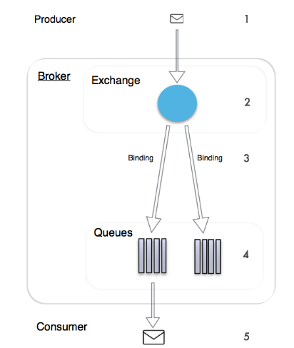

[TOC]


# RabbitMQ Exchange类型详解

## 前言

在上一篇文章中，我们知道了RabbitMQ的消息流程如下：



但在具体的使用中，我们还需知道exchange的类型，因为不同的类型对应不同的队列和路由规则。

在rabbitmq中，exchange有4个类型：direct，topic，fanout，header。

### direct exchange

此类型的exchange路由规则很简单：

exchange在和queue进行binding时会设置**routingkey**

```
channel.QueueBind(queue: "create_pdf_queue",
                    exchange: "pdf_events",
                    routingKey: "pdf_create",
                    arguments: null);
```

 然后我们在将消息发送到exchange时会设置对应的**routingkey**：

```
channel.BasicPublish(exchange: "pdf_events",
                        routingKey: "pdf_create",
                        basicProperties: properties,
                        body: body);
```

 在direct类型的exchange中，只有这两个routingkey完全相同，exchange才会选择对应的binging进行消息路由。

具体的流程如下：


通过代码可以会理解好一点：

```
var factory = new ConnectionFactory() { HostName = "localhost" };
using (var connection = factory.CreateConnection())
using (var channel = connection.CreateModel())
{
    // Direct类型的exchange, 名称 pdf_events
    channel.ExchangeDeclare(exchange: "pdf_events",
                            type: ExchangeType.Direct,
                            durable: true,
                            autoDelete: false,
                            arguments: null);

    // 创建create_pdf_queue队列
    channel.QueueDeclare(queue: "create_pdf_queue",
                            durable: true,
                            exclusive: false,
                            autoDelete: false,
                            arguments: null);

    //创建 pdf_log_queue队列
    channel.QueueDeclare(queue: "pdf_log_queue",
                            durable: true,
                            exclusive: false,
                            autoDelete: false,
                            arguments: null);

    //绑定 pdf_events --> create_pdf_queue 使用routingkey:pdf_create
    channel.QueueBind(queue: "create_pdf_queue",
                        exchange: "pdf_events",
                        routingKey: "pdf_create",
                        arguments: null);

    //绑定 pdf_events --> pdf_log_queue 使用routingkey:pdf_log
    channel.QueueBind(queue: "pdf_log_queue",
                        exchange: "pdf_events",
                        routingKey: "pdf_log",
                        arguments: null);


    var message = "Demo some pdf creating...";
    var body = Encoding.UTF8.GetBytes(message);
    var properties = channel.CreateBasicProperties();
    properties.Persistent = true;

    //发送消息到exchange :pdf_events ,使用routingkey: pdf_create
    //通过binding routinekey的比较，次消息会路由到队列 create_pdf_queue
    channel.BasicPublish(exchange: "pdf_events",
                routingKey: "pdf_create",
                basicProperties: properties,
                body: body);

    message = "pdf loging ...";
    body = Encoding.UTF8.GetBytes(message);
    properties = channel.CreateBasicProperties();
    properties.Persistent = true;

    //发送消息到exchange :pdf_events ,使用routingkey: pdf_log
    //通过binding routinekey的比较，次消息会路由到队列 pdf_log_queue
    channel.BasicPublish(exchange: "pdf_events",
            routingKey: "pdf_log",
            basicProperties: properties,
            body: body);

    
}
```

###  topic exchange

此类型exchange和上面的direct类型差不多，但direct类型要求routingkey完全相等，这里的routingkey可以有通配符：'*','#'.

其中'*'表示匹配一个单词， '#'则表示匹配没有或者多个单词


如上图第一个binding：

- exchange: agreements
- queue A: berlin_agreements
- binding routingkey: agreements.eu.berlin.#

第二个binding: 

- exchange: agreements
- queue B: all_agreements
- binding routingkey: agreements.#

第三个binding：

- exchange: agreements
- queue c: headstore_agreements
- binding routingkey: agreements.eu.*.headstore

所以如果我们消息的routingkey为*agreements.eu.berlin那么符合第一和第二个binding，但最后一个不符合*，具体的代码如下：

```
var factory = new ConnectionFactory() { HostName = "localhost" };
using (var connection = factory.CreateConnection())
using (var channel = connection.CreateModel())
{
    // Topic类型的exchange, 名称 agreements
    channel.ExchangeDeclare(exchange: "agreements",
                            type: ExchangeType.Topic,
                            durable: true,
                            autoDelete: false,
                            arguments: null);

    // 创建berlin_agreements队列
    channel.QueueDeclare(queue: "berlin_agreements",
                            durable: true,
                            exclusive: false,
                            autoDelete: false,
                            arguments: null);

    //创建 all_agreements 队列
    channel.QueueDeclare(queue: "all_agreements",
                            durable: true,
                            exclusive: false,
                            autoDelete: false,
                            arguments: null);

    //创建 headstore_agreements 队列
    channel.QueueDeclare(queue: "headstore_agreements",
                            durable: true,
                            exclusive: false,
                            autoDelete: false,
                            arguments: null);

    //绑定 agreements --> berlin_agreements 使用routingkey:agreements.eu.berlin.#
    channel.QueueBind(queue: "berlin_agreements",
                        exchange: "agreements",
                        routingKey: "agreements.eu.berlin.#",
                        arguments: null);

    //绑定 agreements --> all_agreements 使用routingkey:agreements.#
    channel.QueueBind(queue: "all_agreements",
                        exchange: "agreements",
                        routingKey: "agreements.#",
                        arguments: null);

    //绑定 agreements --> headstore_agreements 使用routingkey:agreements.eu.*.headstore
    channel.QueueBind(queue: "headstore_agreements",
                        exchange: "agreements",
                        routingKey: "agreements.eu.*.headstore",
                        arguments: null);


    var message = "hello world";
    var body = Encoding.UTF8.GetBytes(message);
    var properties = channel.CreateBasicProperties();
    properties.Persistent = true;

    //发送消息到exchange :agreements ,使用routingkey: agreements.eu.berlin
    //agreements.eu.berlin 匹配  agreements.eu.berlin.## 和agreements.#
    //agreements.eu.berlin 不匹配  agreements.eu.*.headstore
    //最终次消息会路由到队里：berlin_agreements（agreements.eu.berlin.#） 和 all_agreements（agreements.#）
    channel.BasicPublish(exchange: "agreements",
                            routingKey: "agreements.eu.berlin",
                            basicProperties: properties,
                            body: body);

               
}
```

###  fanout exchange

此exchange的路由规则很简单直接将消息路由到所有绑定的队列中，无须对消息的routingkey进行匹配操作。


### header exchange

 此类型的exchange和以上三个都不一样，其路由的规则是根据header来判断，其中的header就是以下方法的**arguments**参数：

```
Dictionary<string, object> aHeader = new Dictionary<string, object>();
aHeader.Add("format", "pdf");
aHeader.Add("type", "report");
aHeader.Add("x-match", "all");
channel.QueueBind(queue: "queue.A",
                    exchange: "agreements",
                    routingKey: string.Empty,
                    arguments: aHeader);
```

其中的x-match为特殊的header，可以为all则表示要匹配所有的header，如果为any则表示只要匹配其中的一个header即可。

在发布消息的时候就需要传入header值：

```
var properties = channel.CreateBasicProperties();
properties.Persistent = true;
Dictionary<string, object> mHeader1 = new Dictionary<string, object>();
mHeader1.Add("format", "pdf");
mHeader1.Add("type", "report");
properties.Headers = mHeader1;
```

 具体的规则可以看以下代码：

```java
var factory = new ConnectionFactory() { HostName = "localhost" };
using (var connection = factory.CreateConnection())
using (var channel = connection.CreateModel())
{
    // Headers类型的exchange, 名称 agreements
    channel.ExchangeDeclare(exchange: "agreements",
                            type: ExchangeType.Headers,
                            durable: true,
                            autoDelete: false,
                            arguments: null);

    // 创建queue.A队列
    channel.QueueDeclare(queue: "queue.A", durable: true, exclusive: false, autoDelete: false, arguments: null);

    //创建 queue.B 队列
    channel.QueueDeclare(queue: "queue.B", durable: true, exclusive: false, autoDelete: false, arguments: null);

    //创建 queue.C 队列
    channel.QueueDeclare(queue: "queue.C", durable: true, exclusive: false, autoDelete: false, arguments: null);

    //绑定 agreements --> queue.A 使用arguments (format=pdf, type=report, x-match=all)
    Dictionary<string, object> aHeader = new Dictionary<string, object>();
    aHeader.Add("format", "pdf");
    aHeader.Add("type", "report");
    aHeader.Add("x-match", "all");
    channel.QueueBind(queue: "queue.A",
                        exchange: "agreements",
                        routingKey: string.Empty,
                        arguments: aHeader);

    //绑定 agreements --> queue.B 使用arguments (format=pdf, type=log, x-match=any)
    Dictionary<string, object> bHeader = new Dictionary<string, object>();
    bHeader.Add("format", "pdf");
    bHeader.Add("type", "log");
    bHeader.Add("x-match", "any");
    channel.QueueBind(queue: "queue.B",
                        exchange: "agreements",
                        routingKey: string.Empty,
                        arguments: bHeader);

    //绑定 agreements --> queue.C 使用arguments (format=zip, type=report, x-match=all)
    Dictionary<string, object> cHeader = new Dictionary<string, object>();
    cHeader.Add("format", "zip");
    cHeader.Add("type", "report");
    cHeader.Add("x-match", "all");
    channel.QueueBind(queue: "queue.C",
                        exchange: "agreements",
                        routingKey: string.Empty,
                        arguments: cHeader);


    string message1 = "hello world";
    var body = Encoding.UTF8.GetBytes(message1);
    var properties = channel.CreateBasicProperties();
    properties.Persistent = true;
    Dictionary<string, object> mHeader1 = new Dictionary<string, object>();
    mHeader1.Add("format", "pdf");
    mHeader1.Add("type", "report");
    properties.Headers = mHeader1;
    //此消息路由到 queue.A 和 queue.B
    //queue.A 的binding (format=pdf, type=report, x-match=all)
    //queue.B 的binding (format = pdf, type = log, x - match = any)
    channel.BasicPublish(exchange: "agreements",
                            routingKey: string.Empty,
                            basicProperties: properties,
                            body: body);


    string message2 = "hello world";
    body = Encoding.UTF8.GetBytes(message2);
    properties = channel.CreateBasicProperties();
    properties.Persistent = true;
    Dictionary<string, object> mHeader2 = new Dictionary<string, object>();
    mHeader2.Add("type", "log");
    properties.Headers = mHeader2;
    //x-match 配置queue.B 
    //queue.B 的binding (format = pdf, type = log, x-match = any)
    channel.BasicPublish(exchange: "agreements",
                    routingKey: string.Empty,
                    basicProperties: properties,
                    body: body);

    string message3= "hello world";
    body = Encoding.UTF8.GetBytes(message3);
    properties = channel.CreateBasicProperties();
    properties.Persistent = true;
    Dictionary<string, object> mHeader3 = new Dictionary<string, object>();
    mHeader3.Add("format", "zip");
    properties.Headers = mHeader3;
    //配置失败，不会被路由
    channel.BasicPublish(exchange: "agreements",
                    routingKey: string.Empty,
                    basicProperties: properties,
                    body: body);


}
```

##  总计

以上就是exchange 类型的总结，一般来说direct和topic用来具体的路由消息，如果要用广播的消息一般用fanout的exchange。

header类型用的比较少，但还是知道一点好。


https://www.cnblogs.com/julyluo/p/6265775.html