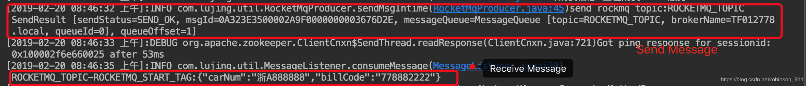

[TOC]


# RocketMQ与Spring集成（含生产者消费者）

2019年02月20日 09:03:30 [水桶前辈](https://me.csdn.net/robinson_911) 阅读数：172


## 一. 启动RocketMQ环境，如上几篇博客的配置。

\1. 启动mqnamesrv

cd /Users/sunww/Documents/JAVA/MQ/rocketmq-all-4.2.0-bin-release  

nohup sh bin/mqnamesrv &

tail -f ~/logs/rocketmqlogs/namesrv.log

\2. 启动broker

nohup sh bin/mqbroker -n localhost:9876 &

## 二. Spring集成配置（spring-rocketMQ.xml加入到Spring中）

```xml

<?xml version="1.0" encoding="UTF-8"?>
<beans xmlns="http://www.springframework.org/schema/beans"
       xmlns:xsi="http://www.w3.org/2001/XMLSchema-instance"
       xsi:schemaLocation="http://www.springframework.org/schema/beans
	http://www.springframework.org/schema/beans/spring-beans.xsd">
    <bean id="consumer"
          class="com.alibaba.rocketmq.client.consumer.DefaultMQPushConsumer">
        <constructor-arg name="consumerGroup" value="mySpring" />
        <property name="namesrvAddr" value="127.0.0.1:9876" />
    </bean>
 
    <!--监听消息-->
    <bean id="messageListener" class="com.lujing.util.MessageListener">
    </bean>
 
    <!--生产消息-->
    <bean id="rocketMqProducer" class="com.lujing.util.RocketMqProducer"
          init-method="init" lazy-init="false" />
 
    <!-- 订阅topic是ROCKETMQ_TOPIC的消息  -->
    <bean id="rocketmqConsumer" class="com.alibaba.rocketmq.client.consumer.DefaultMQPushConsumer" init-method="start" destroy-method="shutdown">
        <property name="consumerGroup" value="mySpring"/>
        <property name="namesrvAddr" value="127.0.0.1:9876"/>
        <property name="messageListener" ref="messageListener"/>
        <property name="subscription">
            <map>
                <!--<entry key="${rocketmq.topic}" value="${rocketmq.tags}" />-->
                <entry key="ROCKETMQ_TOPIC" value="ROCKETMQ_START_TAG" />
            </map>
        </property>
    </bean>
 
</beans> 
```

## 三. 封装生产者和消费者（消息监听）

### \1. 生产者RocketMqProducer

```java
package com.sww.util;
 
import org.slf4j.Logger;
import org.slf4j.LoggerFactory;
 
import com.alibaba.rocketmq.client.exception.MQClientException;
import com.alibaba.rocketmq.client.producer.DefaultMQProducer;
import com.alibaba.rocketmq.common.message.Message;
 
 
/**
 * rocketmq消息的生产者
 *
 * @author TF 2018-1-20 下午2:30:03
 */
public class RocketMqProducer {
    private static final Logger       LOGGER         = LoggerFactory.getLogger(RocketMqProducer.class);
 
    public static DefaultMQProducer producer = null;
 
    public static void init(){
        producer = new DefaultMQProducer("myspring");
        producer.setNamesrvAddr("127.0.0.1:9876");
        try {
            producer.start();
        } catch (MQClientException e) {
 
        }
    }
 
    /**
     * rocketmq发送消息方法
     *
     * @author TF013242 2018-1-20 下午2:32:19
     * @param topic 组名
     * @param tagName 同一个topic下的不同 分支,同一个消费者只能取一个组的下的不同的tag分支
     * @param key 保持唯一
     * @param msgBody消息体
     * @return
     */
    public static void sendMsgIntime(String topic, String tagName, String key, byte[] msgBody) {
        Message msg = new Message(topic,tagName,key,msgBody);
        try {
            String result = producer.send(msg).toString();
            LOGGER.info("send rockmq topic:" + topic + " " + result);
        } catch (Exception e) {
            LOGGER.error("send rockmq error topic:" + topic + new String(msgBody), e);
        }
    }
} 
```

### \2. 消费者（消息监听器）

```java
package com.sww.util;
 
import com.alibaba.fastjson.JSONArray;
import com.alibaba.rocketmq.client.consumer.listener.ConsumeConcurrentlyContext;
import com.alibaba.rocketmq.client.consumer.listener.ConsumeConcurrentlyStatus;
import com.alibaba.rocketmq.client.consumer.listener.MessageListenerConcurrently;
import com.alibaba.rocketmq.common.message.Message;
import com.alibaba.rocketmq.common.message.MessageExt;
import org.apache.commons.lang.StringUtils;
import org.apache.log4j.Logger;
import org.springframework.beans.factory.annotation.Autowired;
 
import java.util.Date;
import java.util.List;
 
/**
 *
 * rocketMQ消息处理
 */
public class MessageListener implements MessageListenerConcurrently {
 
    private static final Logger logger = Logger.getLogger(MessageListener.class);
 
    @Override
    public ConsumeConcurrentlyStatus consumeMessage(List<MessageExt> msgs, ConsumeConcurrentlyContext context) {
        Message msg = msgs.get(0);
        String body = null;
        try {
            body = new String(msg.getBody(), "utf-8");
            logger.info(msg.getTopic() +"-"+msg.getTags()+ ":" + body);
            if (StringUtils.equals(msg.getTopic(), "ROCKETMQ_PAYSUCCESS_TOPIC")) {
                if (StringUtils.equals(msg.getTags(), "ROCKETMQ_PAYSUCCESS_TAG")) {
                }
            }
        } catch (Exception e) {
            logger.error("consumeMessage error, msg=" + msg.getTopic() +"-"+msg.getTags()+ ":" + body, e);
        }
        return ConsumeConcurrentlyStatus.CONSUME_SUCCESS;
    }
 
} 
```

## 四. 消息测试

在浏览器中输入<http://localhost:8080/mySpring/test/getLoginfo>

可以看到控制台打印的消息信息：



测试页面代码

```java
package com.sww.controller;
 
import com.lujing.service.ProviderServiceDemo;
import org.springframework.beans.factory.annotation.Autowired;
import org.springframework.web.bind.annotation.RequestMapping;
import org.apache.commons.logging.Log;
import org.apache.commons.logging.LogFactory;
import org.springframework.web.bind.annotation.RestController;
 
import com.lujing.util.RocketMqProducer;
import com.alibaba.fastjson.JSON;
 
import java.util.HashMap;
import java.util.Map;
 
 
@RestController
@RequestMapping(value = "/test")
public class TestController {
 
    private static Log logger = LogFactory.getLog(TestController.class);
 
    @Autowired
    ProviderServiceDemo providerServiceDemo;
 
    @RequestMapping("/getLoginfo")
    public String helloWord(){
 
//        logger.trace("我是trace信息");
//        logger.debug("我是debug信息");
//        logger.info("我是info信息");
//        logger.warn("我是warn信息");
//        logger.error("我是error信息");
//        logger.fatal("我是fatal信息");
 
        String consumerStr =  providerServiceDemo.getName("sww");
        logger.info("消费信息:" +consumerStr);
 
        //向GIS发送消息，开始中交定位
        Map<String, Object> msg = new HashMap<>();
        msg.put("carNum", "浙A888888");
        msg.put("code", "778882222");
        RocketMqProducer.sendMsgIntime("ROCKETMQ_TOPIC",
                "ROCKETMQ_START_TAG",
                "",
                (JSON.toJSONString(msg)).getBytes());
 
        return "消费信息:" +consumerStr;
    }
} 
```

参考：<https://blog.csdn.net/earthhour/article/details/78133888>


<https://blog.csdn.net/robinson_911/article/details/87772359>