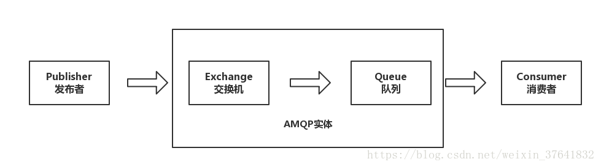
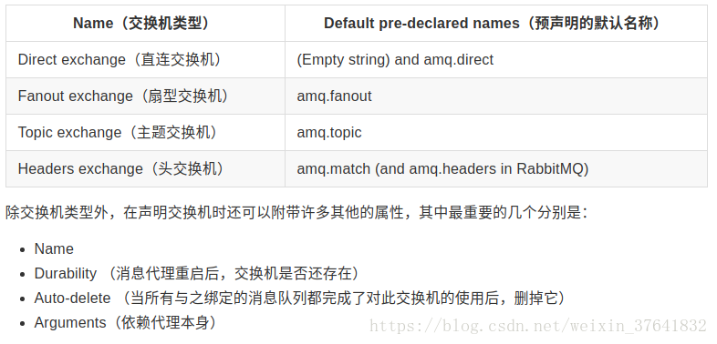
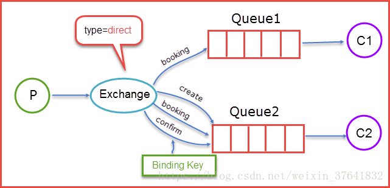
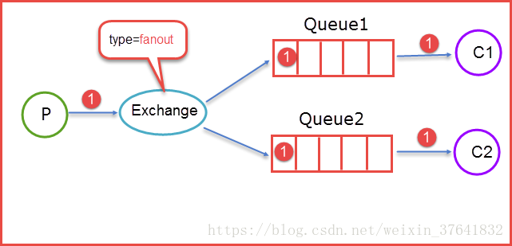

[TOC]

# 深入理解AMQP协议

2018年10月22日 12:32:16 

## 一、AMQP 是什么

AMQP（Advanced Message Queuing Protocol，高级消息队列协议）是一个进程间传递**异步消息**的**网络协议**。

## 二、AMQP模型

### 工作过程

发布者（Publisher）发布消息（Message），经由交换机（Exchange）。

交换机根据**路由规则**将收到的消息分发给与该交换机绑定的队列（Queue）。

最后 AMQP 代理会将消息投递给订阅了此队列的消费者，或者消费者按照需求自行获取。

### 深入理解

1、发布者、交换机、队列、消费者都可以有多个。同时因为 AMQP 是一个网络协议，所以这个过程中的发布者，消费者，消息代理 可以分别存在于不同的设备上。

2、发布者发布消息时可以给消息指定各种消息属性（Message Meta-data）。有些属性有可能会被消息代理（Brokers）使用，然而其他的属性则是完全不透明的，它们只能被接收消息的应用所使用。

3、从安全角度考虑，网络是不可靠的，又或是消费者在处理消息的过程中意外挂掉，这样没有处理成功的消息就会丢失。基于此原因，AMQP 模块包含了一个消息确认（Message Acknowledgements）机制：当一个消息从队列中投递给消费者后，不会立即从队列中删除，直到它收到来自消费者的确认回执（Acknowledgement）后，才完全从队列中删除。

4、在某些情况下，例如当一个消息无法被成功路由时（无法从交换机分发到队列），消息或许会被返回给发布者并被丢弃。或者，如果消息代理执行了延期操作，消息会被放入一个所谓的死信队列中。此时，消息发布者可以选择某些参数来处理这些特殊情况。

## 三、Exchange交换机

交换机是用来发送消息的 AMQP 实体。

交换机拿到一个消息之后将它**路由**给一个或零个队列。

它使用哪种路由算法是由**交换机类型**和**绑定（Bindings）规则**所决定的。

AMQP 0-9-1 的代理提供了四种交换机：

交换机可以有两个状态：持久（durable）、暂存（transient）。

持久化的交换机会在消息代理（broker）重启后依旧存在，而暂存的交换机则不会（它们需要在代理再次上线后重新被声明）。

并不是所有的应用场景都需要持久化的交换机。

### 默认交换机

默认交换机（default exchange）实际上是一个由消息代理预先声明好的没有名字（名字为空字符串）的直连交换机（direct exchange）。

它有一个特殊的属性使得它对于简单应用特别有用处：那就是每个新建队列（queue）都会自动绑定到默认交换机上，绑定的路由键（routing key）名称与队列名称相同。

举个栗子：当你声明了一个名为 “search-indexing-online” 的队列，AMQP 代理会自动将其绑定到默认交换机上，绑定（binding）的路由键名称也是为 “search-indexing-online”。因此，当携带着名为 “search-indexing-online” 的路由键的消息被发送到默认交换机的时候，此消息会被默认交换机路由至名为 “search-indexing-online” 的队列中。换句话说，默认交换机看起来貌似能够直接将消息投递给队列，尽管技术上并没有做相关的操作。

### 直连交换机

直连型交换机（direct exchange）是根据消息携带的路由键（routing key）将消息投递给对应绑定键的队列。直连交换机用来处理消息的单播路由（unicast routing）（尽管它也可以处理多播路由）。下边介绍它是如何工作的：

1）将一个队列绑定到某个交换机上时，赋予该绑定一个绑定键（Binding Key），假设为R；

2）当一个携带着路由键（Routing Key）为R的消息被发送给直连交换机时，交换机会把它路由给绑定键为R的队列。

直连交换机的队列通常是循环分发任务给多个消费者（我们称之为轮询）。比如说有3个消费者，4个任务。分别分发每个消费者一个任务后，第4个任务又分发给了第一个消费者。综上，我们很容易得出一个结论，在 AMQP 0-9-1 中，消息的负载均衡是发生在消费者（consumer）之间的，而不是队列（queue）之间。

直连型交换机图例：

当生产者（P）发送消息时 Rotuing key=booking 时，这时候将消息传送给 Exchange，Exchange 获取到生产者发送过来消息后，会根据自身的规则进行与匹配相应的 Queue，这时发现 Queue1 和 Queue2 都符合，就会将消息传送给这两个队列。

如果我们以 Rotuing key=create 和 Rotuing key=confirm 发送消息时，这时消息只会被推送到 Queue2 队列中，其他 Routing Key 的消息将会被丢弃。

### 扇型交换机

扇型交换机（funout exchange）将消息路由给绑定到它身上的所有队列，而不理会绑定的路由键。如果 N 个队列绑定到某个扇型交换机上，当有消息发送给此扇型交换机时，交换机会将消息的拷贝分别发送给这所有的 N 个队列。扇型用来交换机处理消息的广播路由（broadcast routing）。

因为扇型交换机投递消息的拷贝到所有绑定到它的队列，所以他的应用案例都极其相似：

- 大规模多用户在线（MMO）游戏可以使用它来处理排行榜更新等全局事件
- 体育新闻网站可以用它来近乎实时地将比分更新分发给移动客户端
- 分发系统使用它来广播各种状态和配置更新
- 在群聊的时候，它被用来分发消息给参与群聊的用户。（AMQP 没有内置 presence 的概念，因此 XMPP 可能会是个更好的选择）

扇型交换机图例：

上图所示，生产者（P）生产消息 1 将消息 1 推送到 Exchange，由于 Exchange Type=fanout 这时候会遵循 fanout 的规则将消息推送到所有与它绑定 Queue，也就是图上的两个 Queue 最后两个消费者消费。

### 主题交换机

前面提到的 direct 规则是严格意义上的匹配，换言之 Routing Key 必须与 Binding Key 相匹配的时候才将消息传送给 Queue.

而Topic 的路由规则是一种模糊匹配，可以通过通配符满足一部分规则就可以传送。

它的约定是：

1）binding key 中可以存在两种特殊字符 “*” 与“#”，用于做模糊匹配，其中 “\*” 用于匹配一个单词，“#”用于匹配多个单词（可以是零个）

2）routing key 为一个句点号 “.” 分隔的字符串（我们将被句点号 “. ” 分隔开的每一段独立的字符串称为一个单词），如“stock.usd.nyse”、“nyse.vmw”、“quick.orange.rabbit”
binding key 与 routing key 一样也是句点号 “.” 分隔的字符串

主题交换机图例：

当生产者发送消息 Routing Key=F.C.E 的时候，这时候只满足 Queue1，所以会被路由到 Queue 中，如果 Routing Key=A.C.E 这时候会被同是路由到 Queue1 和 Queue2 中，如果 Routing Key=A.F.B 时，这里只会发送一条消息到 Queue2 中。

主题交换机拥有非常广泛的用户案例。无论何时，当一个问题涉及到那些想要有针对性的选择需要接收消息的 多消费者 / 多应用（multiple consumers/applications） 的时候，主题交换机都可以被列入考虑范围。

使用案例：

- 分发有关于特定地理位置的数据，例如销售点
- 由多个工作者（workers）完成的后台任务，每个工作者负责处理某些特定的任务
- 股票价格更新（以及其他类型的金融数据更新）
- 涉及到分类或者标签的新闻更新（例如，针对特定的运动项目或者队伍）
- 云端的不同种类服务的协调
- 分布式架构 / 基于系统的软件封装，其中每个构建者仅能处理一个特定的架构或者系统。

### 头交换机

headers 类型的 Exchange 不依赖于 routing key 与 binding key 的匹配规则来路由消息，而是根据发送的消息内容中的 headers 属性进行匹配。

头交换机可以视为直连交换机的另一种表现形式。但直连交换机的路由键必须是一个字符串，而头属性值则没有这个约束，它们甚至可以是整数或者哈希值（字典）等。灵活性更强（但实际上我们很少用到头交换机）。工作流程：

1）绑定一个队列到头交换机上时，会同时绑定多个用于匹配的头（header）。

2）传来的消息会携带header，以及会有一个 “x-match” 参数。当 “x-match” 设置为 “any” 时，消息头的任意一个值被匹配就可以满足条件，而当 “x-match” 设置为 “all” 的时候，就需要消息头的所有值都匹配成功。

### 交换机小结

| 类型名称 | 路由规则                                                |
| -------- | ------------------------------------------------------- |
| Default  | 自动命名的直交换机                                      |
| Direct   | Routing Key==Binding Key，严格匹配                      |
| Fanout   | 把发送到该 Exchange 的消息路由到所有与它绑定的 Queue 中 |
| Topic    | Routing Key==Binding Key，模糊匹配                      |
| Headers  | 根据发送的消息内容中的 headers 属性进行匹配             |

## 四、Queue队列

AMQP 中的队列（queue）跟其他消息队列或任务队列中的队列是很相似的：它们存储着即将被应用消费掉的消息。

### 队列属性

队列跟交换机共享某些属性，但是队列也有一些另外的属性。

- Name
- Durable（消息代理重启后，队列依旧存在）
- Exclusive（只被一个连接（connection）使用，而且当连接关闭后队列即被删除）
- Auto-delete（当最后一个消费者退订后即被删除）
- Arguments（一些消息代理用他来完成类似与 TTL 的某些额外功能）

### 队列创建

队列在声明（declare）后才能被使用。如果一个队列尚不存在，声明一个队列会创建它。如果声明的队列已经存在，并且属性完全相同，那么此次声明不会对原有队列产生任何影响。如果声明中的属性与已存在队列的属性有差异，那么一个错误代码为 406 的通道级异常就会被抛出。

### 队列持久化

持久化队列（Durable queues）会被存储在磁盘上，当消息代理（broker）重启的时候，它依旧存在。没有被持久化的队列称作暂存队列（Transient queues）。并不是所有的场景和案例都需要将队列持久化。

持久化的队列并不会使得路由到它的消息也具有持久性。倘若消息代理挂掉了，重新启动，那么在重启的过程中持久化队列会被重新声明，无论怎样，只有经过持久化的消息才能被重新恢复。

## 五、Consumer消费者

消息如果只是存储在队列里是没有任何用处的。被应用消费掉，消息的价值才能够体现。在 AMQP 0-9-1 模型中，有两种途径可以达到此目的：

1）将消息投递给应用 (“push API”)

2）应用根据需要主动获取消息 (“pull API”)

使用 push API，应用（application）需要明确表示出它在某个特定队列里所感兴趣的，想要消费的消息。如是，我们可以说应用注册了一个消费者，或者说订阅了一个队列。一个队列可以注册多个消费者，也可以注册一个独享的消费者（当独享消费者存在时，其他消费者即被排除在外）。

每个消费者（订阅者）都有一个叫做消费者标签的标识符。它可以被用来退订消息。消费者标签实际上是一个字符串。

## 六、消息机制

### 消息确认

消费者应用（Consumer applications） - 用来接受和处理消息的应用 - 在处理消息的时候偶尔会失败或者有时会直接崩溃掉。而且网络原因也有可能引起各种问题。这就给我们出了个难题，AMQP 代理在什么时候删除消息才是正确的？AMQP 0-9-1 规范给我们两种建议：

1）自动确认模式：当消息代理（broker）将消息发送给应用后立即删除。（使用 AMQP 方法：basic.deliver 或 basic.get-ok）)

2）显式确认模式：待应用（application）发送一个确认回执（acknowledgement）后再删除消息。（使用 AMQP 方法：basic.ack）

如果一个消费者在尚未发送确认回执的情况下挂掉了，那 AMQP 代理会将消息重新投递给另一个消费者。如果当时没有可用的消费者了，消息代理会死等下一个注册到此队列的消费者，然后再次尝试投递。

### 拒绝消息

当一个消费者接收到某条消息后，处理过程有可能成功，有可能失败。应用可以向消息代理表明，本条消息由于 “拒绝消息（Rejecting Messages）” 的原因处理失败了（或者未能在此时完成）。

当拒绝某条消息时，应用可以告诉消息代理如何处理这条消息——销毁它或者重新放入队列。

当此队列只有一个消费者时，请确认不要由于拒绝消息并且选择了重新放入队列的行为而引起消息在同一个消费者身上无限循环的情况发生。

在 AMQP 中，basic.reject 方法用来执行拒绝消息的操作。但 basic.reject 有个限制：你不能使用它决绝多个带有确认回执（acknowledgements）的消息。但是如果你使用的是 RabbitMQ，那么你可以使用被称作 negative acknowledgements（也叫 nacks）的 AMQP 0-9-1 扩展来解决这个问题。

### 预取消息

在多个消费者共享一个队列的案例中，明确指定在收到下一个确认回执前每个消费者一次可以接受多少条消息是非常有用的。这可以在试图批量发布消息的时候起到简单的负载均衡和提高消息吞吐量的作用。For example, if a producing application sends messages every minute because of the nature of the work it is doing.（？？？例如，如果生产应用每分钟才发送一条消息，这说明处理工作尚在运行。）

注意，RabbitMQ 只支持通道级的预取计数，而不是连接级的或者基于大小的预取。

### 消息属性

AMQP 模型中的消息（Message）对象是带有属性（Attributes）的。有些属性及其常见，以至于 AMQP 0-9-1 明确的定义了它们，并且应用开发者们无需费心思思考这些属性名字所代表的具体含义。例如：

- Content type（内容类型）
- Content encoding（内容编码）
- Routing key（路由键）
- Delivery mode (persistent or not)
- 投递模式（持久化 或 非持久化）
- Message priority（消息优先权）
- Message publishing timestamp（消息发布的时间戳）
- Expiration period（消息有效期）
- Publisher application id（发布应用的 ID）

有些属性是被 AMQP 代理所使用的，但是大多数是开放给接收它们的应用解释器用的。有些属性是可选的也被称作消息头（headers）。他们跟 HTTP 协议的 X-Headers 很相似。消息属性需要在消息被发布的时候定义。

### 消息主体

AMQP 的消息除属性外，也含有一个有效载荷 - Payload（消息实际携带的数据），它被 AMQP 代理当作不透明的字节数组来对待。

消息代理不会检查或者修改有效载荷。消息可以只包含属性而不携带有效载荷。它通常会使用类似 JSON 这种序列化的格式数据，为了节省，协议缓冲器和 MessagePack 将结构化数据序列化，以便以消息的有效载荷的形式发布。AMQP 及其同行者们通常使用 “content-type” 和 “content-encoding” 这两个字段来与消息沟通进行有效载荷的辨识工作，但这仅仅是基于约定而已。

### 消息持久化

消息能够以持久化的方式发布，AMQP 代理会将此消息存储在磁盘上。如果服务器重启，系统会确认收到的持久化消息未丢失。

简单地将消息发送给一个持久化的交换机或者路由给一个持久化的队列，并不会使得此消息具有持久化性质：它完全取决与消息本身的持久模式（persistence mode）。将消息以持久化方式发布时，会对性能造成一定的影响（就像数据库操作一样，健壮性的存在必定造成一些性能牺牲）。

## 七、其他

### 连接

AMQP 连接通常是长连接。AMQP 是一个使用 TCP 提供可靠投递的应用层协议。AMQP 使用认证机制并且提供 TLS（SSL）保护。当一个应用不再需要连接到 AMQP 代理的时候，需要优雅的释放掉 AMQP 连接，而不是直接将 TCP 连接关闭。

### 通道

有些应用需要与 AMQP 代理建立多个连接。无论怎样，同时开启多个 TCP 连接都是不合适的，因为这样做会消耗掉过多的系统资源并且使得防火墙的配置更加困难。AMQP 0-9-1 提供了通道（channels）来处理多连接，可以把通道理解成共享一个 TCP 连接的多个轻量化连接。

在涉及多线程 / 进程的应用中，为每个线程 / 进程开启一个通道（channel）是很常见的，并且这些通道不能被线程 / 进程共享。

一个特定通道上的通讯与其他通道上的通讯是完全隔离的，因此每个 AMQP 方法都需要携带一个通道号，这样客户端就可以指定此方法是为哪个通道准备的。

### 虚拟主机

为了在一个单独的代理上实现多个隔离的环境（用户、用户组、交换机、队列 等），AMQP 提供了一个虚拟主机（virtual hosts - vhosts）的概念。这跟 Web servers 虚拟主机概念非常相似，这为 AMQP 实体提供了完全隔离的环境。当连接被建立的时候，AMQP 客户端来指定使用哪个虚拟主机。

### AMQP 是可扩展的

AMQP 0-9-1 拥有多个扩展点：

1）定制化交换机类型：可以让开发者们实现一些开箱即用的交换机类型尚未很好覆盖的路由方案。例如 geodata-based routing。)

2）交换机和队列的声明中可以包含一些消息代理能够用到的额外属性。例如 RabbitMQ 中的 per-queue message TTL 即是使用该方式实现。)

3）特定消息代理的协议扩展。例如 RabbitMQ 所实现的扩展。
新的 AMQP 0-9-1 方法类可被引入。)

4）消息代理可以被其他的插件扩展，例如 RabbitMQ 的管理前端 和 已经被插件化的 HTTP API。

这些特性使得 AMQP 0-9-1 模型更加灵活，并且能够适用于解决更加宽泛的问题。

### AMQP 0-9-1 客户端生态系统

AMQP 0-9-1 拥有众多的适用于各种流行语言和框架的客户端。其中一部分严格遵循 AMQP 规范，提供 AMQP 方法的实现。另一部分提供了额外的技术，方便使用的方法和抽象。有些客户端是异步的（非阻塞的），有些是同步的（阻塞的），有些将这两者同时实现。有些客户端支持 “供应商的特定扩展”（例如 RabbitMQ 的特定扩展）。

因为 AMQP 的主要目标之一就是实现交互性，所以对于开发者来讲，了解协议的操作方法而不是只停留在弄懂特定客户端的库就显得十分重要。这样一来，开发者使用不同类型的库与协议进行沟通时就会容易的多。

## 参考资料

[1]：[RabbitMQ中文文档](http://rabbitmq.mr-ping.com/)
[2]：<https://www.cnblogs.com/dwlsxj/p/RabbitMQ.html>

<https://blog.csdn.net/weixin_37641832/article/details/83270778>