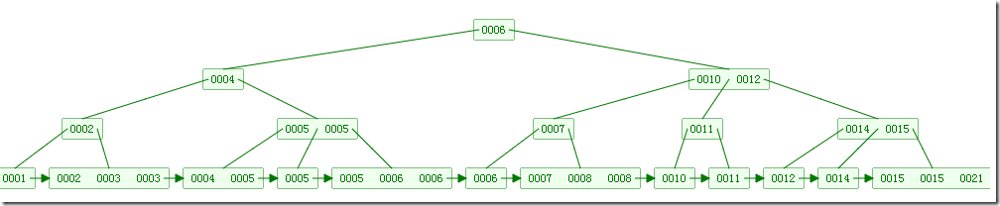

[TOC]


# 一步步分析为什么B+树适合作为索引的结构

## 前言

本文是在讲述什么样的数据结构适合作为索引，以及其适合作为索引的原因。而阅读本文需要对B树和B+树结构有稍微的理解。以及需要对磁盘操作知识有稍微的了解。对于磁盘操作的相关知识，在文章尾部的链接文章中，有详细的介绍。

在MySQL中，主要有四种类型的索引，分别为：B-Tree索引，Hash索引，Fulltext索引和R-Tree索引，本文讲的是B-Tree索引。

## 什么是索引

索引（Index）是帮助数据库高效获取数据的数据结构。索引是在基于数据库表创建的，它包含一个表中某些列的值以及记录对应的地址，并且把这些值存储在一个数据结构中。最常见的就是使用哈希表、B+树作为索引。

## 为什么要使用索引

我们知道，数据库查询是数据库最主要的功能之一。而查询速度当然是越快越好。而当数据量越来越大的时候，查询花费的时间会随之增长。而索引，可以加速数据的查询。因为索引是有序排列的。

举个例子来说，假设我们有一个数据库表Employee，这个表分别有三个字段：name，age，address。假设表中有1000条记录。

假如没有使用索引，当我们查询名为“Jesus”的雇员的时候，即调用：

```
select name,age,address from Employee where name = 'Jesus';
```

此时数据库不得不在Employee表中对这1000条记录一条一条的进行判断name字段是否为“Jesus”。这也就是所谓的全表扫描。

而当我们在Employee表上的name字段上创建索引时，当我们查询名为“Jesus”的雇员时，会通过索引查找去查询名为“Jesus”的雇员，因为该索引已经按照字母顺序排列，因此要查找名为“Jesus”的记录时会快很多，因为名字首字母为“J”的雇员都是排列在一起的。通过该索引，能获取到表中对应的记录。

## 举例说明使用索引的好处

假设索引（索引是一种数据结构）是链表结构。每个节点存储的是关键字字段（这个例子中对应的是name属性）以及该关键字字段在数据库表的对应的记录的地址。而这些节点是根据name属性排序的（即根据字母顺序排序）。因此，当我们执行上面说的查找名为“Jesus”的sql语句时，数据库会通过该索引来查询，因为该链表是有序排列的，在我们找到第一个name属性为“Jesus”的节点后，继续往后找，当遇到name属性不为“Jesus”的节点时，就无需再往后查找了，因为节点是根据name属性有序排列的啊。假设第一个name=“Jesus”的节点是第499个节点，最后一个name=“Jesus”的节点是第500个节点，那么只需要遍历501个节点就可以了。当发现第501个节点的name字段不为“Jesus”，后面的499个节点也就无需遍历了。通过索引，我们就找到了name为“Jesus”的节点，而通过该节点的另一个属性（关键字字段在数据库表的对应的记录的地址），我们就能获取到Employee表中满足条件name=“Jesus”的记录了。

通过使用索引，查询判断的次数就从1000次缩小到了501次了。起到了加速了查询效率。但实际上数据库中索引的结构，并不是链表结构。

## 数据库中使用什么数据结构作为索引

数据库中实际使用的索引并不会是链表结构，因为效率太低了。 
我们知道链表的查询效率是O(n)。就像上面的例子，遍历了501次才找到第一条符合条件的记录，这是很低效的。而我们知道，数组+二分查找的效率是O(lgn)，但是数组的插入元素以及删除元素的效率很低，因此使用数组做为索引结构并不合适。

另外，在选择数据库索引的结构的时候，要考虑到另一个问题。索引是存在于磁盘中，当索引非常大的时候，达到几个G的时候，无法一次加载到内存中。

考虑到上面两个因素，数据库中索引使用的是树形结构。

## 各种树的名字

有这么几种树：

```
B-Tree
B+-Tree
B*-Tree123
```

首先要明白三种树名中的“-”起到的是分隔的作用，并不是“减”的意思。 
因此正确的翻译应该是`B树，B+树，B*树`。而不是`B-树，B+树，B*树`。因此，当你听到别人说“B减树”的时候，要明白它指的是B-Tree。即B树和B-树是同一种树。

为什么要强调上面这一点呢，因为有的博文中写的是：**B树是二叉树，B-树是多路搜索树。**

然而B树和B-树都是指B-Tree。引用维基百科上的话：

> B-tree 
> Not to be confused with Binary tree.

也就是输，B-Tree并不是Binart tree。B-Tree的中文名是平衡多路搜索树。 
（B树的相关介绍在下面）

## 平衡二叉树

树形结构是计算机系统里最重要的数据结构。

我们知道，二叉树的查找的时间复杂度是O(log2N)，其查找效率与深度有关，而普通的二叉树可能由于内部节点排列问题退化成链表，这样查找效率就会很低。因此平衡二叉树是更好的选择，因为它保持平衡，即通过旋转调整结构保持最小的深度。其查找的时间复杂度也是O(log2N)。

但实际上，数据库中索引的结构也并非AVL树或更优秀的红黑树，尽管它的查询的时间复杂度很低。

## 为什么平衡二叉树也不适合作为索引

之前说了平衡树的查找时间复杂度是O(log2N)，已经很不错了，但还是不适合作为索引结构。那么肯定是有一种更适合作为索引的数据结构。那么这个更适合作为索引的数据结构，难道是查找的时间复杂度更低吗？并不是。这种作为索引的数据结构的查找的时间复杂度也近似O(log2N)。

那为什么平衡二叉树不适合作为索引呢？

索引是存在于索引文件中，是存在于磁盘中的。因为索引通常是很大的，因此无法一次将全部索引加载到内存当中，因此每次只能从磁盘中读取一个磁盘页的数据到内存中。而这个磁盘的读取的速度较内存中的读取速度而言是差了好几个级别。

注意，我们说的平衡二叉树结构，指的是逻辑结构上的平衡二叉树，其物理实现是数组。然后由于在逻辑结构上相近的节点在物理结构上可能会差很远。因此，每次读取的磁盘页的数据中有许多是用不上的。因此，查找过程中要进行许多次的磁盘读取操作。

而适合作为索引的结构应该是尽可能少的执行磁盘IO操作，因为执行磁盘IO操作非常的耗时。因此，平衡二叉树并不适合作为索引结构。

## B-Tree适合作为索引

平衡二叉树不适合作为索引。那么什么才适合作为索引——B树。

平衡二叉树没能充分利用磁盘预读功能，而B树是为了充分利用磁盘预读功能来而创建的一种数据结构，也就是说B树就是为了作为索引才被发明出来的的。

来看看关于“局部性原理与磁盘预读”的知识：

> 局部性原理与磁盘预读：
>
> > 由于存储介质的特性，磁盘本身存取就比主存慢很多，再加上机械运动耗费，磁盘的存取速度往往是主存的几百分分之一，因此为了提高效率，要尽量减少磁盘I/O。为了达到这个目的，磁盘往往不是严格按需读取，而是每次都会预读，即使只需要一个字节，磁盘也会从这个位置开始，顺序向后读取一定长度的数据放入内存。这样做的理论依据是计算机科学中著名的局部性原理： 
> > 当一个数据被用到时，其附近的数据也通常会马上被使用。 
> > 程序运行期间所需要的数据通常比较集中。 
> > 由于磁盘顺序读取的效率很高（不需要寻道时间，只需很少的旋转时间），因此对于具有局部性的程序来说，预读可以提高I/O效率。

搞清楚上面的意思。磁盘预读是具体实现，其理论依据是局部性原理。

为什么说红黑树没能充分利用磁盘预读功能，引用一篇博文的一段话：

> 红黑树这种结构，h明显要深的多。由于逻辑上很近的节点（父子）物理上可能很远，无法利用局部性，所以红黑树的I/O渐进复杂度也为O(h)，效率明显比B-Tree差很多。

也就是说，使用红黑树（平衡二叉树）结构的话，每次磁盘预读中的很多数据是用不上的数据。因此，它没能利用好磁盘预读的提供的数据。然后又由于深度大（较B树而言），所以进行的磁盘IO操作更多。

B树的每个节点可以存储多个关键字，它将节点大小设置为磁盘页的大小，充分利用了磁盘预读的功能。每次读取磁盘页时就会读取一整个节点。也正因每个节点存储着非常多个关键字，树的深度就会非常的小。进而要执行的磁盘读取操作次数就会非常少，更多的是在内存中对读取进来的数据进行查找。

B树的查询，主要发生在内存中，而平衡二叉树的查询，则是发生在磁盘读取中。因此，虽然B树查询查询的次数不比平衡二叉树的次数少，但是相比起磁盘IO速度，内存中比较的耗时就可以忽略不计了。因此，B树更适合作为索引。

## 比B树更适合作为索引的结构——B+树

比B树更适合作为索引的结构是B+树。MySQL中也是使用B+树作为索引。它是B树的变种，因此是基于B树来改进的。为什么B+树会比B树更加优秀呢？

B树：有序数组+平衡多叉树； 
B+树：有序数组链表+平衡多叉树；

B+树的关键字全部存放在叶子节点中，非叶子节点用来做索引，而叶子节点中有一个指针指向一下个叶子节点。做这个优化的目的是为了提高区间访问的性能。而正是这个特性决定了B+树更适合用来存储外部数据。

引用一段话：

> 走进搜索引擎的作者梁斌老师针对B树、B+树给出了他的意见（为了真实性，特引用其原话，未作任何改动）： “B+树还有一个最大的好处，方便扫库，B树必须用中序遍历的方法按序扫库，而B+树直接从叶子结点挨个扫一遍就完了，B+树支持range-query非常方便，而B树不支持。这是数据库选用B+树的最主要原因。 
> 比如要查 5-10之间的，B+树一把到5这个标记，再一把到10，然后串起来就行了，B树就非常麻烦。B树的好处，就是成功查询特别有利，因为树的高度总体要比B+树矮。不成功的情况下，B树也比B+树稍稍占一点点便宜。 
> B树比如你的例子中查，17的话，一把就得到结果了， 
> 有很多基于频率的搜索是选用B树，越频繁query的结点越往根上走，前提是需要对query做统计，而且要对key做一些变化。 
> 另外B树也好B+树也好，根或者上面几层因为被反复query，所以这几块基本都在内存中，不会出现读磁盘IO，一般已启动的时候，就会主动换入内存。”

举个例子来对比。 
B树： 

该图以及下一张图均来自博文《浅谈算法和数据结构: 十 平衡查找树之B树》，链接文章最后。

比如说，我们要查找关键字范围在3到7的关键字，在找到第一个符合条件的数字3后，访问完第一个关键字所在的块后，得遍历这个B树，获取下一个块，直到遇到一个不符合条件的关键字。遍历的过程是比较复杂的。

B+树： 


相比之下，B+树的基于范围的查询简洁很多。由于叶子节点有指向下一个叶子节点的指针，因此从块1到块2的访问，通过块1指向块2的指针即可。从块2到块3也是通过一个指针即可。

引用一篇博文中网友评论的一段话：

> 数据库索引采用B+树的主要原因是B树在提高了磁盘IO性能的同时并没有解决元素遍历的效率低下的问题。正是为了解决这个问题，B+树应运而生。B+树只要遍历叶子节点就可以实现整棵树的遍历。而且在数据库中基于范围的查询是非常频繁的，而B树不支持这样的操作（或者说效率太低）。

正如上面所说，在数据库中基于范围的查询是非常频繁的，因此MySQL最终选择的索引结构是B+树而不是B树。

## 最后

之前对索引几乎没什么理解，只知道索引能加速查询，但至于为什么，完全不懂。现在写出这篇文章，对MySQL的索引的理解自然是深刻了很多。在这篇文章中我没有具体的讲B树和B+树的定义的结构，但是对B树和B+树的理解却是前提。我也是一边看其他关于索引的博客一边看B树、B+树的介绍来学习。 
这篇文章，参考了许多文章，而最主要的，也是讲解的最后的，是下面几篇文章。

## 参考文章

1.[MySQL索引背后的数据结构及算法原理](http://blog.codinglabs.org/articles/theory-of-mysql-index.html)（超赞的文章，2011年写的文章，厉害……） 
2.[从B树、B+树、B*树谈到R 树](http://blog.csdn.net/v_JULY_v/article/details/6530142)(这篇文章作者也是好厉害，其博客访问量达千万) 
3.[浅谈算法和数据结构: 十 平衡查找树之B树](http://www.cnblogs.com/yangecnu/p/Introduce-B-Tree-and-B-Plus-Tree.html)，而这篇博文里有B树和B+树插入元素的过程GIF图，超赞，有助于对B树和B+树的理解！


https://blog.csdn.net/weixin_30531261/article/details/79312676