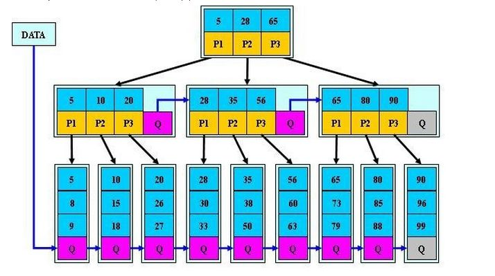

# 平衡二叉树、B树、B+树、B*树 理解其中一种你就都明白了

## **1、平衡二叉树**

（1）由来：平衡二叉树是基于二分法的策略提高数据的查找速度的二叉树的数据结构；

（2）特点：

平衡二叉树是采用二分法思维把数据按规则组装成一个树形结构的数据，用这个树形结构的数据减少无关数据的检索，大大的提升了数据检索的速度；平衡二叉树的数据结构组装过程有以下规则：

非叶子节点只能允许最多两个子节点存在，每一个非叶子节点数据分布规则为左边的子节点小当前节点的值，右边的子节点大于当前节点的值(这里值是基于自己的算法规则而定的，比如hash值)；

平衡树的层级结构：因为平衡二叉树查询性能和树的层级（h高度）成反比，h值越小查询越快、为了保证树的结构左右两端数据大致平衡降低二叉树的查询难度一般会采用一种算法机制实现节点数据结构的平衡，实现了这种算法的有比如AVL、[Treap](https://link.zhihu.com/?target=http%3A//baike.baidu.com/item/Treap)、红黑树，使用平衡二叉树能保证数据的左右两边的节点层级相差不会大于1.，通过这样避免树形结构由于删除增加变成线性链表影响查询效率，保证数据平衡的情况下查找数据的速度近于二分法查找；

总结平衡二叉树特点：

（1）非叶子节点最多拥有两个子节点；

（2）非叶子节值大于左边子节点、小于右边子节点；

（3）树的左右两边的层级数相差不会大于1;

（4）没有值相等重复的节点;

## **2、B树(B-tree)**

注意:之前有看到有很多文章把B树和B-tree理解成了两种不同类别的树，其实这两个是同一种树;

1、概念：B树和平衡二叉树稍有不同的是B树属于多叉树又名平衡多路查找树（查找路径不只两个），数据库索引技术里大量使用者B树和B+树的数据结构，让我们来看看他有什么特点;

2、规则：

（1）树种的每个节点最多拥有m个子节点且m>=2,空树除外（注：m阶代表一个树节点最多有多少个查找路径，m阶=m路,当m=2则是2叉树,m=3则是3叉）；

（2）除根节点外每个节点的关键字数量大于等于ceil(m/2)-1个小于等于m-1个，非根节点关键字数必须>=2;（注：ceil()是个朝正无穷方向取整的函数 如ceil(1.1)结果为2)

（3）所有叶子节点均在同一层、叶子节点除了包含了关键字和关键字记录的指针外也有指向其子节点的指针只不过其指针地址都为null对应下图最后一层节点的空格子

（4）如果一个非叶节点有N个子节点，则该节点的关键字数等于N-1;

（5）所有节点关键字是按递增次序排列，并遵循左小右大原则；

最后我们用一个图和一个实际的例子来理解B树（这里为了理解方便我就直接用实际字母的大小来排列C>B>A）

3、B树的查询流程： 如上图我要从上图中找到E字母，查找流程如下

（1）获取根节点的关键字进行比较，当前根节点关键字为M，E要小于M（26个字母顺序），所以往找到指向左边的子节点（二分法规则，左小右大，左边放小于当前节点值的子节点、右边放大于当前节点值的子节点）；

（2）拿到关键字D和G，D<E<G 所以直接找到D和G中间的节点；

（3）拿到E和F，因为E=E 所以直接返回关键字和指针信息（如果树结构里面没有包含所要查找的节点则返回null）；

4、B树的插入节点流程

定义一个5阶树（平衡5路查找树;），现在我们要把3、8、31、11、23、29、50、28 这些数字构建出一个5阶树出来;

遵循规则：

（1）当前是要组成一个5路查找树，那么此时m=5,关键字数必须大于等于ceil（5/2） -1小于等于5-1（关键字数小于cei(5/2) -1就要进行节点合并，大于5-1就要进行节点拆分,非根节点关键字数>=2）；

（2）满足节点本身比左边节点大，比右边节点小的排序规则;

5、B树节点的删除

规则：

（1）当前是要组成一个5路查找树，那么此时m=5,关键字数必须大于等于cei(5/2)-1，小于等于5-1，非根节点关键字数大于2；

（2）满足节点本身比左边节点大，比右边节点小的排序规则;

（3）关键字数小于二时先从子节点取，子节点没有符合条件时就向向父节点取，取中间值往父节点放；

3、特点：

B树相对于平衡二叉树的不同是，每个节点包含的关键字增多了，特别是在B树应用到数据库中的时候，数据库充分利用了磁盘块的原理（磁盘数据存储是采用块的形式存储的，每个块的大小为4K，每次IO进行数据读取时，同一个磁盘块的数据可以一次性读取出来）把节点大小限制和充分使用在磁盘快大小范围；把树的节点关键字增多后树的层级比原来的二叉树少了，减少数据查找的次数和复杂度;

## 3、**B+树**

B+树是B树的一个升级版，相对于B树来说B+树更充分的利用了节点的空间，让查询速度更加稳定，其速度完全接近于二分法查找。为什么说B+树查找的效率要比B树更高、更稳定；我们先看看两者的区别

（1）B+跟B树不同B+树的非叶子节点不保存关键字记录的指针，这样使得B+树每个节点所能保存的关键字大大增加；

（2）B+树叶子节点保存了父节点的所有关键字和关键字记录的指针，每个叶子节点的关键字从小到大链接；

（3）B+树的根节点关键字数量和其子节点个数相等;

（4）B+的非叶子节点只进行数据索引，不会存实际的关键字记录的指针，所有数据地址必须要到叶子节点才能获取到，所以每次数据查询的次数都一样；

**图片解释:**

P1 P2 P3 : 是下一个节点的地址

5 28 65: 是关键字

最底层Q : 具体的数据

**特点：**

在B树的基础上每个节点存储的关键字数更多，树的层级更少所以查询数据更快，所有指关键字指针都存在叶子节点，所以每次查找的次数都相同所以查询速度更稳定;

## 4、**B\*树**

B*树是B+树的变种，相对于B+树他们的不同之处如下：

（1）首先是关键字个数限制问题，B+树初始化的关键字初始化个数是cei(m/2)，b*树的初始化个数为（cei(2/3*m)）

（2）B+树节点满时就会分裂，而B*树节点满时会检查兄弟节点是否满（因为每个节点都有指向兄弟的指针），如果兄弟节点未满则向兄弟节点转移关键字，如果兄弟节点已满，则从当前节点和兄弟节点各拿出1/3的数据创建一个新的节点出来；

特点：

在B+树的基础上因其初始化的容量变大，使得节点空间使用率更高，而又存有兄弟节点的指针，可以向兄弟节点转移关键字的特性使得B*树额分解次数变得更少；

总结：从平衡二叉树、B树、B+树、B*树总体来看它们的贯彻的思想是相同的，都是采用二分法和数据平衡策略来提升查找数据的速度；

不同点是他们一个一个在演变的过程中通过IO从磁盘读取数据的原理进行一步步的演变，每一次演变都是为了让节点的空间更合理的运用起来，从而使树的层级减少达到快速查找数据的目的；

如果还没理解的话推荐以下资料描叙的很详细：

补充概念：

附一（二分法查找）：[二分法查找原理 - 知乎专栏](https://zhuanlan.zhihu.com/p/27597160)

附二（B、B+、B*树）：[从B树、B+树、B*树谈到R 树](https://link.zhihu.com/?target=http%3A//blog.csdn.net/v_JULY_v/article/details/6530142/)

附三（B、B+、B*树）：[end's coding life](https://link.zhihu.com/?target=http%3A//blog.csdn.net/endlu/article/details/51720299)

发布于 2017-07-05

https://zhuanlan.zhihu.com/p/27700617