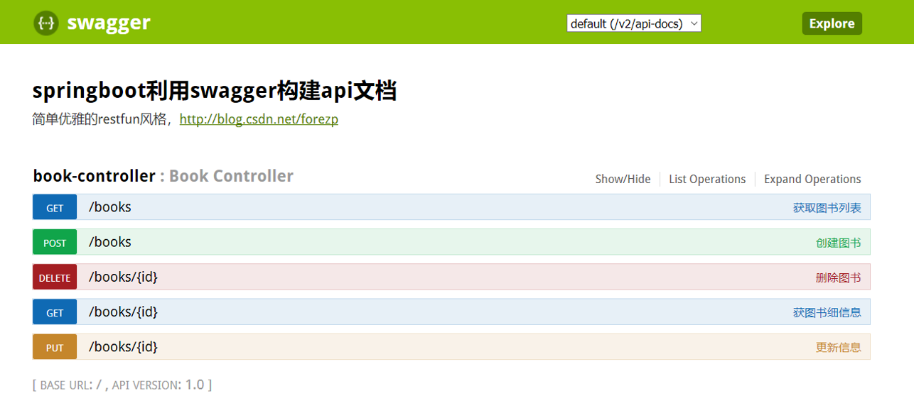
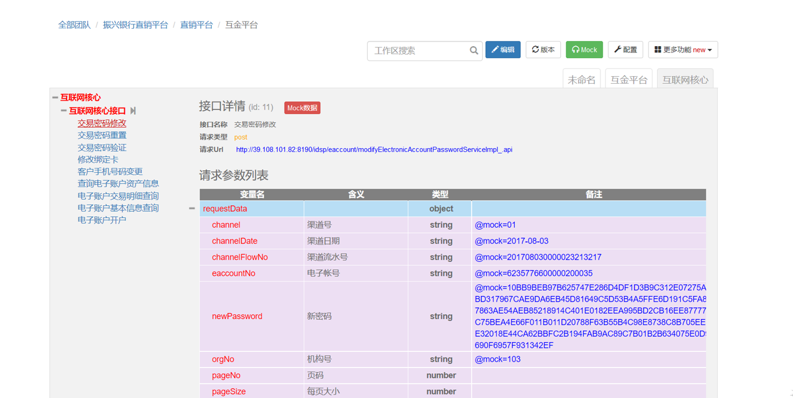

[TOC]

# API 管理工具 Swagger 和 RAP 的比较

### # 概述

微服务在当今的 web 开发中越来越盛行，前后端分离现在似乎也已成为中大型 Web 工程的基本模式，如何建立好前端调用和后端接口 (或者服务调用方和 API 提供方) 之间的契约，妥善处理好前端和后端之间的调用关系已经已经成为每个 web 项目开发前必须要考虑的一个问题，选择一个良好的 API 管理工具可以妥善处理好前端和后端开发人员的任务分工，使得项目开发可以达到事半功倍的效果。

之所以关注这个方面，是因为部门里越来越多的即将开始的新项目都要采取这种前后端分离或者微服务的模式，部门老大让我找一下当下比较流行的 API 文档管理工具，做一下对比整理一些资料给他做一下参考。因为之前做项目时使用过阿里的 RAP，学习 Springboot 时又接触了 Swagger，在网上搜索 API 管理相关工具时也是以这两个工具为主，所以这篇文章也是主要对比分析 RAP 和 Swagger 两种工具。

### # 什么是 API 文档管理工具

在通常 Web 开发中，尤其是在前后端分离的开发模式下，我们通常需要定义一份接口文档来规范接口的具体信息。如一个请求的地址、有几个参数、参数名称及类型含义等等。而 API 管理工具可以帮我们管理这些接口，现在常用 API 管理工具有 Swagger、阿里的 RAP、Postman 等等。

### # 为什么需要 API 文档管理工具

- 使用接口文档能够帮助我们节省编写接口文档的时间，方便前后端之间接口的展现和调用，提高我们开发时的效率。
- 帮助测试人员更好的根据接口文档进行测试
- 能够将前后端开发分离出来独立开发，甚至可以在某个接口后端还未完成但前段开发人员需要调试时可以直接 mock 数据调用，不影响前段进度。

### # Swagger 简介及特点

#### 简介

Swagger 是一种 Rest API 的 简单但强大的表示方式，标准的，语言无关，这种表示方式不但人可读，而且机器可读。 可以作为 Rest API 的交互式文档，也可以作为 Rest API 的形式化的接口描述，生成客户端和服务端的代码。 Swagger 主要包括三部分 Swagger API Spec，描述 Rest API 的语言。Swagger UI，将 Swagger API Spec 以 HTML 页面展现出来的模块。Swagger Editor，Swagger API Spec 的编辑器。这里不描述 Editor。

#### 特点

- 使用注解的方式添加文档描述，在开发过程中可以进行接口的编写
- 展示界面继承在依赖包中，启动项目后访问指定 url 就可看到接口列表
- 可以在接口列表界面进行接口调用，查看详细的请求和响应信息

官网地址：[https://swagger.io/specification/](https://hacpai.com/forward?goto=https%3A%2F%2Fswagger.io%2Fspecification%2F)
相关教程：[http://blog.csdn.net/catoop/article/details/50668896](https://hacpai.com/forward?goto=http%3A%2F%2Fblog.csdn.net%2Fcatoop%2Farticle%2Fdetails%2F50668896)

#### Swagger 接口管理界面

### # RAP 简介及特点

#### 简介

RAP 是一个 GUI 的 WEB 接口管理工具。在 RAP 中，可以定义接口的 URL、请求 & 响应细节格式等等。同时 RAP 还提供 MOCK 服务、测试服务等自动化工等工具，帮助开发团队高效开发。

#### 特点

- 强大的 GUI 界面工具 ，完全可视化可编辑的管理工具。
- 完善的 MOCK 服务，文档定义好后接口就已准备就绪，可方便的 mock 调用接口
- 庞大的用户群 ，RAP 在阿里巴巴广泛使用，也有许多著名的公司在用。
- 有免费且快速的技术支持 RAP 是免费的，可以 github、微博、旺旺群咨询。

#### rap 接口管理界面

### # Swagger 和 RAP 的对比

#### Swagger 的优势

- Swagger 在代码编写过程中可以通过注解的方式进行文档的编写，不需要手动编写文档
- Swagger 的接口管理工具继承在依赖包中，启动工程后可以在指定路径访问，不需要单独部署工程
- 支持 Restful 风格的 API，和 http 中默认的方法十分契合

#### Swagger 的不足

- 自身不支持 mock 接口调用，需要借用其他工具才能实现接口的 mock。
- 在编写代码工程中需要开发人员手写录入接口信息（不晓得算不算不足）

#### RAP 的优势

- 可以直接 mock 接口调用
- 有团队功能，方便团队接口及开发人员的管理
- 支持 Json/XML 报文的直接导入并解析为相关 API
- 项目为在 GitHub 已开源，可以直接 clone 到本地根据团队本身需求进行定制化修改

#### RAP 的不足

- 接口管理工具需要单独部署在 Tomcat 中（只支持 Tomcat），且只能部署在 Root 下（可能后续维护能修改）
- 仍需要人员编写接口文档，并手动（或批量复制）录入接口，不能自动生成

 

博主用过 eolinker 吗？是我用过最好的 API 接口管理工具。
        
seanlee • API • 1 个月前
这个还倒真没了解过，刚去官网看了一下，看接口管理类似于 RAP，功能比 RAP 完备丰富多了，而且支持 Postman、RAP 等数据导入，后面有机会再详细了解一下
        
lwl • 1 个月前 
rap 手动编辑确实麻烦
        
zk123 • 1 个月前 
apidoc 也是类似 swagger 但支持直接 mock 调用
        
skipper • 1 个月前
到底哪个好？
1 回复         
lwl • 1 个月前     
各有各的好处吧。结合起来更好
        
seanlee • API • 1 个月前
有时间了解一下

作者：wa
链接：https://hacpai.com/article/1519833837647#1520238131828
来源：黑客派
著作权归作者所有。商业转载请联系作者获得授权，非商业转载请注明出处。

https://hacpai.com/article/1519833837647