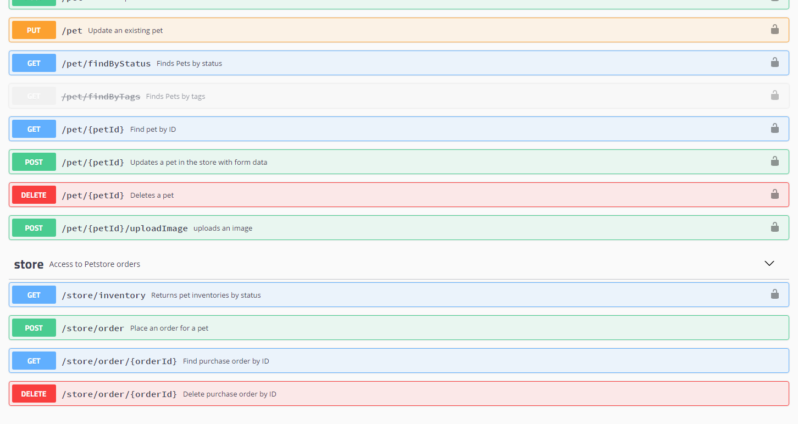
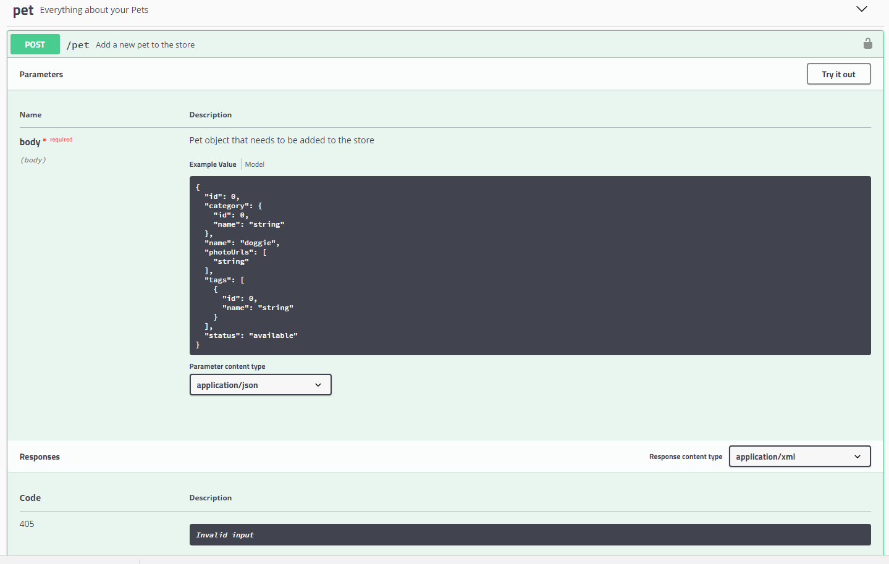
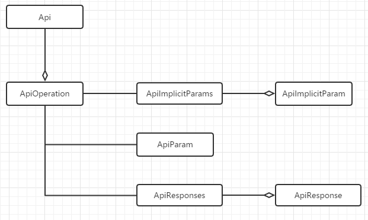

[TOC]


# Swagger Annotation 详解 

 0.4 2017.05.27 16:51* 字数 2089 阅读 22868评论 14喜欢 49

在软件开发行业，管理文档是件头疼的事。不是文档难于撰写，而是文档难于维护，因为需求与代码会经常变动，尤其在采用敏捷软件开发模式的系统中。好的工具能够提高团队沟通效率，保证系统质量以及缩短项目的交付周期。反之，差的管理工具，会严重影响沟通效率，增加系统bug数量，并且延误产品的上线日期。所以选用合理与合适的软件开发文档管理工具十分重要，真正让开发者做到“高高兴兴地把活干完，早点回家吃饭打游戏”。

## Swagger是什么？

[Swagger](https://link.jianshu.com/?t=http://swagger.io/) 是一款目前世界最流行的API管理工具。但目前Swagger已经形成一个生态圈，能够管理API的整个生命周期，从设计、文档到测试与部署。Swagger有几个重要特性：

- 代码侵入式注解
- 遵循YAML文档格式
- 非常适合三端（PC、iOS及Android）的API管理，尤其适合前后端完全分离的架构模式。
- 减少没有必要的文档，符合敏捷开发理念
- 功能强大

Swagger拥有众多不同语言和平台的开源实现与工具，主要有：

- [Swagger UI](https://link.jianshu.com/?t=https://github.com/swagger-api/swagger-ui)，基于Swagger-compliant API的一套可以展示优美文档的Web应用。
- [Swagger Editor](https://link.jianshu.com/?t=https://github.com/swagger-api/swagger-editor)，一款以YAML格式编辑与管理API的工具，同时支持JSON格式的文档描述。
- [Swagger-Core](https://link.jianshu.com/?t=https://github.com/swagger-api/swagger-core)，Swagger的Java/Scala实现，并已集成 JAX-RS (Jersey, Resteasy, CXF...), Servlets与Play Framework。
- [Swagger-JS](https://link.jianshu.com/?t=https://github.com/swagger-api/swagger-js)，Swagger的Javascript版本实现。

更多的列表可以参考[此处](https://link.jianshu.com/?t=http://swagger.io/open-source-integrations/)。

尤其要注意的是Swagger UI，它是Swagger的Web页面展现形式，能够对符合swagger规范的文件进行解析与显示。通过友好的页面，可以对API进行分组管理、文档显示以及实现mock测试。所以在大多数情形下，都使用Swagger UI实现对API的管理与展现。



API分组列表



API Mock测试

## Swagger UI的安装

Swagger UI是一个Web应用程序，所以可以单独部署使用。可以从这里下载[Swagger UI](https://link.jianshu.com/?t=https://github.com/swagger-api/swagger-ui)，然后根据文档说明进行安装与配置。

对于以Java与Spring Boot作为后台开发语言和框架而言，专门有一个开源插件[springfox](https://link.jianshu.com/?t=https://github.com/springfox/springfox)同时实现了Swagger UI及Swagger-Core。这个插件可以很方便地利用构建工具Maven或Gradle引入与管理。本文以下部分将着重讲述有关这个插件的swagger相关注解。

## Swagger Annotation分析

对于java版本的swagger annotations比较多，本着精简与必要的原则，不会对所有annotation及每个annotation的所有属性进行描述，仅选择重要且工作中常用的部分进行说明。

Swagger的annotation主要分为两类，一类是对Model的注解；另一类是对API的注解。

### **API的注解**

对于API的设计，一般倾向于将功能相同的API归集为一组。在Spring Boot中，利用Controller来实现，每个Controller里包含若干个REST API，而每个API都有输入及输出值。所以swagger对API的注解也是参照这个层级来划分与实现的。其逻辑结果如下图：



Swagger Annotation 逻辑结构图

- @Api

  该注解将一个Controller（Class）标注为一个swagger资源（API）。在默认情况下，Swagger-Core只会扫描解析具有@Api注解的类，而会自动忽略其他类别资源（JAX-RS endpoints，Servlets等等）的注解。该注解包含以下几个重要属性：

  - tags
    API分组标签。具有相同标签的API将会被归并在一组内展示。
  - value
    如果tags没有定义，value将作为Api的tags使用
  - description
    API的详细描述，在1.5.X版本之后不再使用，**但实际发现在2.0.0版本中仍然可以使用**

- @ApiOperation

  在指定的（路由）路径上，对一个操作或HTTP方法进行描述。具有相同路径的不同操作会被归组为同一个操作对象。不同的HTTP请求方法及路径组合构成一个唯一操作。此注解的属性有：

  - value
    对操作的简单说明，长度为120个字母，60个汉字。
  - notes
    对操作的详细说明。
  - httpMethod
    HTTP请求的动作名，可选值有："GET", "HEAD", "POST", "PUT", "DELETE", "OPTIONS" and "PATCH"。
  - code
    默认为200，有效值必须符合标准的[HTTP Status Code Definitions](https://link.jianshu.com/?t=http://www.w3.org/Protocols/rfc2616/rfc2616-sec10.html)。

- @ApiImplicitParams
  注解ApiImplicitParam的容器类，以数组方式存储。

- @ApiImplicitParam

  对API的单一参数进行注解。虽然注解@ApiParam同JAX-RS参数相绑定，但这个@ApiImplicitParam注解可以以统一的方式定义参数列表，也是在Servelet及非JAX-RS环境下，唯一的方式参数定义方式。注意这个注解@ApiImplicitParam必须被包含在注解@ApiImplicitParams之内。可以设置以下重要参数属性：

  - name
    参数名称
  - value
    参数的简短描述
  - required
    是否为必传参数
  - dataType
    参数类型，可以为类名，也可以为基本类型（String，int、boolean等）
  - paramType
    参数的传入（请求）类型，可选的值有path, query, body, header or form。

- @ApiParam

  增加对参数的元信息说明。这个注解只能被使用在JAX-RS 1.x/2.x的综合环境下。其主要的属性有：

  - required
    是否为必传参数
  - value
    参数简短说明

- @ApiResponses
  注解@ApiResponse的包装类，数组结构。即使需要使用一个@ApiResponse注解，也需要将@ApiResponse注解包含在注解@ApiResponses内。

- @ApiResponse

  描述一个操作可能的返回结果。当REST API请求发生时，这个注解可用于描述所有可能的成功与错误码。可以用，也可以不用这个注解去描述操作的返回类型，但成功操作的返回类型必须在@ApiOperation中定义。如果API具有不同的返回类型，那么需要分别定义返回值，并将返回类型进行关联。但Swagger不支持同一返回码，多种返回类型的注解。注意：这个注解必须被包含在@ApiResponses注解中。

  - code
    HTTP请求返回码。有效值必须符合标准的[HTTP Status Code Definitions](https://link.jianshu.com/?t=http://www.w3.org/Protocols/rfc2616/rfc2616-sec10.html)。
  - message
    更加易于理解的文本消息
  - response
    返回类型信息，必须使用完全限定类名，比如“com.xyz.cc.Person.class”。
  - responseContainer
    如果返回类型为容器类型，可以设置相应的值。有效值为 "List", "Set" or "Map"，其他任何无效的值都会被忽略。

### **Model的注解**

对于Model的注解，Swagger提供了两个：@ApiModel及@ApiModelProperty，分别用以描述Model及Model内的属性。

- @ApiModel

  提供对Swagger model额外信息的描述。在标注@ApiOperation注解的操作内，所有的类将自动被内省（introspected），但利用这个注解可以做一些更加详细的model结构说明。主要属性有：

  - value
    model的别名，默认为类名
  - description
    model的详细描述

- @ApiModelProperty

  对model属性的注解，主要的属性值有：

  - value
    属性简短描述
  - example
    属性的示例值
  - required
    是否为必须值

## 关于Token问题

考虑到安全的问题，每次请求API需要对用户进行验证与授权。目前主流的验证方式采用请求头部（request header）传递token，即用户登录之后获取一个token，然后每次都使用这个token去请求API。如果想利用swagger-UI进行API测试，必须显式为每个需要验证的API指定token参数。这时可以为每个操作添加一个注解@ApiImplicitParams，具体代码如下：

```
@ApiImplicitParams({@ApiImplicitParam(name = "TOKEN", value = "Authorization token", required = true, dataType = "string", paramType = "header")})
 
```

 


<https://www.jianshu.com/p/b0b19368e4a8>