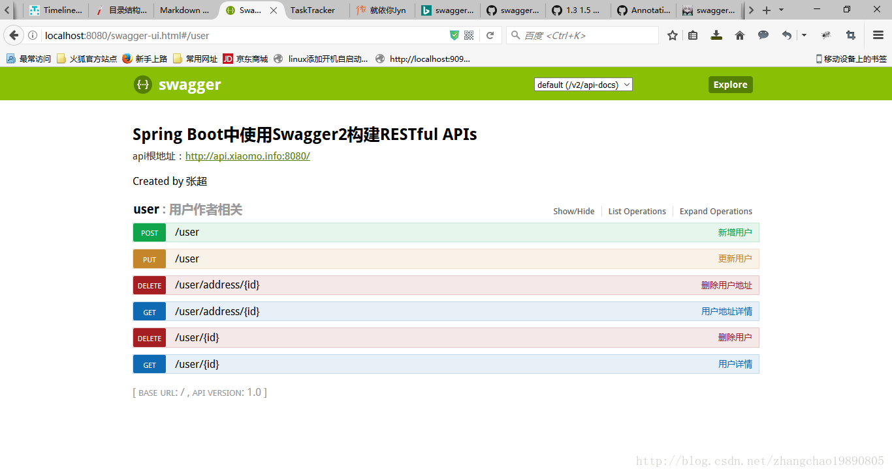

# swagger构建api文档description过时废弃 使用tags

UserController.java 的内容：

```java
package zhangchao.blog4;

import java.math.BigDecimal;
import java.sql.Timestamp;
import java.util.UUID;

import org.springframework.http.MediaType;
import org.springframework.web.bind.annotation.PathVariable;
import org.springframework.web.bind.annotation.RequestBody;
import org.springframework.web.bind.annotation.RequestMapping;
import org.springframework.web.bind.annotation.RequestMethod;
import org.springframework.web.bind.annotation.RestController;

import io.swagger.annotations.Api;
import io.swagger.annotations.ApiOperation;

/*
 * 在swagger-annotations jar包中 1.5.X版本以上, 注解 io.swagger.annotations.API 
 * 中的description被废弃了。新的swagger组件中使用了新的方法来对Web api 进行分组。原来使用 description ，
 * 默认一个Controller类中包含的方法构成一 个api分组。现在使用tag，可以更加方便的分组。
 * 比如把两个Controller类里的方法划分成同一个分组。tag的key用来区分不同的分组。tag的value用做分组的描述。
 * @ApiOperation 中value是api的简要说明，在界面api 链接的右侧，少于120个字符。
 * @ApiOperation 中notes是api的详细说明，需要点开api 链接才能看到。
 * @ApiOperation 中 produces 用来标记api返回值的具体类型。这里是json格式，utf8编码。
 */

@RestController
@RequestMapping("/user")
@Api(tags={"user"})
public class UserController {

    @ApiOperation(value = "新增用户", notes = "新增用户注意事项", produces = MediaType.APPLICATION_JSON_UTF8_VALUE)
    @RequestMapping(value="",method=RequestMethod.POST)
    public User save(@RequestBody User user){
        user.id = UUID.randomUUID().toString();
        return user;
    }

    @ApiOperation(value = "用户详情", notes = "用户详情注意事项", produces = MediaType.APPLICATION_JSON_UTF8_VALUE)
    @RequestMapping(value="/{id}",method=RequestMethod.GET)
    public User get(@PathVariable String id){
        User user = new User();
        user.balance = new BigDecimal("3.2");
        user.id = id;
        user.name = "小明";
        user.birthday = new Timestamp(System.currentTimeMillis());
        return user;
    }

    @ApiOperation(value = "更新用户", notes = "更新用户注意事项", produces = MediaType.APPLICATION_JSON_UTF8_VALUE)
    @RequestMapping(value="",method=RequestMethod.PUT)
    public User update(@RequestBody User user){
        return user;
    }

    @ApiOperation(value = "删除用户", notes = "删除用户注意事项", produces = MediaType.APPLICATION_JSON_UTF8_VALUE)
    @RequestMapping(value="/{id}",method=RequestMethod.DELETE)
    public String delete(@PathVariable String id){
        return "success";
    }
}

```


UserAddressController.java 内容：

```java
package zhangchao.blog4;


import org.springframework.http.MediaType;
import org.springframework.web.bind.annotation.PathVariable;

import org.springframework.web.bind.annotation.RequestMapping;
import org.springframework.web.bind.annotation.RequestMethod;
import org.springframework.web.bind.annotation.RestController;

import io.swagger.annotations.Api;
import io.swagger.annotations.ApiOperation;

/*
UserAddressController 和 UserController 的 Api 注解的 tags 参数都使用
了key=user 的tag。在文档中，可以看到 这两个Controller的web api 被放在同一个
分组中。
*/

@RestController
@RequestMapping("/user")
@Api(tags={"user"})
public class UserAddressController {


    @ApiOperation(value = "用户地址详情", notes = "用户地址详情注意事项", produces = MediaType.APPLICATION_JSON_UTF8_VALUE)
    @RequestMapping(value="/address/{id}",method=RequestMethod.GET)
    public String get(@PathVariable String id){
        return "莱阳路8号";
    }


    @ApiOperation(value = "删除用户地址", notes = "删除用户地址注意事项", produces = MediaType.APPLICATION_JSON_UTF8_VALUE)
    @RequestMapping(value="/address/{id}",method=RequestMethod.DELETE)
    public String delete(@PathVariable String id){
        return "success";
    }
}

```


启动项目，访问 http://localhost:8080/swagger-ui.html 就可以看到文档了。成功后的文档应该如下显示：
--------------------- 



作者：zhangchao19890805 
来源：CSDN 
原文：https://blog.csdn.net/zhangchao19890805/article/details/54863338 
