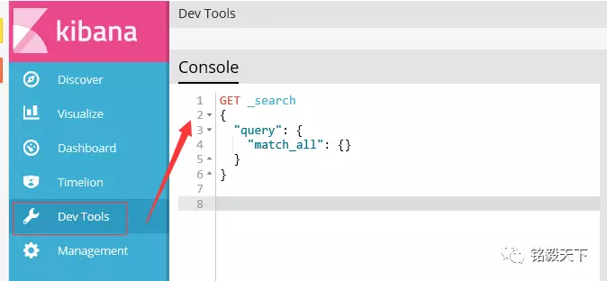
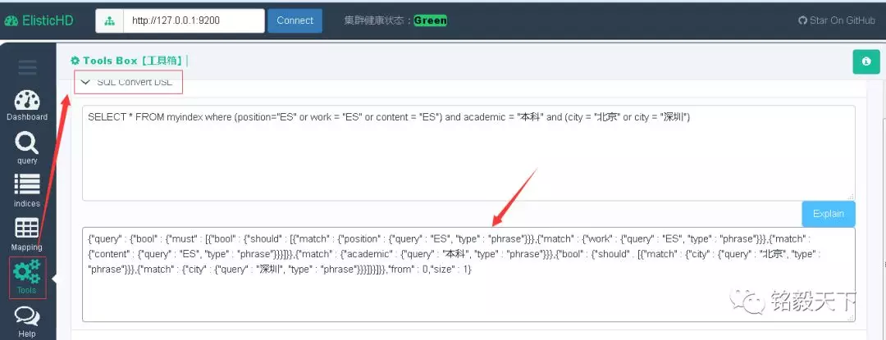
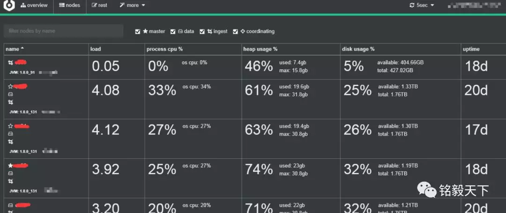
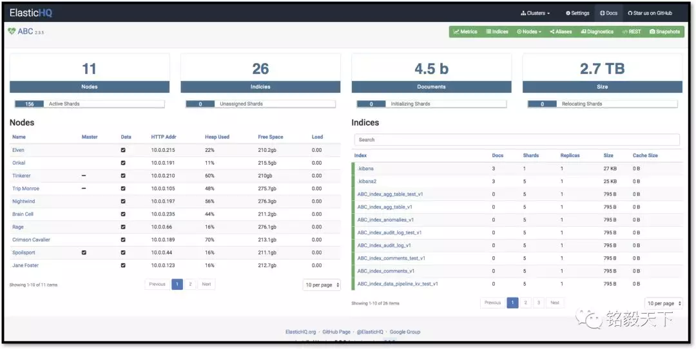
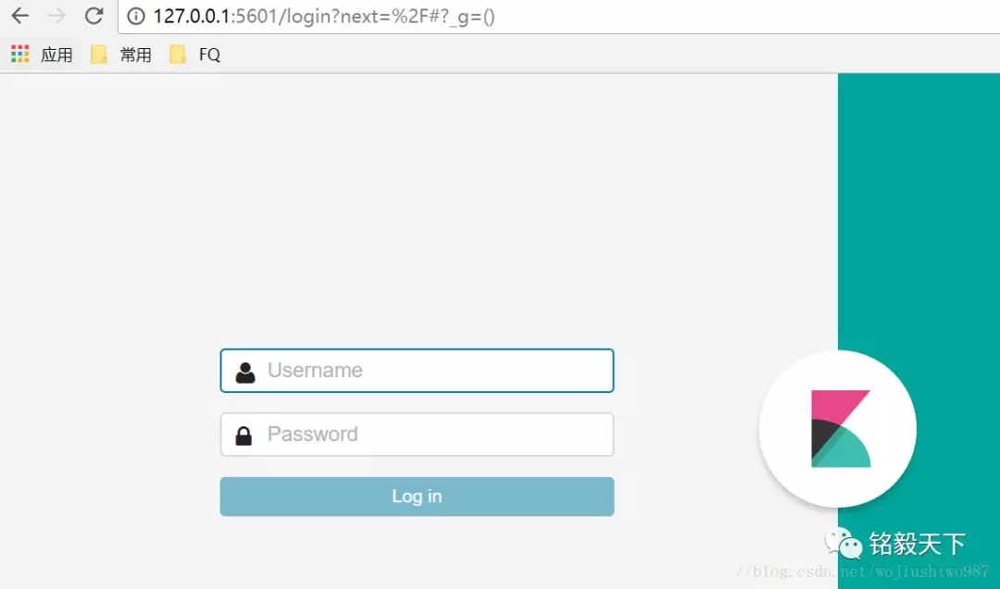
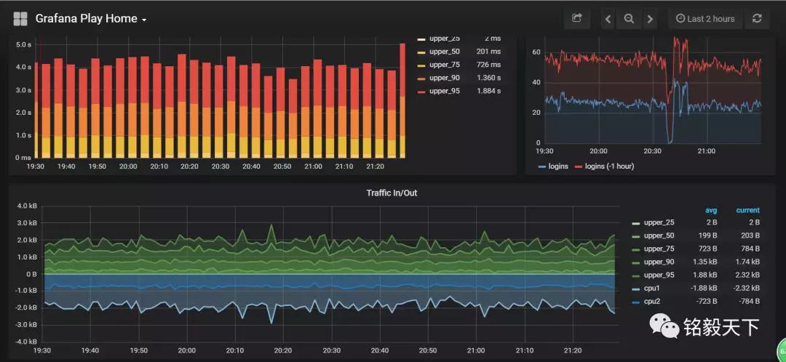
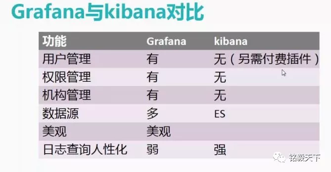
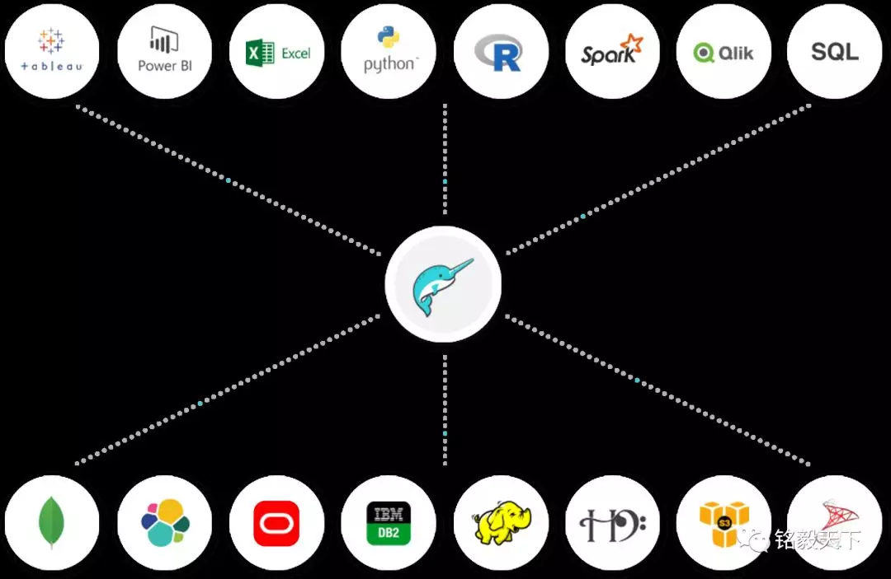
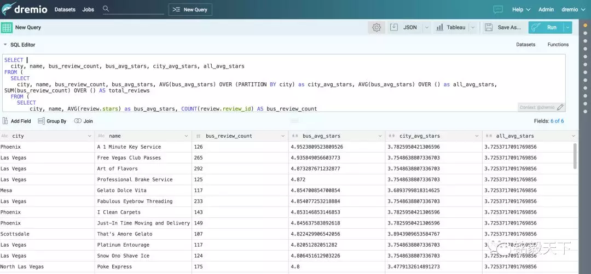

[TOC]

## Elasticsearch史上最全最常用工具清单

# **1、题记**

工欲善其事必先利其器，ELK Stack的学习和实战更是如此，特将工作中用到的“高效”工具分享给大家。

希望能借助“工具”提高开发、运维效率！

# **2、工具分类概览**

## 2.1 基础类工具

**1、Head插件**

1）功能概述：

ES集群状态查看、索引数据查看、ES DSL实现（增、删、改、查操作）
比较实用的地方：json串的格式化

2）地址：http://mobz.github.io/elasticsearch-head/

**2、Kibana工具**

除了支持各种数据的可视化之外，最重要的是：支持Dev Tool进行RESTFUL API增删改查操作。
——比Postman工具和curl都方便很多。

地址：https://www.elastic.co/products/kibana

**3、ElasticHD工具**

强势功能——支持sql转DSL，不要完全依赖，可以借鉴用。

地址：https://github.com/360EntSecGroup-Skylar/ElasticHD

## 2.2 集群监控工具

**4、cerebro工具**

地址：https://github.com/lmenezes/cerebro

**5、Elaticsearch-HQ工具**

管理elasticsearch集群以及通过web界面来进行查询操作 

地址：https://github.com/royrusso/elasticsearch-HQ

## 2.3 集群迁移工具

**6、Elasticsearch-migration工具**

支持多个版本间的数据迁移，使用scroll+bulk

地址：https://github.com/medcl/elasticsearch-migration

**7、Elasticsearch-Exporter**

将ES中的数据向其他导出的简单脚本实现。

地址：https://github.com/mallocator/Elasticsearch-Exporter

**8、Elasticsearch-dump**

移动和保存索引的工具。

地址：https://github.com/taskrabbit/elasticsearch-dump

## 2.4 集群数据处理工具

**9、elasticsearch-curator**

elasticsearch官方工具，能实现诸如数据只保留前七天的数据的功能。

地址：https://pypi.python.org/pypi/elasticsearch-curator

另外 ES6.3（还未上线）  有一个 Index LifeCycle Management 可以很方便的管理索引的保存期限。

## 2.5 安全类工具

**10、x-pack工具**

地址：https://www.elastic.co/downloads/x-pack

**11、search-guard 第三方工具**

Search Guard  是 Elasticsearch 的安全插件。它为后端系统（如LDAP或Kerberos）提供身份验证和授权，并向Elasticsearch添加审核日志记录和文档/字段级安全性。

Search Guard所有基本安全功能（非全部）都是免费的，并且内置在Search Guard中。  Search Guard支持OpenSSL并与Kibana和logstash配合使用。

地址：https://github.com/floragunncom/search-guard

## 2.6 可视化类工具

**12、grafana工具**

地址：https://grafana.com/grafana

grafana工具与kibana可视化的区别：

1. 如果你的业务线数据较少且单一，可以用kibana做出很棒很直观的数据分析。
2. 而如果你的数据源很多并且业务线也多，建议使用grafana，可以减少你的工作量

对比：https://www.zhihu.com/question/54388690

## 2.7 自动化运维工具

elasticsearch免费的自动化运维工具

**13、Ansible**

https://github.com/elastic/ansible-elasticsearch

**14、Puppet**

https://github.com/elastic/puppet-elasticsearch

**15、Cookbook**

https://github.com/elastic/cookbook-elasticsearch

以上三个工具来自medcl大神社区问题的回复，我没有实践过三个工具。

## 2.8 类SQl查询工具

**16、Elasticsearch-sql 工具**

sql 一款国人NLP-china团队写的通过类似sql语法进行查询的工具

地址：https://github.com/NLPchina/elasticsearch-sql

ES6.3+以后的新版本会集成sql。

## 2.9 增强类工具

**17、Conveyor 工具**

kibna插件——图形化数据导入工具

地址：http://t.cn/REOhwGT

**18、kibana_markdown_doc_view 工具**

Kibana文档查看强化插件，以markdown格式展示文档

地址：http://t.cn/REOhKgB

**19、 indices_view工具**

indices_view 是新蛋网开源的一个 kibana APP 插件项目，可以安装在 kibana 中，快速、高效、便捷的查看elasticsearch 中 indices 相关信息

地址：https://gitee.com/newegg/indices_view

**20、dremio 工具**

> 支持sql转DSL，
>
> 支持elasticsearch、mysql、oracle、mongo、csv等多种格式可视化处理；
>
> 支持ES多表的Join操作

地址：https://www.dremio.com/

## **2.10 报警类**

**21、elastalert**
ElastAlert 是 Yelp 公司开源的一套用 Python2.6 写的报警框架。属于后来 Elastic.co 公司出品的 Watcher 同类产品。

官网地址: http://elastalert.readthedocs.org/

使用举例：当我们把ELK搭建好、病顺利的收集到日志，但是日志里发生了什么事，我们并不能第一时间知道日志里到底发生了什么，运维需要第一时间知道日志发生了什么事，所以就有了ElastAlert的邮件报警。

**22、sentinl**
SENTINL 6扩展了Siren Investigate和Kibana的警报和报告功能，使用标准查询，可编程验证器和各种可配置操作来监控，通知和报告数据系列更改 - 将其视为一个独立的“Watcher” “报告”功能（支持PNG / PDF快照）。

SENTINL还旨在简化在Siren Investigate / Kibana 6.x中通过其本地应用程序界面创建和管理警报和报告的过程，或通过在Kibana 6.x +中使用本地监视工具来创建和管理警报和报告的过程。

官网地址：https://github.com/sirensolutions/sentinl

# **3、小结**

> 突然想起鲁迅先生笔下的孔乙己“茴香豆的茴字有几种写法？”
>
> 管几种写法，适合自己的工具才是最好的！
>
> https://www.elastic.co/guide/en/elasticsearch/plugins/6.2/index.html

https://mp.weixin.qq.com/s/ntBfYpXPVN3t_CgthjduAQ