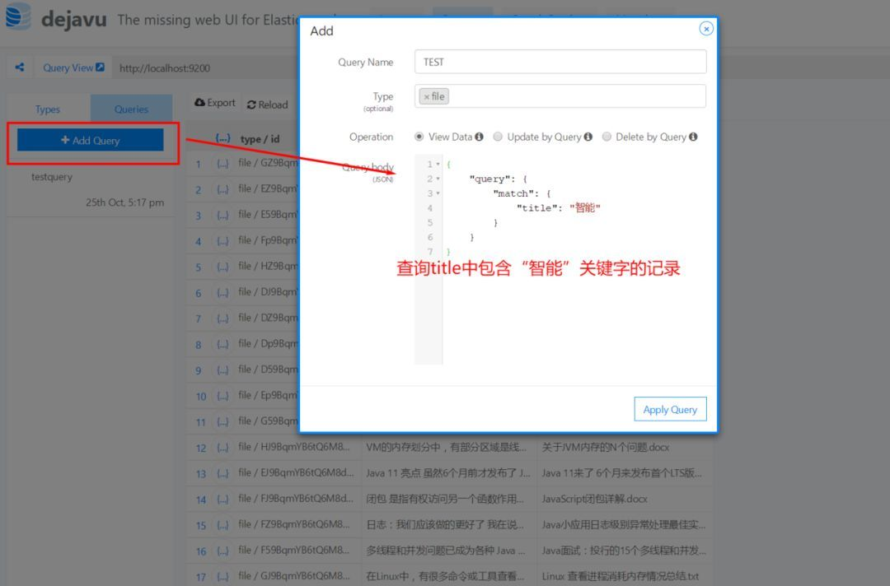

[TOC]

# 一文上手 Elasticsearch常用可视化管理工具

文章来源：企鹅号 - CodeSheep 

本文共 674字，阅读大约需要 2分钟，文尾有计时器可自行对时。

## **概   述**

强大的搜索引擎 Elasticsearch 与传统关系型数据库的一个明显不同点在于 前者是一个非结构化的 NoSQL数据库，因此里面的很多概念诸如索引、类型、文档等对于初学者可能会有些疑惑。有时候我们即使搭建好了ES集群，但数据存进去后到底是以一个什么形态存在，我们可能也疑惑重重，此时要是有个可视化的管理工具来辅助一下就便易于理解了，因此本文就搜罗了几种 Elasticsearch可视化管理工具并一一体验一番。

本文内容脑图如下：

**注：**本文首发于 作者**公众号CodeSheep**，可**长按**/**扫描**下面的**小心心**来订阅 ↓ ↓ ↓

## **elasticsearch-head**

**项目地址**：

https://github.com/mobz/elasticsearch-head

**直接安装方式**：此处不赘述，在我的前文《

》中已经记录过，可以前去查看

**Docker安装方式：**

**启动访问**：http://localhost:9100

**使用效果：**

（ 算了，这个简直上古时期的UI真心不想多看一眼，下面就凑合放两张图意思一下吧 ）

## **ElasticHD**

ElasticHD 支持 ES监控、实时搜索，Index template快捷替换修改，索引列表信息查看， SQL converts to DSL工具等，体验下来感觉还是比较强大的！

**项目地址：**

https://github.com/360EntSecGroup-Skylar/ElasticHD

**直接安装方式：**

**Docker安装方式：**

**启动访问**：http://localhost:9800

**使用效果：**

这个 Dashboard有点酷炫：

数据搜索直观易使用：

索引列表看得比较清楚：

这个 SQL查询语句转 ES的Json查询格式的小工具挺厉害的：

## **Dejavu** 推荐使用chrome 插件

Dejavu 也是一个 Elasticsearch的 Web UI 工具，其 UI界面更符合当下主流的前端页面风格，因此使用起来很方便。

**项目地址：**

https://github.com/appbaseio/dejavu/

**Docker安装方式：**

**启动访问：**：http://localhost:1358/

**使用效果：**

这个数据预览页面非常直观，索引/类型/文档 看得一清二楚

查询功能也不错

好了，就抛砖引玉到这里了，大家可以根据自己的喜好进行深度体验！

<https://cloud.tencent.com/developer/news/335618>

 