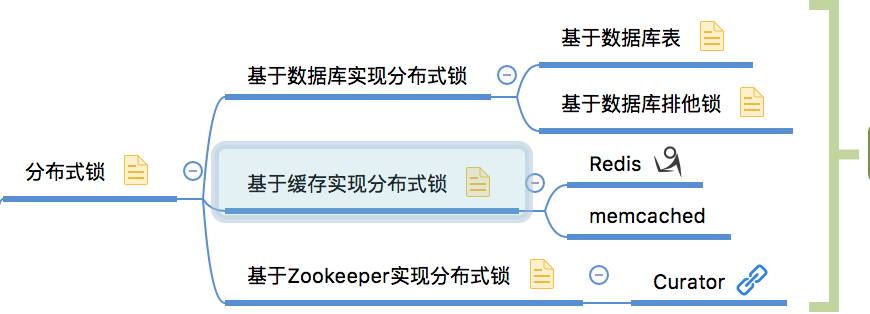
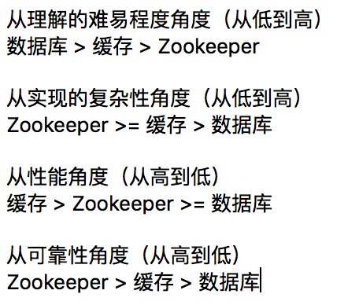
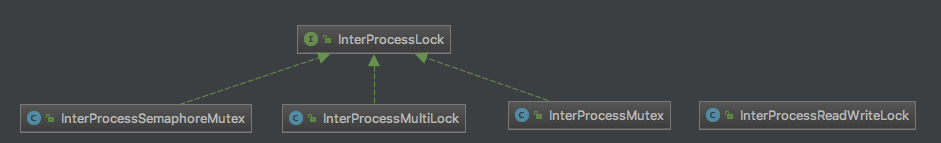
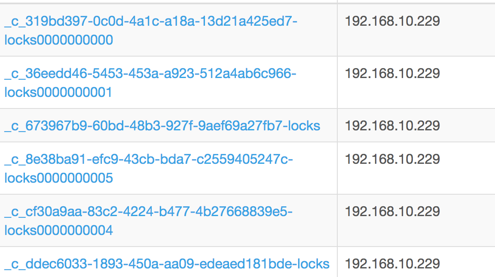

[TOC]


# curator笔记-分布式锁的实现与原理

 0.2 2018.03.26 21:13* 字数 2257 阅读 7555评论 1喜欢 41

------

### 1.分布式锁

在我们进行单机应用开发，涉及并发同步的时候，我们往往采用synchronized或者Lock的方式来解决多线程间的代码同步问题。但当我们的应用是分布式部署的情况下，那么就需要一种更加高级的锁机制来处理这个进程级别的代码同步问题。那么接下来引出现在比较常用的几种分布式锁实现方案，如下图：



分布式锁的常用实现方案

而在这几次的实现方案也是各有优缺点，对比如下：

 

 

------

### 2.Curator的分布式锁介绍

今天我们主要介绍这个基于Zookeeper实现的分布式锁方案(Curator)，当然随着我们去了解Curator这个产品的时候，会惊喜的发现，它带给我们的不仅仅是分布式锁的实现。此处先不做介绍，我会另外用博客来记录，有兴趣的朋友可以自行下载这个项目来解读。 [apache/curator](https://link.jianshu.com/?t=https%3A%2F%2Fgithub.com%2Fapache%2Fcurator)
现在先让我们看看Curator的几种锁方案：

 

四种锁方案

- InterProcessMutex：分布式可重入排它锁
- InterProcessSemaphoreMutex：分布式排它锁
- InterProcessReadWriteLock：分布式读写锁
- InterProcessMultiLock：将多个锁作为单个实体管理的容器

接下来我们以InterProcessMutex为例，介绍一下这个分布式可重入排它锁的实现原理

------

### 3.InterProcessMutex代码跟踪

#### 一、获取锁的过程

1).实例化InterProcessMutex：

```
// 代码进入：InterProcessMutex.java
    /**
     * @param client client
     * @param path   the path to lock
     */
    public InterProcessMutex(CuratorFramework client, String path)
    {
        this(client, path, new StandardLockInternalsDriver());
    }
    /**
     * @param client client
     * @param path   the path to lock
     * @param driver lock driver
     */
    public InterProcessMutex(CuratorFramework client, String path, LockInternalsDriver driver)
    {
        this(client, path, LOCK_NAME, 1, driver);
    }
```

两个构造函数共同的入参：

- client：curator实现的zookeeper客户端
- path：要在zookeeper加锁的路径，即后面创建临时节点的父节点

我们可以看到上面两个构造函数中，其实第一个也是在调用第二个构造函数，它传入了一个默认的StandardLockInternalsDriver对象，即标准的锁驱动类（该类的作用在后面会介绍）。就是说InterProcessMutex也支持你传入自定义的锁驱动类来扩展。

```
// 代码进入：InterProcessMutex.java
InterProcessMutex(CuratorFramework client, String path, String lockName, int maxLeases, LockInternalsDriver driver)
    {
        basePath = PathUtils.validatePath(path);
        internals = new LockInternals(client, driver, path, lockName, maxLeases);
    }
// 代码进入：LockInternals.java
LockInternals(CuratorFramework client, LockInternalsDriver driver, String path, String lockName, int maxLeases)
    {
        this.driver = driver;
        this.lockName = lockName;
        this.maxLeases = maxLeases;

        this.client = client.newWatcherRemoveCuratorFramework();
        this.basePath = PathUtils.validatePath(path);
        this.path = ZKPaths.makePath(path, lockName);
    }
```

跟着构造函数的代码走完，它接着做了两件事：验证入参path的合法性 & 实例化了一个LockInternals对象。

2).加锁方法acquire：
实例化完成的InterProcessMutex对象，开始调用acquire()方法来尝试加锁：

```java
// 代码进入：InterProcessMutex.java
   /**
     * Acquire the mutex - blocking until it's available. Note: the same thread
     * can call acquire re-entrantly. Each call to acquire must be balanced by a call
     * to {@link #release()}
     *
     * @throws Exception ZK errors, connection interruptions
     */
    @Override
    public void acquire() throws Exception
    {
        if ( !internalLock(-1, null) )
        {
            throw new IOException("Lost connection while trying to acquire lock: " + basePath);
        }
    }

    /**
     * Acquire the mutex - blocks until it's available or the given time expires. Note: the same thread
     * can call acquire re-entrantly. Each call to acquire that returns true must be balanced by a call
     * to {@link #release()}
     *
     * @param time time to wait
     * @param unit time unit
     * @return true if the mutex was acquired, false if not
     * @throws Exception ZK errors, connection interruptions
     */
    @Override
    public boolean acquire(long time, TimeUnit unit) throws Exception
    {
        return internalLock(time, unit);
    }
```

- acquire() :入参为空，调用该方法后，会一直堵塞，直到抢夺到锁资源，或者zookeeper连接中断后，上抛异常。
- acquire(long time, TimeUnit unit)：入参传入超时时间以及单位，抢夺时，如果出现堵塞，会在超过该时间后，返回false。

对比两种方式，可以选择适合自己业务逻辑的方法。但是一般情况下，我推荐后者，传入超时时间，避免出现大量的临时节点累积以及线程堵塞的问题。

3).锁的可重入：

```java
// 代码进入：InterProcessMutex.java
private boolean internalLock(long time, TimeUnit unit) throws Exception
    {
        /*
           Note on concurrency: a given lockData instance
           can be only acted on by a single thread so locking isn't necessary
        */

        Thread currentThread = Thread.currentThread();

        LockData lockData = threadData.get(currentThread);
        if ( lockData != null )
        {
            // re-entering
            lockData.lockCount.incrementAndGet();
            return true;
        }
        String lockPath = internals.attemptLock(time, unit, getLockNodeBytes());
        if ( lockPath != null )
        {
            LockData newLockData = new LockData(currentThread, lockPath);
            threadData.put(currentThread, newLockData);
            return true;
        }
        return false;
    }
```

这段代码里面，实现了锁的可重入。每个InterProcessMutex实例，都会持有一个ConcurrentMap类型的threadData对象，以线程对象作为Key，以LockData作为Value值。通过判断当前线程threadData是否有值，如果有，则表示线程可以重入该锁，于是将lockData的lockCount进行累加；如果没有，则进行锁的抢夺。
internals.attemptLock方法返回lockPath!=null时，表明了该线程已经成功持有了这把锁，于是乎LockData对象被new了出来，并存放到threadData中。

4).抢夺锁：
重头戏来了，attemptLock方法就是核心部分，直接看代码：

```java
// 代码进入：LockInternals.java
String attemptLock(long time, TimeUnit unit, byte[] lockNodeBytes) throws Exception
    {
        final long      startMillis = System.currentTimeMillis();
        final Long      millisToWait = (unit != null) ? unit.toMillis(time) : null;
        final byte[]    localLockNodeBytes = (revocable.get() != null) ? new byte[0] : lockNodeBytes;
        int             retryCount = 0;

        String          ourPath = null;
        boolean         hasTheLock = false;
        boolean         isDone = false;
        while ( !isDone )
        {
            isDone = true;

            try
            {
                ourPath = driver.createsTheLock(client, path, localLockNodeBytes);
                hasTheLock = internalLockLoop(startMillis, millisToWait, ourPath);
            }
            catch ( KeeperException.NoNodeException e )
            {
                // gets thrown by StandardLockInternalsDriver when it can't find the lock node
                // this can happen when the session expires, etc. So, if the retry allows, just try it all again
                if ( client.getZookeeperClient().getRetryPolicy().allowRetry(retryCount++, System.currentTimeMillis() - startMillis, RetryLoop.getDefaultRetrySleeper()) )
                {
                    isDone = false;
                }
                else
                {
                    throw e;
                }
            }
        }

        if ( hasTheLock )
        {
            return ourPath;
        }
        return null;
    }
```

此处注意三个地方

- 1.while循环
  正常情况下，这个循环会在下一次结束。但是当出现NoNodeException异常时，会根据zookeeper客户端的重试策略，进行有限次数的重新获取锁。
- 2.driver.createsTheLock
  顾名思义，这个driver的createsTheLock方法就是在创建这个锁，即在zookeeper的指定路径上，创建一个临时序列节点。注意：此时只是纯粹的创建了一个节点，不是说线程已经持有了锁。

```java
// 代码进入：StandardLockInternalsDriver.java
    @Override
    public String createsTheLock(CuratorFramework client, String path, byte[] lockNodeBytes) throws Exception
    {
        String ourPath;
        if ( lockNodeBytes != null )
        {
            ourPath = client.create().creatingParentContainersIfNeeded().withProtection().withMode(CreateMode.EPHEMERAL_SEQUENTIAL).forPath(path, lockNodeBytes);
        }
        else
        {
            ourPath = client.create().creatingParentContainersIfNeeded().withProtection().withMode(CreateMode.EPHEMERAL_SEQUENTIAL).forPath(path);
        }
        return ourPath;
    }
```

- 3.internalLockLoop
  判断自身是否能够持有锁。如果不能，进入wait，等待被唤醒。

```java
// 代码进入：LockInternals.java
private boolean internalLockLoop(long startMillis, Long millisToWait, String ourPath) throws Exception
    {
        boolean     haveTheLock = false;
        boolean     doDelete = false;
        try
        {
            if ( revocable.get() != null )
            {
                client.getData().usingWatcher(revocableWatcher).forPath(ourPath);
            }

            while ( (client.getState() == CuratorFrameworkState.STARTED) && !haveTheLock )
            {
                List<String>        children = getSortedChildren();
                String              sequenceNodeName = ourPath.substring(basePath.length() + 1); // +1 to include the slash

                PredicateResults    predicateResults = driver.getsTheLock(client, children, sequenceNodeName, maxLeases);
                if ( predicateResults.getsTheLock() )
                {
                    haveTheLock = true;
                }
                else
                {
                    String  previousSequencePath = basePath + "/" + predicateResults.getPathToWatch();

                    synchronized(this)
                    {
                        try 
                        {
                            // use getData() instead of exists() to avoid leaving unneeded watchers which is a type of resource leak
                            client.getData().usingWatcher(watcher).forPath(previousSequencePath);
                            if ( millisToWait != null )
                            {
                                millisToWait -= (System.currentTimeMillis() - startMillis);
                                startMillis = System.currentTimeMillis();
                                if ( millisToWait <= 0 )
                                {
                                    doDelete = true;    // timed out - delete our node
                                    break;
                                }

                                wait(millisToWait);
                            }
                            else
                            {
                                wait();
                            }
                        }
                        catch ( KeeperException.NoNodeException e ) 
                        {
                            // it has been deleted (i.e. lock released). Try to acquire again
                        }
                    }
                }
            }
        }
        catch ( Exception e )
        {
            ThreadUtils.checkInterrupted(e);
            doDelete = true;
            throw e;
        }
        finally
        {
            if ( doDelete )
            {
                deleteOurPath(ourPath);
            }
        }
        return haveTheLock;
    }
```

诶！又是一大片代码。好吧，咱还是分段挑里面重要的说。

- while循环

> 如果你一开始使用无参的acquire方法，那么此处的循环可能就是一个死循环。当zookeeper客户端启动时，并且当前线程还没有成功获取到锁时，就会开始新的一轮循环。

- getSortedChildren

> 这个方法比较简单，就是获取到所有子节点列表，并且从小到大根据节点名称后10位数字进行排序。在上面提到了，创建的是序列节点。如下生成的示例：
>
> 
>
> zookeeper序列节点

- driver.getsTheLock

```java
// 代码进入：StandardLockInternalsDriver.java
@Override
    public PredicateResults getsTheLock(CuratorFramework client, List<String> children, String sequenceNodeName, int maxLeases) throws Exception
    {
        int             ourIndex = children.indexOf(sequenceNodeName);
        validateOurIndex(sequenceNodeName, ourIndex);

        boolean         getsTheLock = ourIndex < maxLeases;
        String          pathToWatch = getsTheLock ? null : children.get(ourIndex - maxLeases);

        return new PredicateResults(pathToWatch, getsTheLock);
    }
```

> 判断是否可以持有锁，判断规则：当前创建的节点是否在上一步获取到的子节点列表的首位。
> 如果是，说明可以持有锁，那么getsTheLock = true，封装进PredicateResults返回。
> 如果不是，说明有其他线程早已先持有了锁，那么getsTheLock = false，此处还需要获取到自己前一个临时节点的名称pathToWatch。（注意这个pathToWatch后面有比较关键的作用）

- synchronized(this)

> 这块代码在争夺锁失败以后的逻辑中。那么此处该线程应该做什么呢？
> 首先添加一个watcher监听，而监听的地址正是上面一步返回的pathToWatch进行basePath + "/" 拼接以后的地址。也就是说当前线程会监听自己前一个节点的变动，而不是父节点下所有节点的变动。然后华丽丽的...wait(millisToWait)。线程交出cpu的占用，进入等待状态，等到被唤醒。
> 接下来的逻辑就很自然了，如果自己监听的节点发生了变动，那么就将线程从等待状态唤醒，重新一轮的锁的争夺。

自此, 我们完成了整个锁的抢夺过程。

#### 二、释放锁

相对上面获取锁的长篇大论来说，释放的逻辑就很简单了。

```java
// 代码进入：InterProcessMutex.java
/**
     * Perform one release of the mutex if the calling thread is the same thread that acquired it. If the
     * thread had made multiple calls to acquire, the mutex will still be held when this method returns.
     *
     * @throws Exception ZK errors, interruptions, current thread does not own the lock
     */
    @Override
    public void release() throws Exception
    {
        /*
            Note on concurrency: a given lockData instance
            can be only acted on by a single thread so locking isn't necessary
         */

        Thread currentThread = Thread.currentThread();
        LockData lockData = threadData.get(currentThread);
        if ( lockData == null )
        {
            throw new IllegalMonitorStateException("You do not own the lock: " + basePath);
        }

        int newLockCount = lockData.lockCount.decrementAndGet();
        if ( newLockCount > 0 )
        {
            return;
        }
        if ( newLockCount < 0 )
        {
            throw new IllegalMonitorStateException("Lock count has gone negative for lock: " + basePath);
        }
        try
        {
            internals.releaseLock(lockData.lockPath);
        }
        finally
        {
            threadData.remove(currentThread);
        }
    }
```

- 减少重入锁的计数，直到变成0。
- 释放锁，即移除移除Watchers & 删除创建的节点
- 从threadData中，删除自己线程的缓存

#### 三、锁驱动类

开始的时候，我们提到了这个StandardLockInternalsDriver-标准锁驱动类。还提到了我们可以传入自定义的，来扩展。
是的，我们先来看看这个它提供的功能接口：

```
// 代码进入LockInternalsDriver.java
public PredicateResults getsTheLock(CuratorFramework client, List<String> children, String sequenceNodeName, int maxLeases) throws Exception;

public String createsTheLock(CuratorFramework client,  String path, byte[] lockNodeBytes) throws Exception;

// 代码进入LockInternalsSorter.java
public String           fixForSorting(String str, String lockName);
```

- getsTheLock：判断是够获取到了锁
- createsTheLock：在zookeeper的指定路径上，创建一个临时序列节点。
- fixForSorting：修复排序，在StandardLockInternalsDriver的实现中，即获取到临时节点的最后序列数，进行排序。

借助于这个类，我们可以尝试实现自己的锁机制，比如判断锁获得的策略可以做修改，比如获取子节点列表的排序方案可以自定义。。。

------

### 4.InterProcessMutex原理总结

InterProcessMutex通过在zookeeper的某路径节点下创建临时序列节点来实现分布式锁，即每个线程（跨进程的线程）获取同一把锁前，都需要在同样的路径下创建一个节点，节点名字由uuid + 递增序列组成。而通过对比自身的序列数是否在所有子节点的第一位，来判断是否成功获取到了锁。当获取锁失败时，它会添加watcher来监听前一个节点的变动情况，然后进行等待状态。直到watcher的事件生效将自己唤醒，或者超时时间异常返回。

------

### 5.参考资料

- [分布式锁的几种实现方式](https://link.jianshu.com/?t=http%3A%2F%2Fwww.cnblogs.com%2Faustinspark-jessylu%2Fp%2F8043726.html)
- [Curator官方文档](https://link.jianshu.com/?t=http%3A%2F%2Fcurator.apache.org%2F)

------

### 6.写在最后的话

在最近看的一本书叫《从Paxos到Zookeeper 分布式一致性原理与实践》中也提到了一个关于基于zookeeper的排它锁的实现方案，大致的想法是通过zookeeper节点不能重复的特性，来判断是否成功持有了锁。跟InterProcessMutex对比来看，还是后者更灵活些，而且后者的监听范围仅限于前一个节点的变动，更小粒度的监听范围可以带来更好的性能。

> 如若此文能让您有所得，便是吾之大幸！

------

本博文欢迎转载，转载请注明出处和作者。


<https://www.jianshu.com/p/6618471f6e75>