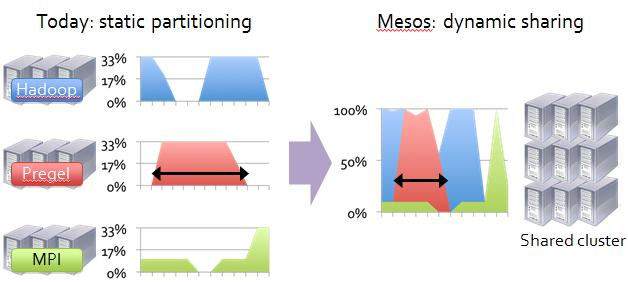
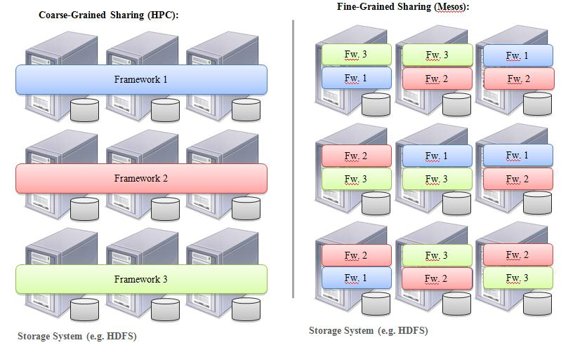
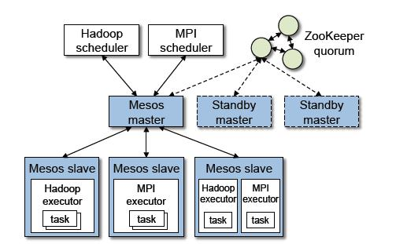
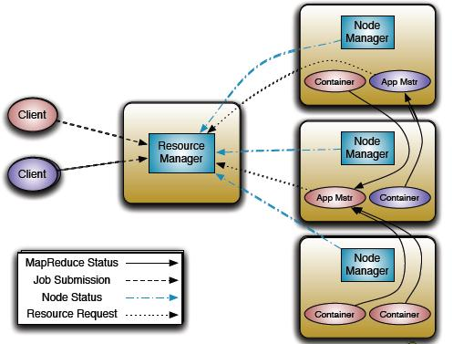
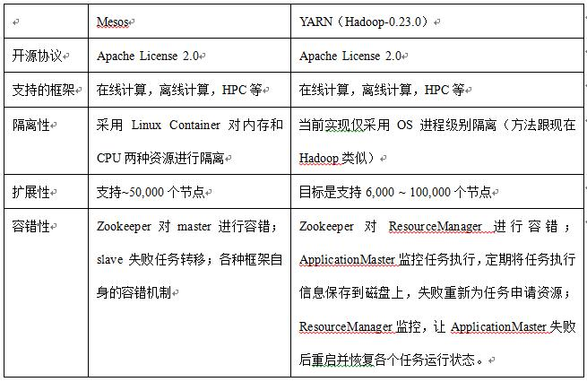

 

[TOC]

# 统一资源管理与调度平台（系统）介绍

Category: [hadoop 2.0之YARN](http://dongxicheng.org/category/mapreduce-nextgen/) View: 32,583 Author: Dong

作者:**Dong** | 新浪微博：[西成懂](http://weibo.com/clseer) | 可以转载, 但必须以超链接形式标明文章原始出处和作者信息及[版权声明](http://creativecommons.org/licenses/by/2.5/cn/)
网址:<http://dongxicheng.org/mapreduce-nextgen/mesos_vs_yarn/>
本博客的文章集合:<http://dongxicheng.org/recommend/>

------

## 1. 背景

随着互联网的高速发展，基于数据密集型应用的计算框架不断出现，从支持离线处理的MapReduce，到支持在线处理的Storm，从迭代式计算框架Spark到流式处理框架S4，…，各种框架诞生于不同的公司或者实验室，它们各有所长，各自解决了某一类应用问题。而在大部分互联网公司中，这几种框架可能都会采用，比如对于搜索引擎公司，可能的技术方案如下：网页建索引采用MapReduce框架，自然语言处理/数据挖掘采用Spark（网页PageRank计算，聚类分类算法等，【注】Spark现在不太成熟，很少有公司尝试使用），对性能要求很高的数据挖掘算法用MPI等。考虑到资源利用率，运维成本，数据共享等因素，公司一般希望将所有这些框架部署到一个公共的集群中，让它们共享集群的资源，并对资源进行统一使用，这样，便诞生了资源统一管理与调度平台，典型代表是Mesos和YARN。

本文总结了资源统一管理与调度平台产生背景以及它们所应具有的特点，并对比了当前比较有名的资源统一管理与调度平台Mesos和YARN。

## 2. 资源统一管理和调度平台具有的特点

**（1）支持多种计算框架**

资源统一管理和调度平台应该提供一个全局的资源管理器。所有接入的框架要先向该全局资源管理器申请资源，申请成功之后，再由框架自身的调度器决定资源交由哪个任务使用，也就是说，整个大的系统是个双层调度器，第一层是统一管理和调度平台提供的，另外一层是框架自身的调度器。

资源统一管理和调度平台应该提供资源隔离。不同的框架中的不同任务往往需要的资源（内存，CPU，网络IO等）不同，它们运行在同一个集群中，会相互干扰，为此，应该提供一种资源隔离机制避免任务之间由资源争用导致效率下降。

**（2）扩展性**

现有的分布式计算框架都会将系统扩展性作为一个非常重要的设计目标，比如Hadoop，好的扩展性意味着系统能够随着业务的扩展线性扩展。资源统一管理和调度平台融入多种计算框架后，不应该破坏这种特性，也就是说，统一管理和调度平台不应该成为制约框架进行水平扩展。

**（3）容错性**

同扩展性类似，容错性也是当前分布式计算框架的一个重要设计目标，统一管理和调度平台在保持原有框架的容错特性基础上，自己本身也应具有良好的容错性。

**（4） 高资源利用率**

如果采用静态资源分配，也就是每个计算框架分配一个集群，往往由于作业自身的特点或者作业提交频率等原因，集群利用率很低。当将各种框架部署到同一个大的集群中，进行统一管理和调度后，由于各种作业交错且作业提交频率大幅度升高，则为资源利用率的提升增加了机会。

**（5）细粒度的资源分配**

细粒度的资源分配是指直接按照任务实际需求分配资源，而不是像MapReduce那样将槽位作为资源分配单位。这种分配机制可大大提高资源利用率。

## 3. 当前比较有名的开源资源统一管理和调度平台

当前比较有名的开源资源统一管理和调度平台有两个，一个是Mesos，另外一个是YARN，下面依次对这两个系统进行介绍。

### 3.1 Mesos

Mesos诞生于UC Berkeley的一个研究项目，现已成为Apache Incubator中的项目，当前有一些公司使用Mesos管理集群资源，比如Twitter。

总体上看，Mesos是一个master/slave结构，其中，master是非常轻量级的，仅保存了framework（各种计算框架称为framework）和mesos slave的一些状态，而这些状态很容易通过framework和slave重新注册而重构，因而很容易使用了zookeeper解决mesos master的单点故障问题。

Mesos master实际上是一个全局资源调度器，采用某种策略将某个slave上的空闲资源分配给某一个framework，各种framework通过自己的调度器向Mesos master注册，以接入到Mesos中；而Mesos slave主要功能是汇报任务的状态和启动各个framework的executor（比如Hadoop的excutor就是TaskTracker）。

### 3.2 YARN

YARN是下一代MapReduce，即MRv2，是在第一代MapReduce基础上演变而来的，主要是为了解决原始Hadoop扩展性较差，不支持多计算框架而提出的。它完全不同于Hadoop MapReduce，所有代码全部重写而成。整个平台由Resource Manager（master，功能是资源分配）和Node Manager组成（slave，功能是节点管理）。较于HadoopMapReduce，其最大特点是将JobTracker拆分成Resource Manager和Application Master，其中Resource Manager是全局的资源管理器，仅负责资源分配（由于Resource Manager功能简单，所以不会严重制约系统的扩展性），而Application Master对应一个具体的application（如Hadoop job， Spark Job等），主要负责application的资源申请，启动各个任务和运行状态监控（没有调度功能）。

## 4. Mesos与YARN比较

Mesos与YARN主要在以下几方面有明显不同：

**（1）框架担任的角色**

在Mesos中，各种计算框架是完全融入Mesos中的，也就是说，如果你想在Mesos中添加一个新的计算框架，首先需要在Mesos中部署一套该框架；而在YARN中，各种框架作为client端的library使用，仅仅是你编写的程序的一个库，不需要事先部署一套该框架。从这点上说，YARN运行和使用起来更加方便。

**（2）调度机制**

两种系统都采用了双层调度机制，即，第一层是源管理系统（mesos/YARN）将资源分配给应用程序（或框架），第二层，应用程序将收到的资源进一步分配给内部的任务。但是资源分配器智能化程度不同，mesos是基于resource offer的调度机制，包含非常少的调度语义，他只是简单的将资源推给各个应用程序，由应用程序选择是否接受资源，而mesos本身并不知道各个应用程序资源需求；YARN则不同，应用程序的ApplicationMaster会把各个任务的资源要求汇报给YARN，YARN则根据需要为应用程序分配资源。

其他各个特性对比如下表：

## 5. Mesos与YARN发展情况

个人认为Mesos和YARN均不成熟，很多承诺的功能还未实现或者实现得不全，但总体看，它们发展很快，尤其是YARN，在去年年末推出Hadoop-0.23.0后，近期又推出Hadoop-0.23.1。随着各种计算框架（如Spark，S4，Storm等）的日趋成熟，一个统一的资源管理和调度平台将不可或缺。

**另一个与Mesos和YARN类似的系统是Facebook开源的Hadoop Coroca，具体可参考：“Hadoop Corona介绍”。**

## 6. 参考资料

（1）Mesos论文：[Mesos: A Platform for Fine-Grained Resource Sharing in the Data Center](http://incubator.apache.org/mesos/papers/nsdi_mesos.pdf). B. Hindman, A. Konwinski, M. Zaharia, A. Ghodsi, A.D. Joseph, R. Katz, S. Shenker and I. Stoica, *NSDI 2011*, March 2011.

（2） Mesos官网：<http://incubator.apache.org/mesos/index.html>

（3）YARN官网：<http://hadoop.apache.org/common/docs/r0.23.0/index.html>

（4）下一代Apache Hadoop MapReduce框架的架构：

<http://dongxicheng.org/mapreduce-nextgen/nextgen-mapreduce-introduction/>

**原创文章，转载请注明：** 转载自[董的博客](http://dongxicheng.org/)

**本文链接地址:** <http://dongxicheng.org/mapreduce-nextgen/mesos_vs_yarn/>

**作者：Dong**，作者介绍：<http://dongxicheng.org/about/>

**本博客的文章集合:**<http://dongxicheng.org/recommend/>

*Hadoop, MapReduce NextGen, Mesos, MRv2, yarn, 下一代MapReduce*

http://dongxicheng.org/mapreduce-nextgen/mesos_vs_yarn/