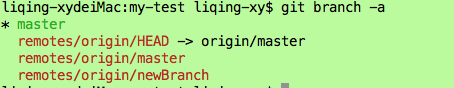
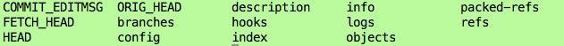
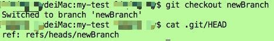

[TOC]


# git checkout 用法总结

> 本文主要参考
>
> - [https://git-scm.com/docs/git-checkout](https://link.jianshu.com/?t=https%3A%2F%2Fgit-scm.com%2Fdocs%2Fgit-checkout)
> - [http://www.tuicool.com/articles/A3Mn6f](https://link.jianshu.com/?t=http%3A%2F%2Fwww.tuicool.com%2Farticles%2FA3Mn6f)

切克闹(checkout)作为git中最为常用的命令之一，对它使用的熟练程度直接决定了你对git理解和掌握的熟练程度，因此我们有理由为这个命令好好的做一下总结。

## 1. 基础

checkout最常用的用法莫过于对于工作分支的切换了：

```
git checkout branchName
```

该命令会将当前工作分支切换到branchName。另外，可以通过下面的命令在新分支创建的同时切换分支：

```
git checkout -b newBranch
```

该命令相当于下面这两条命令的执行结果：

```
1. git branch newBranch 
2. git checkout newBranch
```

该命令的完全体为：

```
  git checkout -b|-B <new_branch> [<start point>]
```

该命令的一个应用场景为：当我们刚从git上clone一个项目后，我们可以查看该项目的分支情况



可以看到，克隆完后，只会默认创建一个master本地分支，其他都是远程分支，此时如果我们想切换到newBranch的远程分支该怎么操作呢？方法有很多种，我们简单介绍两种：
方法一：使用git checkout -b

```
 git checkout -b newBranch  origin/newBranch
```

方法二：使用git branch <branchname> [<start-point>]

```
git branch newBranch origin/newBranch
```

## 2. 深入

要想更深入的了解checkout，我们需要了解checkout的作用机制。该命令的主要关联目标其实是.git 文件夹下的HEAD文件，我们可以查看工程下面的.git文件夹：



该文件夹下HEAD文件记录了当前HEAD的信息，继续查看HEAD文件：


可以看到当前HEAD文件指向了refs/heads路径下的master文件，该文件记录了master分支最近的一次commit id,说明当前HEAD指向了master分支。如果我们将当前分支切换到newBranch 分支，我们再看HEAD文件：



可以看到HEAD文件内容指向了newBranch分支

## 3. 扩展

用法1：

```
 git checkout [-q] [<commit id>] [--] <paths>
```

该命令主要用于检出某一个指定文件。
如果不填写commit id，则默认会从暂存区检出该文件，如果暂存区为空，则该文件会回滚到最近一次的提交状态。当暂存区为空，如果我们想要放弃对某一个文件的修改，可以用这个命令进行撤销：

```
git checkout [-q] [--] <paths>
```

如果填写commit id（既可以是commit hash也可以是分支名称还可以说tag，其本质上都是commit hash），则会从指定commit hash中检出该文件。用于恢复某一个文件到某一个提交状态。

用法2：

```
  git checkout -b <new_branch> [<start_point>]
```

该命令是文章开头部分所说的checkout常见用法的扩展，我们可以指定某一个分支或者某一次提交来创建新的分支，并且切换到该分支下，该命令相当于下面两条命令的执行结果：

```
 1. git branch  <new_branch> [<start_point>]
 2. git checkout <new_branch>
```

用法3：

```
  git checkout -B <new_branch>
```

该命令主要加了一个可选参数B，如果已经存在了同名的分支，使用 git checkout -b <new_branch>会提示错误，加入-B可选参数后会强制创建新分支，并且会覆盖原来存在的同名分支。

用法4：

```
  git checkout --orphan <new_branch>
```

假如你的某个分支上，积累了无数次的提交，你也懒得去打理，打印出的log也让你无力吐槽，那么这个命令将是你的神器，它会基于当前所在分支新建一个赤裸裸的分支，没有任何的提交历史，但是当前分支的内容一一俱全。新建的分支，严格意义上说，还不是一个分支，因为HEAD指向的引用中没有commit值，只有在进行一次提交后，它才算得上真正的分支。

用法5：

```
  git checkout --merge <branch>
```

这个命令适用于在切换分支的时候，将当前分支修改的内容一起打包带走，同步到切换的分支下。
有两个需要注意的问题。
第一，如果当前分支和切换分支间的内容不同的话，容易造成冲突。
第二，切换到新分支后，当前分支修改过的内容就丢失了。
所以这个命令，慎用

用法6：

```
 git checkout -p <branch>
```

这个命令可以用来打补丁。这个命令主要用来比较两个分支间的差异内容，并提供交互式的界面来选择进一步的操作。这个命令不仅可以比较两个分支间的差异，还可以比较单个文件的差异哦！

注：文中如有任何错误，请各位批评指正！


https://www.jianshu.com/p/cad4d2ec4da5