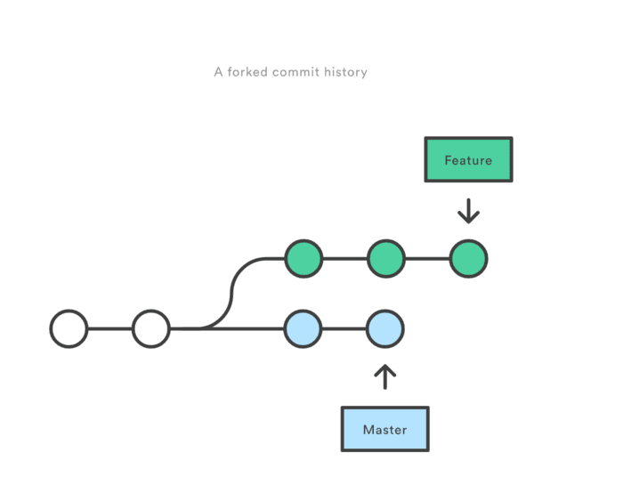
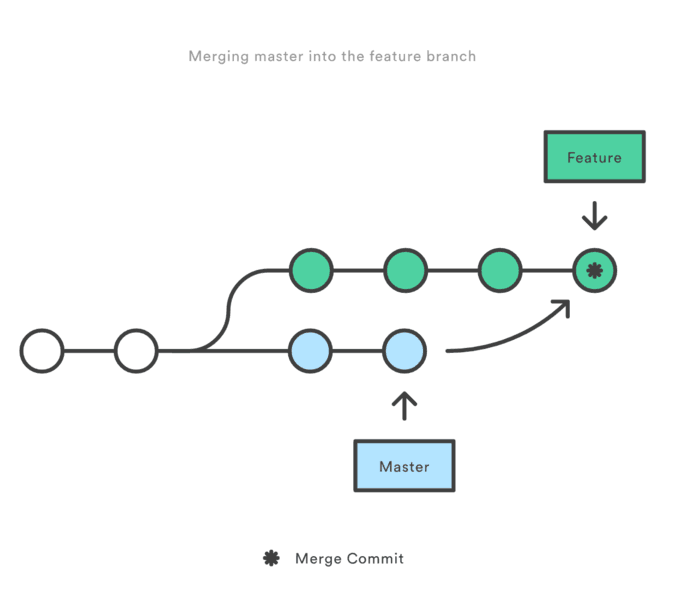
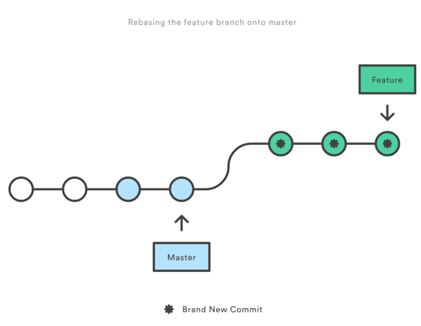
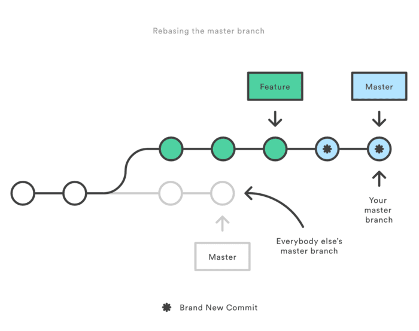

[TOC]


# git rebase 和 git merge 的区别

## 简易说明

最开始实习的时候是使用svn，之后正式工作就一直在使用git，这样算起来，使用git也有两年的时间了。以前带我的同事，让我在拉代码的时候要我使用`git pull --rebase`，一直很纳闷为什么要那样做，后来遇到拉代码的时候有许多冲突要解决，然后去查找资料，才了解到其中的一些事情。今天分享一下，顺便自己也梳理一下。

### git pull

git pull 是　git fetch + git merge FETCH_HEAD 的缩写。所以，默认情况下，git pull就是先fetch，然后执行merge 操作，如果加*–rebase* 参数，就是使用git rebase 代替git merge。

### merge 和 rebase

merge 是合并的意思，rebase是复位基底的意思。

现在我们有这样的两个分支,test和master，提交如下：

```
      D---E test
     /
A---B---C---F master
```

在master执行`git merge test`,然后会得到如下结果：

```
      D--------E
     /          \
A---B---C---F----G   test, master
```

在master执行`git rebase test`，然后得到如下结果：

```
A---B---D---E---C'---F'   test, master  
```

可以看到，merge操作会生成一个新的节点，之前的提交分开显示。而rebase操作不会生成新的节点，是将两个分支融合成一个线性的提交。

### 其他内容放这里

通过上面可以看到，想要更好的提交树，使用rebase操作会更好一点。这样可以线性的看到每一次提交，并且没有增加提交节点。

在我们操作过程中。merge 操作遇到冲突的时候，当前merge不能继续进行下去。手动修改冲突内容后，add 修改，commit 就可以了。

而rebase 操作的话，会中断rebase,同时会提示去解决冲突。解决冲突后,将修改add后执行git rebase –continue继续操作，或者git rebase –skip忽略冲突。

> 原文地址：<http://isming.me/2014/09/26/git-rebase-merge/>，转载请注明出处。


## 详细说明

### Description

git rebase 和 git merge 一样都是用于从一个分支获取并且合并到当前分支，但是他们采取不同的工作方式，以下面的一个工作场景说明其区别

场景：

> 如图所示：你在一个feature分支进行新特性的开发，与此同时，master 分支的也有新的提交。



merge vs rebase.png

为了将master 上新的提交合并到你的feature分支上，你有两种选择：`merging` or`rebasing`

### merge

执行以下命令：

```
git checkout feature
git merge master
```

或者执行更简单的：

```
git merge master feature
```

那么此时在feature上git 自动会产生一个新的commit(merge commit)
look like this：



merge.png

marge 特点：自动创建一个新的commit
如果合并的时候遇到冲突，仅需要修改后重新commit
优点：记录了真实的commit情况，包括每个分支的详情
缺点：因为每次merge会自动产生一个merge commit，所以在使用一些git 的GUI tools，特别是commit比较频繁时，看到分支很杂乱。

### rebase

本质是变基 变基 变基
变基是什么? `找公共祖先`
共同祖先是什么? 详见参考资料2、3官方的文章

执行以下命令：

```
git checkout feature
git rebase master
```

look like this:



rebase.png

rebase 特点：会合并之前的commit历史
优点：得到更简洁的项目历史，去掉了merge commit
缺点：如果合并出现代码问题不容易定位，因为re-write了history

合并时如果出现冲突需要按照如下步骤解决

- 修改冲突部分
- git add
- `git rebase --continue`
- （如果第三步无效可以执行 `git rebase --skip`）

不要在git add 之后习惯性的执行 git commit命令

#### The Golden Rule of Rebasing rebase的黄金法则

```
never use it on public branches(不要在公共分支上使用)
```

比如说如下场景：如图所示



golden rule in using rebase.png

如果你rebase master 到你的feature分支：

rebase 将所有master的commit移动到你的feature 的顶端。问题是：其他人还在original master上开发，由于你使用了rebase移动了master，git 会认为你的主分支的历史与其他人的有分歧，会产生冲突。

所以在执行git rebase 之前 问问自己，

> 会有其他人看这个分支么？
> if YES 不要采用这种带有破坏性的修改commit 历史的rebase命令
> if NO ok，随你便，可以使用rebase

### Summary 总结

如果你想要一个干净的，没有merge commit的线性历史树，那么你应该选择git rebase
如果你想保留完整的历史记录，并且想要避免重写commit history的风险，你应该选择使用git merge


### 参考资料

1. [https://www.atlassian.com/git/tutorials/merging-vs-rebasing/conceptual-overview](https://link.jianshu.com/?t=https://www.atlassian.com/git/tutorials/merging-vs-rebasing/conceptual-overview)
2. [https://git-scm.com/book/zh/v2/Git-%E5%88%86%E6%94%AF-%E5%8F%98%E5%9F%BA](https://link.jianshu.com/?t=https://git-scm.com/book/zh/v2/Git-%E5%88%86%E6%94%AF-%E5%8F%98%E5%9F%BA)
3. [https://git-scm.com/book/zh/v2/Git-%E5%88%86%E6%94%AF-%E5%88%86%E6%94%AF%E7%9A%84%E6%96%B0%E5%BB%BA%E4%B8%8E%E5%90%88%E5%B9%B6#_basic_merging](https://link.jianshu.com/?t=https://git-scm.com/book/zh/v2/Git-%E5%88%86%E6%94%AF-%E5%88%86%E6%94%AF%E7%9A%84%E6%96%B0%E5%BB%BA%E4%B8%8E%E5%90%88%E5%B9%B6#_basic_merging)


https://www.jianshu.com/p/f23f72251abc