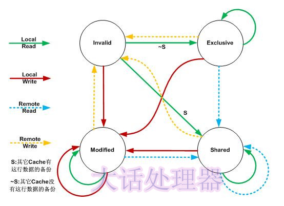

# cpu《大话处理器》 Cache一致性协议之MESI

##  Cache一致性协议之MESI

​          处理器上有一套完整的协议，来保证Cache一致性。比较经典的Cache一致性协议当属MESI协议，奔腾处理器有使用它，很多其他的处理器都是使用它的变种。

单核Cache中每个Cache line有2个标志：dirty和valid标志，它们很好的描述了Cache和Memory(内存)之间的数据关系(数据是否有效，数据是否被修改)，而在多核处理器中，多个核会共享一些数据，MESI协议就包含了描述共享的状态。

​         在MESI协议中，每个Cache line有4个状态，可用2个bit表示，它们分别是： 

| 状态         | 描述                                                         |
| ------------ | ------------------------------------------------------------ |
| M(Modified)  | 这行数据有效，数据被修改了，和内存中的数据不一致，数据只存在于本Cache中。 |
| E(Exclusive) | 这行数据有效，数据和内存中的数据一致，数据只存在于本Cache中。 |
| S(Shared)    | 这行数据有效，数据和内存中的数据一致，数据存在于很多Cache中。 |
| I(Invalid)   | 这行数据无效。                                               |

## MESI状态

​           M(Modified)和E(Exclusive)状态的Cache line，数据是独有的，不同点在于M状态的数据是dirty的(和内存的不一致)，E状态的数据是clean的(和内存的一致)。

​          S(Shared)状态的Cache line，数据和其他Core的Cache共享。只有clean的数据才能被多个Cache共享。

​          I(Invalid)表示这个Cache line无效。

 

### E状态

E状态示例如下：

 

E状态

​       只有Core 0访问变量x，它的Cache line状态为E(Exclusive)。

 

### S状态

​        S状态示例如下：

S状态

​         3个Core都访问变量x，它们对应的Cache line为S(Shared)状态。

 

### M状态和I状态

​         M状态和I状态示例如下：

 

M状态和I状态

​            Core 0修改了x的值之后，这个Cache line变成了M(Modified)状态，其他Core对应的Cache line变成了I(Invalid)状态。

 

## MESI协议状态迁移

​        在MESI协议中，每个Cache的Cache控制器不仅知道自己的读写操作，而且也监听(snoop)其它Cache的读写操作。每个Cache line所处的状态根据本核和其它核的读写操作在4个状态间进行迁移。

​       MESI协议状态迁移图如下：

MESI协议状态迁移图

​        在上图中，Local Read表示本内核读本Cache中的值，Local Write表示本内核写本Cache中的值，Remote Read表示其它内核读其它Cache中的值，Remote Write表示其它内核写其它Cache中的值，箭头表示本Cache line状态的迁移，环形箭头表示状态不变。

​        **当内核需要访问的数据不在本Cache中，而其它Cache有这份数据的备份时，本Cache既可以从内存中导入数据，也可以从其它Cache中导入数据，不同的处理器会有不同的选择**。**MESI协议为了使自己更加通用，没有定义这些细节，只定义了状态之间的迁移**，下面的描述假设本Cache从内存中导入数据。

​        MESI状态之间的迁移过程如下：

| 当前状态     | 事件                                                         | 行为                                                         | 下一个状态 |
| ------------ | ------------------------------------------------------------ | ------------------------------------------------------------ | ---------- |
| I(Invalid)   | Local Read                                                   | 如果其它Cache没有这份数据，本Cache从内存中取数据，Cache line状态变成E；如果其它Cache有这份数据，且状态为M，则将数据更新到内存，本Cache再从内存中取数据，2个Cache 的Cache line状态都变成S；如果其它Cache有这份数据，且状态为S或者E，本Cache从内存中取数据，这些Cache 的Cache line状态都变成S | E/S        |
| Local Write  | 从内存中取数据，在Cache中修改，状态变成M；如果其它Cache有这份数据，且状态为M，则要先将数据更新到内存；如果其它Cache有这份数据，则其它Cache的Cache line状态变成I | M                                                            |            |
| Remote Read  | 既然是Invalid，别的核的操作与它无关                          | I                                                            |            |
| Remote Write | 既然是Invalid，别的核的操作与它无关                          | I                                                            |            |
| E(Exclusive) | Local Read                                                   | 从Cache中取数据，状态不变                                    | E          |
| Local Write  | 修改Cache中的数据，状态变成M                                 | M                                                            |            |
| Remote Read  | 数据和其它核共用，状态变成了S                                | S                                                            |            |
| Remote Write | 数据被修改，本Cache line不能再使用，状态变成I                | I                                                            |            |
| S(Shared)    | Local Read                                                   | 从Cache中取数据，状态不变                                    | S          |
| Local Write  | 修改Cache中的数据，状态变成M，其它核共享的Cache line状态变成I | M                                                            |            |
| Remote Read  | 状态不变                                                     | S                                                            |            |
| Remote Write | 数据被修改，本Cache line不能再使用，状态变成I                | I                                                            |            |
| M(Modified)  | Local Read                                                   | 从Cache中取数据，状态不变                                    | M          |
| Local Write  | 修改Cache中的数据，状态不变                                  | M                                                            |            |
| Remote Read  | 这行数据被写到内存中，使其它核能使用到最新的数据，状态变成S  | S                                                            |            |
| Remote Write | 这行数据被写到内存中，使其它核能使用到最新的数据，由于其它核会修改这行数据，状态变成I | I                                                            |            |

MESI状态迁移

​           AMD的Opteron处理器使用从MESI中演化出的MOESI协议，O(Owned)是MESI中S和M的一个合体，表示本Cache line被修改，和内存中的数据不一致，不过其它的核可以有这份数据的拷贝，状态为S。

​         Intel的core i7处理器使用从MESI中演化出的MESIF协议，F(Forward)从Share中演化而来，一个Cache line如果是Forward状态，它可以把数据直接传给其它内核的Cache，而Share则不能。

https://blog.csdn.net/muxiqingyang/article/details/6615199