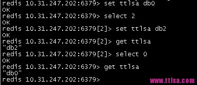
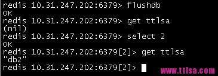
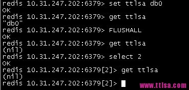

# redis 多数据库 切换数据库

一台服务器上都快开启200个[redis](http://www.ttlsa.com/redis/)实例了，看着就崩溃了。这么做无非就是想让不同类型的数据属于不同的应用程序而彼此分开。

那么，redis有没有什么方法使不同的应用程序数据彼此分开同时又存储在相同的实例上呢？就相当于mysql数据库，不同的应用程序数据存储在不同的数据库下。

redis下，数据库是由一个整数索引标识，而不是由一个数据库名称。默认情况下，一个客户端连接到数据库0。redis配置文件中下面的参数来控制数据库总数：

```
databases 16
```

可以通过下面的命令来切换到不同的数据库下

```
redis> select 2 
OK
```

随后，所有的命令将使用数据库3，知道你明确的切换到另一个数据库下。

每个数据库都有属于自己的空间，不必担心之间的key冲突。

[](http://www.ttlsa.com/wp-content/uploads/2013/12/redis-1.jpg)

不同的数据库下，相同的key取到各自的值。

[](http://www.ttlsa.com/wp-content/uploads/2013/12/redis-2.jpg)

flushdb命令清除数据，只会清除当前的数据库下的数据，不会影响到其他数据库。

[](http://www.ttlsa.com/wp-content/uploads/2013/12/redis-3.jpg)

flushall命令会清除这个实例的数据。在执行这个命令前要格外小心。

数据库的数量是可以配置的，默认情况下是16个。修改redis.conf下的databases指令：

```
databases 64
```

redis没有提供任何方法来关联标识不同的数据库。因此，需要你来跟踪什么数据存储到哪个数据库下。

因此上面的快开启200个实例的场景，可以使用不同的数据库来存储，而不必开启如此那么多的实例。

转载请注明来自[运维生存时间](http://www.ttlsa.com/): http://www.ttlsa.com/html/4010.html


http://www.ttlsa.com/redis/redis-database/