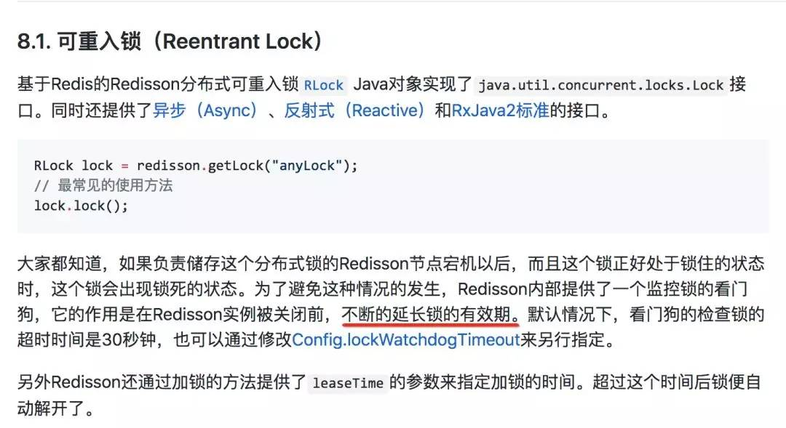
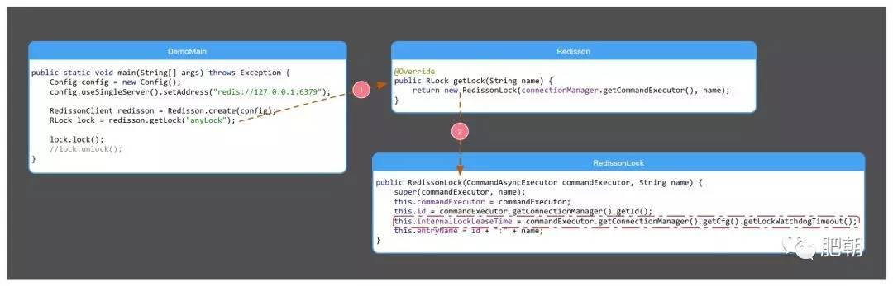
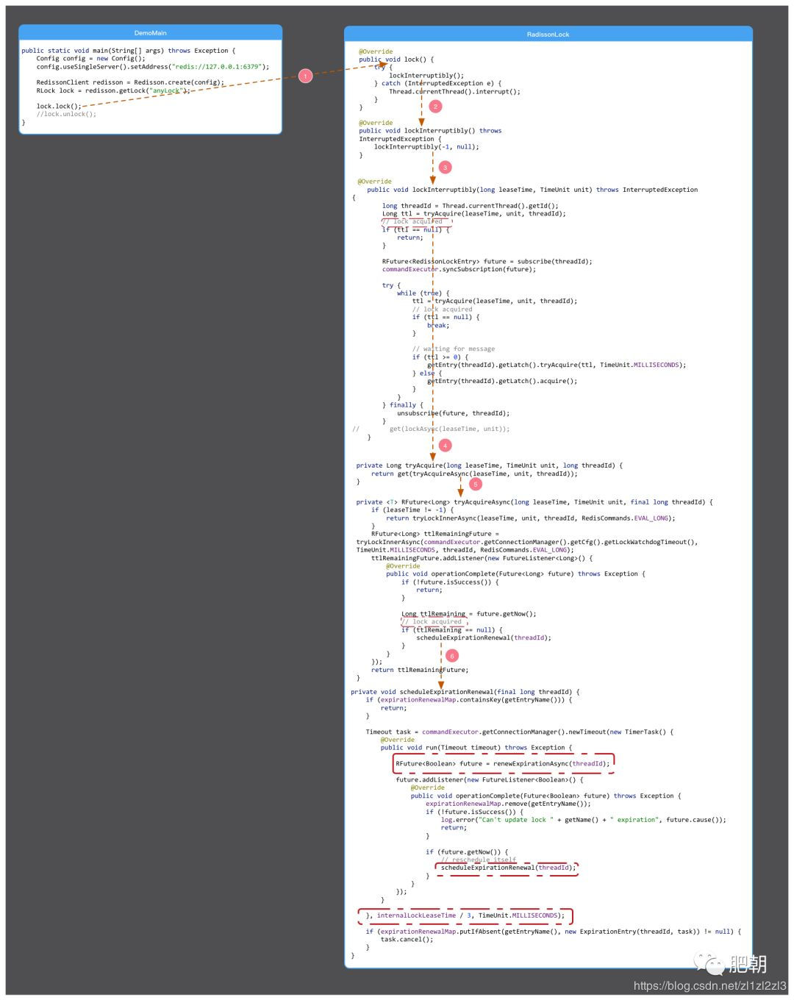

# Redis分布式锁如何续期？

## 前言

上一篇[面试官问我，使用Dubbo有没有遇到一些坑？我笑了。]之后,又有一位粉丝和我说在面试过程中被虐了.鉴于这位粉丝是之前肥朝的**粉丝**,而且周一又要开启新一轮的面试,为了回馈他长期以来的支持,所以连夜写了本篇,希望能对他接下来的面试有所帮助.

## 真实案例


## Redis分布式锁的正确姿势

据肥朝了解,很多同学在用分布式锁时,都是直接百度搜索找一个Redis分布式锁工具类就直接用了.关键是该工具类中还充斥着很多`System.out.println();`等语句.其实Redis分布式锁比较正确的姿势是采用`redisson`这个客户端工具.具体介绍可以搜索最大的同性交友网站`github`.

## 如何回答

首先如果你之前用Redis的分布式锁的姿势正确,并且看过相应的官方文档的话,这个问题`So easy`.我们来看



坦白说,如果你英文棒棒哒那么看英文文档可能更好理解

> By default lock watchdog timeout is 30 seconds and can be changed through Config.lockWatchdogTimeout setting.

但是你如果看的是中文文档

> 看门狗检查锁的超时时间默认是30秒

这句话肥朝从语文角度分析就是一个歧义句,他有两个意思

> 1.看门狗默认30秒去检查一次锁的超时时间
> 2.看门狗会去检查锁的超时时间,锁的时间时间默认是30秒

看到这里,我希望大家不要黑我的小学体育老师,虽然他和语文老师是同个人.语文不行,我们可以源码来凑!

## 源码分析

我们根据官方文档给出的例子,写了一个最简单的demo,例子根据上面截图中`Ctr+C和Ctr+V`一波操作,如下

```java
public class DemoMain {

    public static void main(String[] args) throws Exception {
        Config config = new Config();
        config.useSingleServer().setAddress("redis://127.0.0.1:6379");

        RedissonClient redisson = Redisson.create(config);
        RLock lock = redisson.getLock("anyLock");

        lock.lock();
        //lock.unlock();
    }
} 
```


## create



从这里我们知道,`internalLockLeaseTime` 和 `lockWatchdogTimeout`这两个参数是相等的.

`lockWatchdogTimeout`默认值如下

```java
public class Config {

    private long lockWatchdogTimeout = 30 * 1000;

    public long getLockWatchdogTimeout() {
        return lockWatchdogTimeout;
    }

    //省略无关代码
} 
```

从`internalLockLeaseTime`这个单词也可以看出,这个加的分布式锁的超时时间默认是30秒.但是还有一个问题,那就是这个看门狗,多久来延长一次有效期呢?我们往下看

## lock



从我图中框起来的地方我们就知道了,获取锁成功就会开启一个定时任务,也就是`watchdog`,定时任务会定期检查去续期`renewExpirationAsync(threadId)`.

这里定时用的是`netty-common`包中的`HashedWheelTimer`,肥朝公众号已经和各大搜索引擎建立了密切的合作关系,你只需要把这个类在任何搜索引擎一搜,都能知道相关API参数的意义.

从图中我们明白,该定时调度每次调用的时间差是`internalLockLeaseTime / 3`.也就10秒.

## 真相大白

通过源码分析我们知道,默认情况下,加锁的时间是30秒.如果加锁的业务没有执行完,那么到 30-10 = 20秒的时候,就会进行一次续期,把锁重置成30秒.那这个时候可能又有同学问了,那业务的机器万一宕机了呢?宕机了定时任务跑不了,就续不了期,那自然30秒之后锁就解开了呗.

## 写在最后

如果你是肥朝公众号的老粉丝,并且在面试、工作过程中遇到了什么问题,欢迎来撩.但是肥朝是个正经的Java开发,我们只调接口,不调情!

**作者：肥朝**

> 免费Java资料领取，涵盖了Java、Redis、MongoDB、MySQL、Zookeeper、Spring Cloud、Dubbo/Kafka、Hadoop、Hbase、Flink等高并发分布式、大数据、机器学习等技术。
> 传送门： [mp.weixin.qq.com/s/JzddfH-7y…](https://link.juejin.im/?target=http%3A%2F%2Flink.zhihu.com%2F%3Ftarget%3Dhttps%253A%2F%2Fmp.weixin.qq.com%2Fs%2FJzddfH-7yNudmkjT0IRL8Q)


<https://juejin.im/post/5c890c79e51d4565fa635f9e>