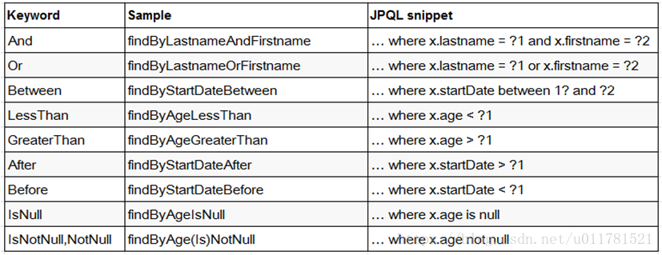

[TOC]


# spring-data-mongodb中的MongoTemplate与MongoRepository及推荐

SpringData支持两种关系数据存储技术：

JDBC

JPA

● SpringData 方法定义JPA规范：

 


1. 不是随便声明的，而需要符合一定的规范
2. 查询方法以find | read | get开头
3. 涉及条件查询时，条件的属性用条件关键字连接
4. 要注意的是：条件属性首字母需要大写
5. 支持属性的级联查询，但若当前类有符合条件的属性则优先使用，而不使用级联属性,若需要使用级联属性，则属性之间使用_强制进行连接

## (一)、MongoRepository  

1.使用Spring Data MongoDb Repository可以使你不用写相关的查询组合语句，它会内部为我们实现这样的一个类。 

2.只要你按规定定义好接口名就可以免去你写查询组合语句。 

3.要有主键值才可以用save(有就更新，没有就插入)。所以就算没有ID也增加这个字段是好的。（id要是String才会自动为你生面ID号（保存时可以没有值），int 要你自己做惟一处理和输入值） 

4.DATE不能作为主键使用。 


Repository 接口是 Spring Data 的一个核心接口，它不提供任何方法，开发者需要在自己定义的接口中声明需要的方法 

public interface Repository<T, ID extends Serializable> { } 

Spring Data可以让我们只定义接口，只要遵循 Spring Data的规范，就无需写实现类。  
与继承 Repository 等价的一种方式，就是在持久层接口上使用 @RepositoryDefinition 注解，并为其指定 domainClass 和 idClass 属性,两种方式没有区别。

Repository 提供了最基本的数据访问功能，其几个子接口则扩展了一些功能。它们的继承关系如下：

```
Repository： 仅仅是一个标识，表明任何继承它的均为仓库接口类
CrudRepository： 继承 Repository，实现了一组 CRUD 相关的方法 
PagingAndSortingRepository： 继承 CrudRepository，实现了一组分页排序相关的方法 
MongoRepository： 继承 PagingAndSortingRepository，实现一组 mongodb规范相关的方法
```

自定义的 XxxxRepository 需要继承 MongoRepository，这样的 XxxxRepository 接口就具备了通用的数据访问控制层的能力(CURD的操作功能)。

**MongoRepository的缺点是不够灵活，MongoTemplate可以用来补充，对mongodb本身熟悉的话，你会发现使用MongoTemplate更加游刃有余，它更加接近原生的mongodb命令。**

## (二)、MongoTemplate（跟Mybatis类似）

MongoTemplate是数据库和代码之间的接口，对数据库的操作都在它里面。

MongoTemplate核心操作类：Criteria和Query 

- Criteria类：封装所有的语句，以方法的形式查询。
- Query类：将语句进行封装或者添加排序之类的操作。

```
1.MongoTemplate实现了interface MongoOperations。
2.MongoDB documents和domain classes之间的映射关系是通过实现了MongoConverter这个interface的类来实现的。
3.MongoTemplate提供了非常多的操作MongoDB的方法。 它是线程安全的，可以在多线程的情况下使用。
4.MongoTemplate实现了MongoOperations接口, 此接口定义了众多的操作方法如"find", "findAndModify", "findOne", "insert", "remove", "save", "update" and "updateMulti"等。
5.MongoTemplate转换domain object为DBObject,缺省转换类为MongoMappingConverter,并提供了Query, Criteria, and Update等流式API。
```

因为我们大都和spring一起使用，所以推荐参考https://docs.spring.io/spring-data/mongodb/docs/2.0.14.RELEASE/reference/html/#mongo.query。


```
public class MongoApp {

  private static final Log log = LogFactory.getLog(MongoApp.class);

  public static void main(String[] args) {

    MongoOperations mongoOps = new MongoTemplate(new MongoClient(), "database"); 
    Person p = new Person("Joe", 34); // Insert is used to initially store the object into the database.  
    mongoOps.insert(p); log.info("Insert: " + p); // Find 
    p = mongoOps.findById(p.getId(), Person.class); 
    log.info("Found: " + p); // Update 
    mongoOps.updateFirst(query(where("name").is("Joe")), update("age", 35), Person.class); 
    p = mongoOps.findOne(query(where("name").is("Joe")), Person.class); 
    log.info("Updated: " + p); // Delete  
    mongoOps.remove(p); // Check that deletion worked 
    List<Person> people = mongoOps.findAll(Person.class); 
    log.info("Number of people = : " + people.size()); 
    mongoOps.dropCollection(Person.class); 
  } 
}
```


```
@Configuration
public class AppConfig {

  public @Bean MongoClient mongoClient() {
      return new MongoClient("localhost");
  }

  public @Bean MongoTemplate mongoTemplate() {
      return new MongoTemplate(mongoClient(), "mydb");
  }
}
```

 


https://www.cnblogs.com/zhjh256/p/10721316.html