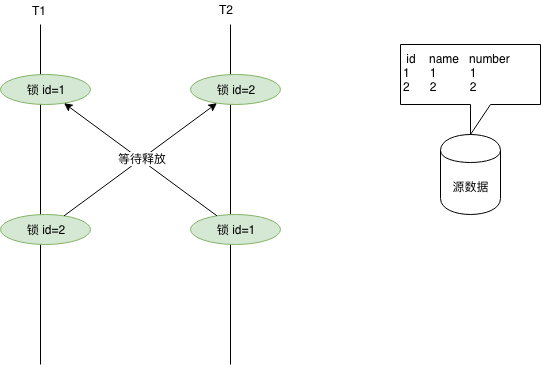

[TOC]

# mysql（InnoDB）是如何处理死锁的

## 一、什么是死锁

官方定义如下：两个事务都持有对方需要的锁，并且在等待对方释放，并且双方都不会释放自己的锁。

这个就好比你有一个人质，对方有一个人质，你们俩去谈判说换人。你让对面放人，对面让你放人。

## 二、为什么会形成死锁

看到这里，也许你会有这样的疑问，事务和谈判不一样，为什么事务不能使用完锁之后立马释放呢？居然还要操作完了之后一直持有锁？这就涉及到 MySQL 的并发控制了。

MySQL的并发控制有两种方式，一个是 MVCC，一个是两阶段锁协议。那么为什么要并发控制呢？是因为多个用户同时操作 MySQL 的时候，为了提高并发性能并且要求如同多个用户的请求过来之后如同串行执行的一样（`可串行化调度`）。具体的并发控制这里不再展开。咱们继续深入讨论两阶段锁协议。

### 两阶段锁协议（2PL）

官方定义：

> 两阶段锁协议是指所有事务必须分两个阶段对数据加锁和解锁，在对任何数据进行读、写操作之前，事务首先要获得对该数据的封锁；在释放一个封锁之后，事务不再申请和获得任何其他封锁。

对应到 MySQL 上分为两个阶段：

1. 扩展阶段（事务开始后，commit 之前）：获取锁
2. 收缩阶段（commit 之后）：释放锁

就是说呢，只有遵循两段锁协议，才能实现 `可串行化调度`。

但是两阶段锁协议不要求事务必须一次将所有需要使用的数据加锁，并且在加锁阶段没有顺序要求，所以这种并发控制方式会形成死锁。

## 三、MySQL 如何处理死锁？

MySQL有两种死锁处理方式：

1. 等待，直到超时（innodb_lock_wait_timeout=50s）。
2. 发起死锁检测，主动回滚一条事务，让其他事务继续执行（innodb_deadlock_detect=on）。默认是这个

由于性能原因，一般都是使用死锁检测来进行处理死锁。

### 死锁检测

死锁检测的原理是构建一个以事务为顶点、锁为边的有向图，判断有向图是否存在环，存在即有死锁。

### 回滚

检测到死锁之后，选择插入更新或者删除的行数最少的事务回滚，基于 INFORMATION_SCHEMA.INNODB_TRX 表中的 trx_weight 字段来判断。

## 四、如何避免发生死锁

### 收集死锁信息：

1. 利用命令 `SHOW ENGINE INNODB STATUS`查看死锁原因。
2. 调试阶段开启 innodb_print_all_deadlocks，收集所有死锁日志。

### 减少死锁：

1. 使用事务，不使用 `lock tables` 。
2. 保证没有长事务。
3. 操作完之后立即提交事务，特别是在交互式命令行中。
4. 如果在用 `(SELECT ... FOR UPDATE or SELECT ... LOCK IN SHARE MODE)`，尝试降低隔离级别。
5. 修改多个表或者多个行的时候，`将修改的顺序保持一致`。
6. 创建索引，可以使创建的锁更少。
7. 最好不要用 `(SELECT ... FOR UPDATE or SELECT ... LOCK IN SHARE MODE)`。
8. 如果上述都无法解决问题，那么尝试使用 `lock tables t1, t2, t3` 锁多张表

 

<https://www.cnblogs.com/wdy1184/p/10703832.html>