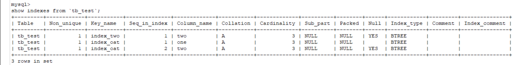
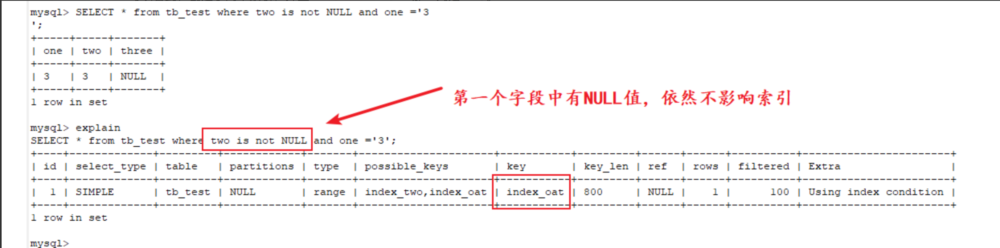
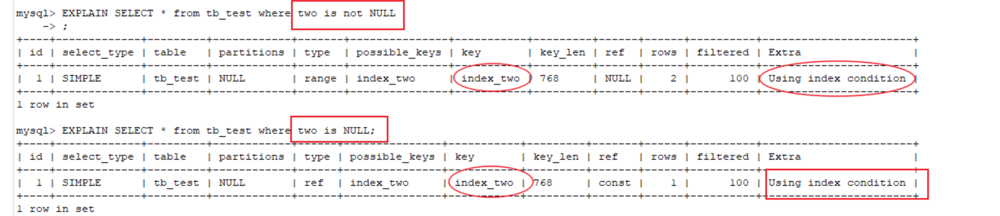
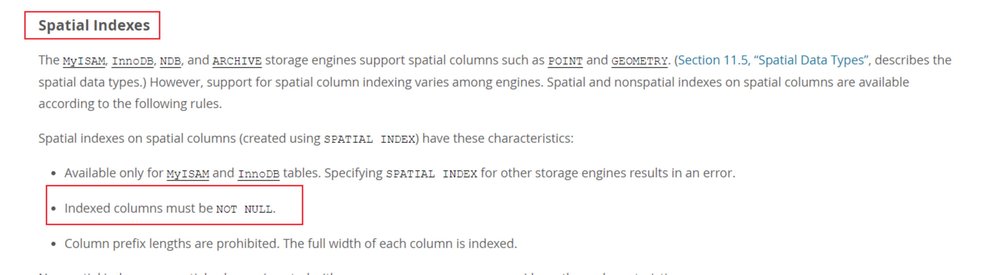

[TOC]


# mysql 中NULL和空值的区别

## 01 小木的故事

作为后台开发，在日常工作中如果要接触Mysql数据库，那么不可避免会遇到Mysql中的NULL和空值。那你知道它们有什么区别吗？

> 学不动了，也不想知道它们有什么区别。大兄弟，不行啊，要面试！


前些天我的好朋友小木去应聘工作，他面试完回来和我聊天回味了一道他的面试题。

------

面试官：你有用过MySQL吗？

小木：有！

面试官：那你能大概说一下Mysql中 NULL值和空值的区别吗？

小木：（思考...）NULL和空值都用过，你要我说它两有啥区别，这个我还真没仔细想过，反正实际开发中会用！

听了小木的这个回答。

我说：你这样回答肯定是不妥的，这个问题你是必挂了。

小木说： NULL翻译过来不就是空吗？我是真的没有仔细想过，这个还是挺迷惑人的。

------

为了其他的伙伴在遇到这个问题的时候不要像我的好友小木一样在此处跌倒，错过心仪的公司，下面简单整理聊聊这两者的一些区别和使用。

## 02 NULL和空值

NULL也就是在字段中存储NULL值，空值也就是字段中存储空字符('')。

### **1、占用空间区别**

```
mysql>  select length(NULL), length(''), length('1');
+--------------+------------+-------------+
| length(NULL) | length('') | length('1') |
+--------------+------------+-------------+
| NULL         |          0 |           1 |
+--------------+------------+-------------+
1 row in set
```

**小总结**：从上面看出空值('')的长度是0，是不占用空间的；而的NULL长度是NULL，其实它是占用空间的，看下面说明。

> NULL columns require additional space in the row to record whether their values are NULL.
>
> NULL列需要行中的额外空间来记录它们的值是否为NULL。

通俗的讲：空值就像是一个真空转态杯子，什么都没有，而NULL值就是一个装满空气的杯子，虽然看起来都是一样的，但是有着本质的区别。

### **2、插入/查询方式区别**

创建一个表，`tb_test`

```
CREATE TABLE `tb_test` (
  `one` varchar(10) NOT NULL,
  `two` varchar(255) DEFAULT NULL
) ENGINE=InnoDB DEFAULT CHARSET=utf8; 
```

插入进行验证：

```
-- 全部插入 NULL，失败
mysql> INSERT tb_test VALUES (NULL,NULL);
1048 - Column 'one' cannot be null 
-- 全部插入 空值，成功
mysql> INSERT tb_test VALUES ('','');
Query OK, 1 row affected 
```

------

模拟数据：

```
INSERT tb_test VALUES (1,NULL);
INSERT tb_test VALUES ('',2);
INSERT tb_test VALUES (3,3); 
```

空值字段：

```
-- 使用 is null/is not null
mysql> SELECT * FROM tb_test where one is NULL;
Empty set

mysql> SELECT * FROM tb_test where one is not NULL;
+-----+------+
| one | two  |
+-----+------+
| 1   | NULL |
|     | 2    |
| 3   | 3    |
+-----+------+
3 rows in set
-- 使用 = 、!=
mysql> SELECT * FROM tb_test where one = '';
+-----+-----+
| one | two |
+-----+-----+
|     | 2   |
+-----+-----+
1 row in set

mysql> SELECT * FROM tb_test where one != '';
+-----+------+
| one | two  |
+-----+------+
| 1   | NULL |
| 3   | 3    |
+-----+------+
2 rows in set

复制代码
```

NULL值字段：

```
-- 使用 is null/is not null
mysql> SELECT * FROM tb_test where two is not NULL;
+-----+-----+
| one | two |
+-----+-----+
|     | 2   |
| 3   | 3   |
+-----+-----+
2 rows in set

mysql> SELECT * FROM tb_test where two is NULL;
+-----+------+
| one | two  |
+-----+------+
| 1   | NULL |
+-----+------+
1 row in set

-- 使用 = 、!=
mysql> SELECT * FROM tb_test where two = '';
Empty set

mysql> SELECT * FROM tb_test where two != '';
+-----+-----+
| one | two |
+-----+-----+
|     | 2   |
| 3   | 3   |
+-----+-----+
2 rows in set
复制代码
```

**小总结**：如果要单纯查NULL值列，则使用 `is NULL`去查，单纯去查空值('')列，则使用 `=''`。

建议查询方式：NULL值查询使用is null/is not null查询，而空值('')可以使用=或者!=、<、>等算术运算符。

### **3、COUNT 和 IFNULL函数**

使用`COUNT`函数：

```
mysql> SELECT count(one) FROM tb_test;
+------------+
| count(one) |
+------------+
|          3 |
+------------+
1 row in set

mysql> SELECT count(two) FROM tb_test;
+------------+
| count(two) |
+------------+
|          2 |
+------------+
1 row in set

mysql> SELECT count(*) FROM tb_test;
+----------+
| count(*) |
+----------+
|        3 |
+----------+
1 row in set
复制代码
```

使用`IFNULL`函数：

```
mysql> SELECT IFNULL(one,111111111) from tb_test WHERE one = '';
+-----------------------+
| IFNULL(one,111111111) |
+-----------------------+
|                       |
+-----------------------+
1 row in set

mysql> SELECT IFNULL(two,11111111) from tb_test where two is NULL;
+----------------------+
| IFNULL(two,11111111) |
+----------------------+
| 11111111             |
+----------------------+
1 row in set
复制代码
```

**小总结**：使用 COUNT(字段) 统计会过滤掉 NULL 值，但是不会过滤掉空值。

说明：IFNULL有两个参数。 如果第一个参数字段不是`NULL`，则返回第一个字段的值。 否则，`IFNULL`函数返回第二个参数的值（默认值）。

### **4、索引字段说明**

看到网上有一些人说： **MySql中如果某一列中含有NULL，那么包含该列的索引就无效了。**

给`one` 和`two` 字段分别加上普通索引。之前有写过，在复习添加索引：[Mysql索引整理总结](https://blog.csdn.net/u010648555/article/details/81102957#_87)

```
-- ALTER TABLE table_name ADD INDEX index_name(col_name);
ALTER TABLE tb_test ADD INDEX index_oat (one, two);
ALTER TABLE tb_test add INDEX index_two(two);
```

使用 `show keys from 表名;`或`show indexes from 表名;` ，查看这个表的所有索引信息。

一个普通索引，一个复合索引。

**复合索引遵守“最左前缀”原则**，**即在查询条件中使用了复合索引的第一个字段，索引才会被使用**。因此，在复合索引中索引列的顺序至关重要。



可以看到，创建了两个索引，并且`index_tow` NULL 那一列是 YES。

使用`EXPLAIN` 来进行演示说明，`EXPLAIN` 的使用说明：[Mysql中explain用法和结果字段的含义介绍](https://blog.csdn.net/u010648555/article/details/81106983#explain_39)

复合索引



普通索引




发现查询`two`字段 是可以正常使用索引的。我使用的MYSQL 5.7 ,**InnoDB** 引擎。也看了一些网上的资料，[MySQL中NULL对索引的影响](https://www.jianshu.com/p/3cae3e364946) 这个文章中用例子验证，**MySQL可以在含有null的列上使用索引**。

**备注**：可能是其他条件下不行，看网上资料说使用`空间索引`会失效，具体我没有去验证，空间索引没有用到过。查询官网[create-index-spatial](https://dev.mysql.com/doc/refman/5.7/en/create-index.html#create-index-spatial)，感兴趣的伙伴可以自行验证。



**这里我想到一点，很多问题的答案都是在指定的条件和环境下才成立，多质疑，多验证**。

**小总结** ：在有NULL值得字段上使用常用的索引，如普通索引、复合索引、全文索引等不会使索引失效。在官网查看在空间索引的情况下，说明了 索引列必须为NOT NULL。

## 03 总结提升

如果你可以从上面的几个方面和面试官进行一个沟通，即使回答的不是那么的完美，但总比 “这两个都用过，具体有啥区别就不知道了” 这样的回答能好那么一点点。

1、空值不占空间，NULL值占空间。当字段不为NULL时，也可以插入空值。

2、当使用 IS NOT NULL 或者 IS NULL 时，只能查出字段中没有不为NULL的或者为 NULL 的，不能查出空值。

3、判断NULL 用IS NULL 或者 is not null,SQL 语句函数中可以使用IFNULL()函数来进行处理，判断空字符用 =''或者<>''来进行处理。

4、在进行count()统计某列的记录数的时候，如果采用的NULL值，会别系统自动忽略掉，但是空值是会进行统计到其中的。

5、MySql中如果某一列中含有NULL，那么包含该列的索引就无效了。这一句不是很准确。

6：实际到底是使用NULL值还是空值('')，根据实际业务来进行区分。个人建议在实际开发中如果没有特殊的业务场景，可以直接使用空值。

以上就是我的对此问题的整理和思考，希望可以在面试中帮助到你。如果你对此话题有自己的思考和理解，也欢迎留言一起探讨！

## 04 参考资料

[www.cnblogs.com/wzmenjoy/p/…](https://www.cnblogs.com/wzmenjoy/p/4244590.html)

[dev.mysql.com/doc/refman/…](https://dev.mysql.com/doc/refman/5.7/en/working-with-null.html)


https://juejin.im/post/5d1c32bf51882551253e483d