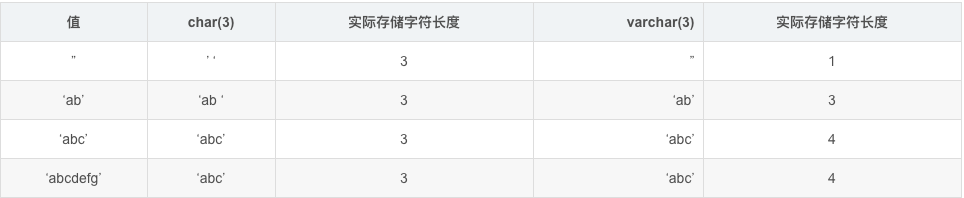

[TOC]

# mysql 中char与varchar数据类型选择原则

原创我爱默小兜 最后发布于2016-05-31 15:37:15 阅读数 7998  收藏

很多地方在分析char与varchar数据类型选择原则上，往往忽略了存储引擎。事实上，我们应当根据选定的存储引擎,确定如何选择合适的数据类型。

## char与varchar比较

总结：从上表可以看出，char属于定长的。

char属于定长类型，varchar属于非定长类型，varchar属于变长。可能有人会问为什么varchar长度比数据长度大呢？因为VARCHAR保存时用一个字节或两个字节长的前缀+数据。如果VARCHAR列声明的长度大于255，长度前缀是两个字节，否则是一个字节。

## MyISAM存储引擎

MyISAM数据表，最好使用固定长度的数据列代替可变长度的数据列。

## InnoDB 存储引擎

建议使用VARCHAR类型。
对于InnoDB数据表，内部的行存储格式没有区分固定长度和可变长度列（所有数据行都使用指向数据列值的头指针），因此在本质上，使用固定长度的CHAR列不一定比使用可变长度VARCHAR列简单。因而，主要的性能因素是数据行使用的存储总量。由于CHAR平均占用的空间多于VARCHAR，因此使用VARCHAR来最小化需要处理的数据行的存储总量和磁盘I/O是比较好的。

## MEMORY存储引擎

MEMORY数据表目前都使用固定长度的数据行存储，因此无论使用CHAR或VARCHAR列都没有关系。两者都是作为CHAR类型处理的。

## 误区

1.我们都知道，utf-8的中文占3个字节，gbk占两个字节，那么varchar(20)是不是只能存储20个字节，即存储6个汉字呢？

答：不是这样的，（网上说5.0之前版本是这样的，没有测试）。mysql varchar(20) 不管中文还是英文都能存20个，但varchar字段的最大长度跟编码有关，如果是utf-8，那么大概65535/3，如果是gbk，那么大概65535/2

原文链接：https://blog.csdn.net/hsd2012/article/details/51546240