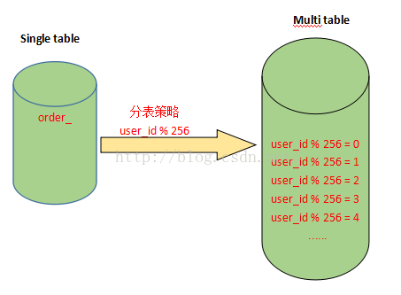
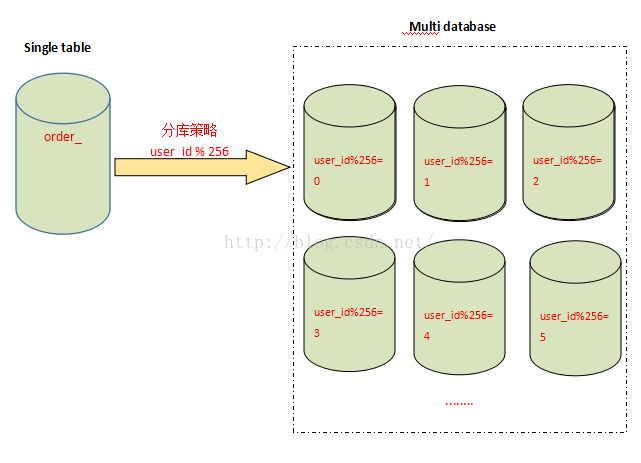

[TOC]


# 分表与分库使用场景以及设计方式

## **一. 分表**

​      场景：对于大型的互联网应用来说，数据库单表的记录行数可能达到千万级甚至是亿级，并且数据库面临着极高的并发访问。采用Master-Slave复制模式的MySQL架构，

只能够对数据库的读进行扩展，而对数据库的写入操作还是集中在Master上，并且单个Master挂载的Slave也不可能无限制多，Slave的数量受到Master能力和负载的限制。

因此，需要对数据库的吞吐能力进行进一步的扩展，以满足高并发访问与海量数据存储的需要！


​      **对于访问极为频繁且数据量巨大的单表来说，我们首先要做的就是减少单表的记录条数，以便减少数据查询所需要的时间，提高数据库的吞吐，这就是所谓的分表！**


​      在分表之前，首先需要选择适当的分表策略，使得数据能够较为均衡地分不到多张表中，并且不影响正常的查询！


​      对于互联网企业来说，大部分数据都是与用户关联的，因此，用户id是最常用的分表字段。因为大部分查询都需要带上用户id，这样既不影响查询，又能够使数据较为均衡地

分布到各个表中(当然，有的场景也可能会出现冷热数据分布不均衡的情况)，如下图：





假设有一张表记录用户购买信息的订单表order，由于order表记录条数太多，将被拆分成256张表。

拆分的记录根据user_id%256取得对应的表进行存储，前台应用则根据对应的user_id%256，找到对应订单存储的表进行访问。

这样一来，user_id便成为一个必需的查询条件，否则将会由于无法定位数据存储的表而无法对数据进行访问。


**注：拆分后表的数量一般为2的n次方，就是上面拆分成256张表的由来！**


假设order表结构如下：


```sql
create table order_(
 order_id bigint(20) primary key auto_increment,
 user_id bigint(20),
 user_nick varchar(50),
 auction_id bigint(20),
 auction_title bigint(20),
 price bigint(20),
 auction_cat varchar(200),
 seller_id bigint(20),
 seller_nick varchar(50)
) 
```

那么分表以后，假设user_id = 257,并且auction_id = 100,需要根据auction_id来查询对应的订单信息，则对应的SQL语句如下：

```sql
select * from order_1 where user_id=257 and auction_id = 100;
```

其中，order_1是根据257%256计算得出，表示分表之后的第一张order表。

 

## **二. 分库**

   场景：分表能够解决单表数据量过大带来的查询效率下降的问题，但是，却无法给数据库的并发处理能力带来质的提升。面对高并发的读写访问，当数据库master

服务器无法承载写操作压力时，不管如何扩展slave服务器，此时都没有意义了。

因此，我们必须换一种思路，对数据库进行拆分，从而提高数据库写入能力，这就是所谓的分库!


​    与分表策略相似，分库可以采用通过一个关键字取模的方式，来对数据访问进行路由，如下图所示：




​    还是之前的订单表，假设user_id 字段的值为258，将原有的单库分为256个库，那么应用程序对数据库的访问请求将被路由到第二个库(258%256 = 2)。


## **三. 分库分表**

​    场景：有时数据库可能既面临着高并发访问的压力，又需要面对海量数据的存储问题，这时需要对数据库既采用分表策略，又采用分库策略，以便同时扩展系统的

并发处理能力，以及提升单表的查询性能，这就是所谓的分库分表。


​    分库分表的策略比前面的仅分库或者仅分表的策略要更为复杂，一种分库分表的路由策略如下：

​    \1. 中间变量 = user_id % (分库数量 * 每个库的表数量)

​    \2. 库 = 取整数 (中间变量 / 每个库的表数量)

​    \3. 表 = 中间变量 % 每个库的表数量


同样采用user_id作为路由字段，首先使用user_id 对库数量*每个库表的数量取模，得到一个中间变量；然后使用中间变量除以每个库表的数量，取整，便得到

对应的库；而中间变量对每个库表的数量取模，即得到对应的表。


分库分表策略详细过程如下：


假设将原来的单库单表order拆分成256个库，每个库包含1024个表，那么按照前面所提到的路由策略，对于user_id=262145 的访问，路由的计算过程如下：

\1.  中间变量 = 262145 % (256 * 1024) = 1

\2.  库 = 取整 (1/1024) = 0

\3.  表 = 1 % 1024 = 1


这就意味着，对于user_id=262145 的订单记录的查询和修改，将被路由到第0个库的第1个order_1表中执行！！！


https://blog.csdn.net/winy_lm/article/details/50708493