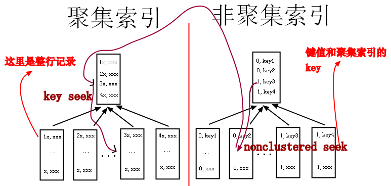

# 为什么重复值高的字段不能建索引（比如性别字段等)

转载[chang_ge](https://me.csdn.net/chang_ge) 发布于2019-04-19 07:35:51 阅读数 308  收藏

 **结论（以innodb为例）**

a、非聚簇索引存储了对主键的引用，如果select字段不在非聚簇索引内，就需要跳到主键索引（上图中从右边的索引树跳到左边的索引树），再获取select字段值

b、如果非聚簇索引值重复率高，那么查询时就会大量出现上图中从右边跳到左边的情况，导致整个流程很慢

c、如果where值重复率高的字段，select用了limit，只查较少数据，也就是跳的次数很少的情况下，还是可以建索引的（后来想想也没必要，limit限制了数量，全表扫描也很快，除非字段值是排序的，必须扫描完前面的所有值）

d、如果没有3这个前提，则不建议在值重复率高的字段上建索引，因为查询效率低，还需要维护索引

<https://blog.csdn.net/chang_ge/article/details/89392359>