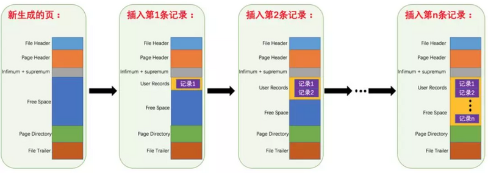
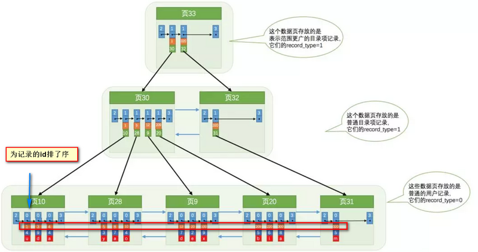
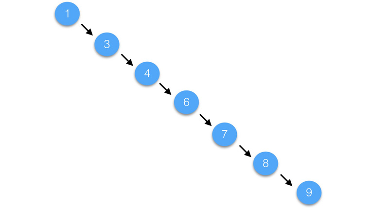
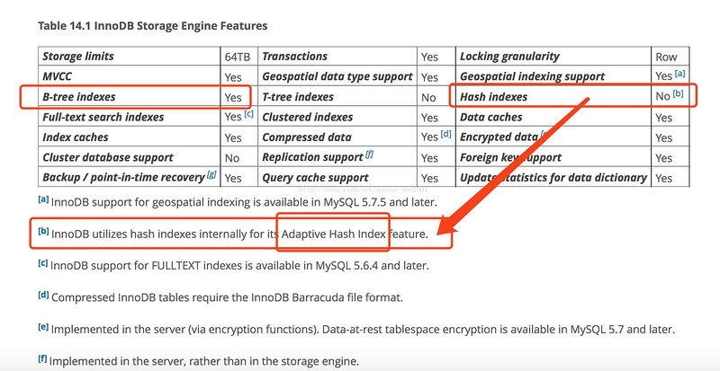
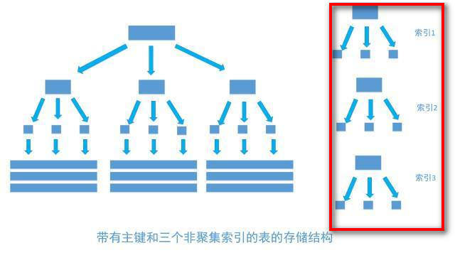
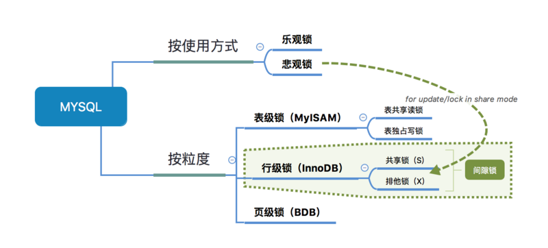
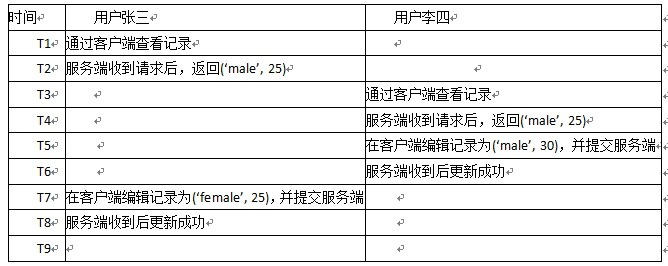
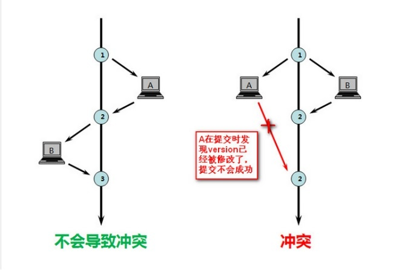

[TOC]


# 数据库两个神器【索引和锁】

8.6k 次阅读  ·  读完需要 54 分钟

# 前言

> 只有光头才能变强

**索引和锁**在数据库中可以说是非常重要的知识点了，在面试中也会经常会被问到的。

本文**力求简单讲清每个知识点**，希望大家看完能有所收获

> 声明：如果没有说明具体的数据库和存储引擎，**默认指的是MySQL中的InnoDB存储引擎**

# 一、索引

在之前，我对索引有以下的认知：

- **索引可以加快数据库的检索速度**
- 表**经常**进行`INSERT/UPDATE/DELETE`操作就不要建立索引了，换言之：**索引会降低**插入、删除、修改等维护任务的速度。
- 索引需要**占物理和数据空间**。
- 了解过索引的最左匹配原则
- 知道索引的分类：聚集索引和非聚集索引
- Mysql支持Hash索引和B+树索引两种

看起来好像啥都知道，但面试让你说的时候可能就GG了：

- 使用索引为什么可以加快数据库的检索速度啊？
- 为什么说索引会降低插入、删除、修改等维护任务的速度。
- 索引的最左匹配原则指的是什么？
- Hash索引和B+树索引有什么区别？主流的使用哪一个比较多？InnoDB存储都支持吗？
- 聚集索引和非聚集索引有什么区别？
- ........

## 1.1聊聊索引的基础知识

首先Mysql的基本存储结构是**页**(记录都存在页里边)：




- **各个数据页**可以组成一个**双向链表**
- 而**每个数据页中的记录**又可以组成一个**单向**链表
  - 每个数据页都会为存储在它里边儿的记录生成一个**页目录**，在通过**主键**查找某条记录的时候可以在页目录中使用**二分法快速定位**到对应的槽，然后再遍历该槽对应分组中的记录即可快速找到指定的记录
  - 以**其他列**(非主键)作为搜索条件：只能从最小记录开始**依次遍历单链表中的每条记录**。

所以说，如果我们写`select * from user where username = 'Java3y'`这样没有进行任何优化的sql语句，默认会这样做：

- 定位到记录所在的页
  - 需要遍历双向链表，找到所在的页
- 从所在的页内中查找相应的记录
  - 由于不是根据主键查询，只能遍历所在页的单链表了

很明显，在数据量很大的情况下这样查找会**很慢**！

## 1.2索引提高检索速度

索引做了些什么可以让我们查询加快速度呢？

其实就是**将无序的数据变成有序(相对)**：



要找到id为8的记录简要步骤：


很明显的是：**没有用索引**我们是需要**遍历双向链表**来定位对应的页，现在通过**“目录”**就可以很快地定位到对应的页上了！

其实底层结构就是**B+树**，B+树作为树的一种实现，能够让我们**很快地**查找出对应的记录。

参考资料：

- [Mysql索引](https://mp.weixin.qq.com/s?__biz=MzIxNTQ3NDMzMw==&mid=2247483701&idx=1&sn=bd229dd584f51ef4fe545d44ad8cdbf9&chksm=979688c7a0e101d1b5c752094013b78f5bd50ab905257ba82149d85d35ea07aba1a15b0e52b4&mpshare=1&scene=1&srcid=0409Tn66UYWSWvqEVlOpwGtR&key=6cd553e86912686a47d76f2d900b1b5b388c90b29708f016db3a6e1bcebe032220ba63626095c4298f32cda7d0d7bd11bded2365f05c32e522584dd149b98db0bb8549ef144cdca694665d31d35cfeef&ascene=0&uin=MzAzMjU4NDM3Nw%3D%3D&devicetype=iMac+MacBookPro12%2C1+OSX+OSX+10.12.4+build(16E195)&version=12020810&nettype=WIFI&lang=zh_CN&fontScale=100&pass_ticket=YHEmqDDX8hHkj5FiSVpQvjYqIMBDHHDS2po4mfJe%2BqIXlqwJI%2Bg7aJUZq0%2BDwGJ0)

## 1.3索引降低增删改的速度

B+树是**平衡树**的一种。

> 平衡树：它是一棵空树或它的左右两个子树的高度差的绝对值不超过1，并且左右两个子树都是一棵平衡二叉树。

如果一棵普通的树在**极端**的情况下，是能**退化成链表**的(树的优点就不复存在了)



B+树是平衡树的一种，是不会退化成链表的，树的高度都是相对比较低的(基本符合**矮矮胖胖(均衡)的结构**)【这样一来我们检索的时间复杂度就是O(logn)】！从上一节的图我们也可以看见，建立索引实际上就是建立一颗B+树。

- B+树是一颗平衡树，如果我们对这颗树增删改的话，那肯定会**破坏它的原有结构**。
- **要维持平衡树，就必须做额外的工作**。正因为这些额外的工作**开销**，导致索引会降低增删改的速度

B+树删除和修改具体可参考：

- <https://www.cnblogs.com/wade-luffy/p/6292784.html>

## 1.4哈希索引

除了B+树之外，还有一种常见的是哈希索引。

哈希索引就是采用一定的**哈希算法**，把键值换算成新的哈希值，检索时不需要类似B+树那样从根节点到叶子节点逐级查找，只需一次哈希算法即可**立刻定位到相应的位置，速度非常快**。

- 本质上就是**把键值换算成新的哈希值**，根据这个**哈希值来定位**。


看起来哈希索引很牛逼啊，但其实哈希索引有好几个局限(根据他本质的原理可得)：

- 哈希索引也没办法利用索引完成**排序**
- 不支持**最左匹配原则**
- 在有大量重复键值情况下，哈希索引的效率也是极低的---->**哈希碰撞**问题。
- **不支持范围查询**

参考资料：

- <http://www.cnblogs.com/zengkefu/p/5647279.html>---hash索引和b+tree索引

## 1.5InnoDB支持哈希索引吗？

主流的还是使用**B+树索引比较多**，对于哈希索引，**InnoDB是自适应哈希索引**的（hash索引的创建由InnoDB存储引擎引擎自动优化创建，我们干预不了）！



参考资料：

- <https://blog.csdn.net/doctor_who2004/article/details/77414742>

## 1.6聚集和非聚集索引

简单概括：

- 聚集索引就是以**主键**创建的索引
- 非聚集索引就是以**非主键**创建的索引

区别：

- 聚集索引在叶子节点存储的是**表中的数据**
- 非聚集索引在叶子节点存储的是**主键和索引列**
- 使用非聚集索引查询出数据时，**拿到叶子上的主键再去查到想要查找的数据**。(拿到主键再查找这个过程叫做**回表**)

**非聚集索引也叫做二级索引**，不用纠结那么多名词，将其等价就行了~

非聚集索引在建立的时候也**未必是单列**的，可以多个列来创建索引。

- 此时就涉及到了哪个列会走索引，哪个列不走索引的问题了(最左匹配原则-->后面有说)
- **创建多个单列(非聚集)索引的时候，会生成多个索引树**(所以过多创建索引会占用磁盘空间)



在创建多列索引中也涉及到了一种特殊的索引-->**覆盖索引**

- 我们前面知道了，如果不是聚集索引，叶子节点存储的是主键+列值
- 最终还是要“回表”，也就是要通过主键**再**查找一次。这样就会比较慢
- 覆盖索引就是把要**查询出的列和索引是对应的**，不做回表操作！

比如说：

- 现在我创建了索引`(username,age)`，在查询数据的时候：`select username , age from user where username = 'Java3y' and age = 20`。
- 很明显地知道，我们上边的查询是走索引的，并且，**要查询出的列在叶子节点都存在**！所以，就不用回表了~
- 所以，能使用覆盖索引就尽量使用吧~

## 1.7索引最左匹配原则

**最左匹配原则**：

- 索引可以简单如一个列`(a)`，也可以复杂如多个列`(a, b, c, d)`，即**联合索引**。
- 如果是联合索引，那么key也由多个列组成，同时，索引只能用于查找key是否**存在（相等）**，遇到范围查询`(>、<、between、like`左匹配)等就**不能进一步匹配**了，后续退化为线性查找。
- 因此，**列的排列顺序决定了可命中索引的列数**。

例子：

- 如有索引`(a, b, c, d)`，查询条件`a = 1 and b = 2 and c > 3 and d = 4`，则会在每个节点依次命中a、b、c，无法命中d。(c已经是范围查询了，d肯定是排不了序了)

为什么能命中c？

举个简单例子：`select * from user where age >30;` 如果在age列创建索引，那你说会走索引吗？

## 1.8=、in自动优化顺序

**不需要考虑=、in等的顺序**，mysql会自动优化这些条件的顺序，以匹配尽可能多的索引列。

例子：

- 如有索引`(a, b, c, d)`，查询条件`c > 3 and b = 2 and a = 1 and d < 4`与`a = 1 and c > 3 and b = 2 and d < 4`等顺序都是可以的，MySQL会自动优化为`a = 1 and b = 2 and c > 3 and d < 4`，依次命中a、b、c。

## 1.9索引总结

索引在数据库中是一个**非常**重要的知识点！上面谈的其实就是索引**最基本**的东西，要创建出好的索引要顾及到很多的方面：

- 1，**最左前缀匹配原则**。这是非常重要、非常重要、非常重要（重要的事情说三遍）的原则，MySQL会一直向右匹配直到遇到范围查询`（>,<,BETWEEN,LIKE）`就停止匹配。
- 3，尽量选择**区分度高的列作为索引**，区分度的公式是 `COUNT(DISTINCT col) / COUNT(*)`。表示字段不重复的比率，比率越大我们扫描的记录数就越少。
- 4，**索引列不能参与计算，尽量保持列“干净”**。比如，`FROM_UNIXTIME(create_time) = '2016-06-06'` 就不能使用索引，原因很简单，**B+树中存储的都是数据表中的字段值**，但是进行检索时，需要把所有元素都应用函数才能比较，显然这样的代价太大。所以语句要写成 ： `create_time = UNIX_TIMESTAMP('2016-06-06')`。
- 5，尽可能的**扩展索引**，不要新建立索引。比如表中已经有了a的索引，现在要加（a,b）的索引，那么只需要修改原来的索引即可。
- 6，单个多列组合索引和多个单列索引的检索查询效果不同，因为在执行SQL时，~~**MySQL只能使用一个索引**，会从多个单列索引中选择一个限制最为严格的索引~~(经指正，在MySQL5.0以后的版本中，有“合并索引”的策略，翻看了《高性能MySQL 第三版》，书作者认为：**还是应该建立起比较好的索引，而不应该依赖于“合并索引”这么一个策略**)。
  - “合并索引”策略简单来讲，就是使用多个单列索引，然后将这些结果用“union或者and”来合并起来

参考资料：

- <https://zhuanlan.zhihu.com/p/23624390>--简单理解索引
- <https://blog.csdn.net/mysteryhaohao/article/details/51719871>--

MySQL学习之——索引(普通索引、唯一索引、全文索引、索引匹配原则、索引命中等)

- <https://monkeysayhi.github.io/2018/03/06/%E6%B5%85%E8%B0%88MySQL%E7%9A%84B%E6%A0%91%E7%B4%A2%E5%BC%95%E4%B8%8E%E7%B4%A2%E5%BC%95%E4%BC%98%E5%8C%96/>---浅谈MySQL的B树索引与索引优化

# 二、锁



在mysql中的锁**看起来**是很复杂的，因为有**一大堆的东西和名词**：排它锁，共享锁，表锁，页锁，间隙锁，意向排它锁，意向共享锁，行锁，读锁，写锁，乐观锁，悲观锁，死锁。这些名词有的博客又直接写锁的英文的简写--->X锁，S锁，IS锁，IX锁，MMVC...

锁的相关知识又跟存储引擎，索引，事务的隔离级别都是关联的....

这就给初学数据库锁的人带来不少的麻烦~~~于是我下面就简单整理一下数据库锁的知识点，希望大家看完会有所帮助。

## 2.1为什么需要学习数据库锁知识

不少人在开发的时候，应该**很少会注意到**这些锁的问题，也很少会给程序加锁(除了**库存**这些对数量准确性要求极高的情况下)

一般也就听过常说的乐观锁和悲观锁，了解过基本的含义之后就没了~~~

**定心丸**：即使我们不会这些锁知识，我们的程序在**一般情况下**还是可以跑得好好的。因为这些锁数据库**隐式**帮我们加了

- 对于`UPDATE、DELETE、INSERT`语句，**InnoDB**会**自动**给涉及数据集加排他锁（X)
- **MyISAM**在执行查询语句`SELECT`前，会**自动**给涉及的所有表加**读锁**，在执行更新操作（`UPDATE、DELETE、INSERT`等）前，会**自动**给涉及的表加**写锁**，这个过程并**不需要用户干预**

只会在某些特定的场景下才需要**手动**加锁，学习数据库锁知识就是为了:

- 能让我们在特定的场景下派得上用场
- 更好**把控自己写的程序**
- 在跟别人聊数据库技术的时候可以搭上几句话
- **构建自己的知识库体系**！在面试的时候不虚

## 2.2表锁简单介绍

首先，从锁的粒度，我们可以分成两大类：

- **表锁**
  - 开销小，加锁快；不会出现死锁；锁定力度大，发生锁冲突概率高，并发度最低
- **行锁**
  - 开销大，加锁慢；会出现死锁；锁定粒度小，发生锁冲突的概率低，并发度高

不同的存储引擎支持的锁粒度是不一样的：

- **InnoDB行锁和表锁都支持**！
- **MyISAM只支持表锁**！

InnoDB只有通过**索引条件**检索数据**才使用行级锁**，否则，InnoDB将使用**表锁**

- 也就是说，**InnoDB的行锁是基于索引的**！

**表锁下又分为两种模式**：

- 表读锁（Table Read Lock）
- 表写锁（Table Write Lock）
- 从下图可以清晰看到，在表读锁和表写锁的环境下：**读读不阻塞，读写阻塞，写写阻塞**！
  - 读读不阻塞：当前用户在读数据，其他的用户也在读数据，不会加锁
  - 读写阻塞：当前用户在读数据，其他的用户**不能修改当前用户读的数据**，会加锁！
  - 写写阻塞：当前用户在修改数据，其他的用户**不能修改当前用户正在修改的数据**，会加锁！


从上面已经看到了：**读锁和写锁是互斥的，读写操作是串行**。

- 如果某个进程想要获取读锁，**同时**另外一个进程想要获取写锁。在mysql里边，**写锁是优先于读锁的**！
- 写锁和读锁优先级的问题是可以通过参数调节的：`max_write_lock_count`和`low-priority-updates`

值得注意的是：

> The LOCAL modifier enables nonconflicting INSERT statements (concurrent inserts) by other sessions to execute while the lock is held. (See Section 8.11.3, “Concurrent Inserts”.) However, READ LOCAL cannot be used if you are going to manipulate the database using processes external to the server while you hold the lock. **For InnoDB tables, READ LOCAL is the same as READ**

- **MyISAM可以**支持查询和插入操作的**并发**进行。可以通过系统变量`concurrent_insert`来指定哪种模式，在**MyISAM**中它默认是：如果MyISAM表中没有空洞（即表的中间没有被删除的行），MyISAM允许在一个进程读表的同时，另一个进程从**表尾**插入记录。
- 但是**InnoDB存储引擎是不支持的**！

参考资料：

- <https://dev.mysql.com/doc/refman/8.0/en/lock-tables.html>--官方手册
- <http://ourmysql.com/archives/564>---几个参数说明

## 2.2行锁细讲

上边简单讲解了表锁的相关知识，我们使用Mysql一般是使用InnoDB存储引擎的。InnoDB和MyISAM有两个本质的区别：

- InnoDB支持行锁
- InnoDB支持事务

从上面也说了：我们是**很少手动加表锁**的。表锁对我们程序员来说几乎是透明的，即使InnoDB不走索引，加的表锁也是自动的！

我们应该**更加关注行锁的内容**，因为InnoDB一大特性就是支持行锁！

InnoDB实现了以下**两种**类型的行锁。

- 共享锁（S锁）：允许一个事务去读一行，阻止其他事务获得相同数据集的排他锁。
  - 也叫做**读锁**：读锁是**共享**的，多个客户可以**同时读取同一个**资源，但**不允许其他客户修改**。
- 排他锁（X锁)：允许获得排他锁的事务更新数据，阻止其他事务取得相同数据集的共享读锁和排他写锁。
  - 也叫做**写锁**：写锁是排他的，**写锁会阻塞其他的写锁和读锁**。

看完上面的有没有发现，在一开始所说的：X锁，S锁，读锁，写锁，共享锁，排它锁其实**总共就两个锁**，只不过它们**有多个名字罢了**~~~

> Intention locks do not block anything except full table requests (for example, LOCK TABLES ... WRITE). The main purpose of intention locks **is to show that someone is locking a row, or going to lock a row in the table**.

另外，**为了允许行锁和表锁共存，实现多粒度锁机制**，InnoDB还有两种内部使用的意向锁（Intention Locks），这两种意向锁都是**表锁**：

- 意向共享锁（IS）：事务打算给数据行加行共享锁，事务在给一个数据行加共享锁前必须先取得该表的IS锁。
- 意向排他锁（IX）：事务打算给数据行加行排他锁，事务在给一个数据行加排他锁前必须先取得该表的IX锁。
- 意向锁也是数据库隐式帮我们做了，**不需要程序员操心**！

参考资料：

- <https://www.zhihu.com/question/51513268>
- <https://dev.mysql.com/doc/refman/8.0/en/innodb-locking.html>

### 2.2.1MVCC和事务的隔离级别

数据库事务有不同的隔离级别，不同的隔离级别对锁的使用是不同的，**锁的应用最终导致不同事务的隔离级别**

MVCC(Multi-Version Concurrency Control)多版本并发控制，可以简单地认为：**MVCC就是行级锁的一个变种(升级版)**。

- 事务的隔离级别就是**通过锁的机制来实现**，只不过**隐藏了加锁细节**

在**表锁中我们读写是阻塞**的，基于提升并发性能的考虑，**MVCC一般读写是不阻塞的**(所以说MVCC很多情况下避免了加锁的操作)

- MVCC实现的**读写不阻塞**正如其名：**多版本**并发控制--->通过一定机制生成一个数据请求**时间点的一致性数据快照（Snapshot)**，并用这个快照来提供一定级别（**语句级或事务级**）的**一致性读取**。从用户的角度来看，好像是**数据库可以提供同一数据的多个版本**。

快照有**两个级别**：

- 语句级
  - 针对于`Read committed`隔离级别
- 事务级别
  - 针对于`Repeatable read`隔离级别

我们在初学的时候已经知道，事务的隔离级别有**4种**：

- Read uncommitted
  - 会出现脏读，不可重复读，幻读
- Read committed
  - 会出现不可重复读，幻读
- Repeatable read
  - 会出现幻读(但在Mysql实现的Repeatable read配合gap锁不会出现幻读！)
- Serializable
  - 串行，避免以上的情况！

------

`Read uncommitted`会出现的现象--->脏读：**一个事务读取到另外一个事务未提交的数据**

- 例子：A向B转账，**A执行了转账语句，但A还没有提交事务，B读取数据，发现自己账户钱变多了**！B跟A说，我已经收到钱了。A回滚事务【rollback】，等B再查看账户的钱时，发现钱并没有多。
- 出现脏读的原因是因为在读的时候**没有加读锁**，导致可以**读取出还没释放锁的记录**。

`Read uncommitted`过程：

- 事务A读取记录(没有加任何的锁)
- 事务B修改记录(此时加了写锁，并且还没有commit-->也就没有释放掉写锁)
- 事务A再次读取记录(此时因为事务A在读取时没有加任何锁，所以可以读取到事务B还没提交的(没释放掉写锁)的记录

------

`Read committed`**避免脏读**的做法其实很简单：

- **在读取的时候生成一个版本号，直到事务其他commit被修改了之后，才会有新的版本号**

`Read committed`过程：

- 事务A读取了记录(生成版本号)
- 事务B修改了记录(此时加了写锁)
- 事务A再读取的时候，**是依据最新的版本号来读取的**(当事务B执行commit了之后，会生成一个新的版本号)，如果事务B还没有commit，那事务A读取的还是之前版本号的数据。

但`Read committed`出现的现象--->不可重复读：**一个事务读取到另外一个事务已经提交的数据，也就是说一个事务可以看到其他事务所做的修改**

- 注：**A查询数据库得到数据，B去修改数据库的数据，导致A多次查询数据库的结果都不一样【危害：A每次查询的结果都是受B的影响的，那么A查询出来的信息就没有意思了】**

------

上面也说了，`Read committed`是**语句级别**的快照！**每次读取的都是当前最新的版本**！

`Repeatable read`避免不可重复读是**事务级别**的快照！每次读取的都是当前事务的版本，即使被修改了，也只会读取当前事务版本的数据。

呃...如果还是不太清楚，我们来看看InnoDB的MVCC是怎么样的吧(摘抄《高性能MySQL》)


至于虚读(幻读)：**是指在一个事务内读取到了别的事务插入的数据，导致前后读取不一致。**

- 注：**和不可重复读类似，但虚读(幻读)会读到其他事务的插入的数据，导致前后读取不一致**
- MySQL的`Repeatable read`隔离级别加上GAP间隙锁**已经处理了幻读了**。

参考资料：

- <https://www.jianshu.com/p/cb97f76a92fd>
- <https://www.zhihu.com/question/263820564>

扩展阅读：

- <https://www.zhihu.com/question/67739617>

## 2.3乐观锁和悲观锁

无论是`Read committed`还是`Repeatable read`隔离级别，都是为了解决**读写冲突**的问题。

单纯在`Repeatable read`隔离级别下我们来考虑一个问题：



此时，用户李四的操作就丢失掉了：

- **丢失更新**：一个事务的更新**覆盖了其它事务的更新结果**。

(ps:暂时没有想到比较好的例子来说明更新丢失的问题，虽然上面的例子也是更新丢失，但**一定程度上是可接受的**..不知道有没有人能想到不可接受的更新丢失例子呢...)

解决的方法：

- 使用Serializable隔离级别，事务是串行执行的！
- 乐观锁
- 悲观锁

> 1. 乐观锁是一种思想，具体实现是，表中有一个版本字段，第一次读的时候，获取到这个字段。处理完业务逻辑开始更新的时候，需要再次查看该字段的值是否和第一次的一样。如果一样更新，反之拒绝。之所以叫乐观，因为这个模式没有从数据库加锁，等到更新的时候再判断是否可以更新。
> 2. 悲观锁是数据库层面加锁，都会阻塞去等待锁。

### 2.3.1悲观锁

所以，按照上面的例子。我们使用悲观锁的话其实很简单(手动加行锁就行了)：

- `select * from xxxx for update`

在select 语句后边加了 `for update`相当于加了排它锁(写锁)，加了写锁以后，其他的事务就不能对它修改了！需要等待当前事务修改完之后才可以修改.

- 也就是说，如果张三使用`select ... for update`，李四就无法对该条记录修改了~

### 2.3.2乐观锁

乐观锁不是数据库层面上的锁，是需要自己手动去加的锁。一般我们添加一个版本字段来实现：

具体过程是这样的：

张三`select * from table `--->会查询出记录出来，同时会有一个version字段


李四`select * from table `--->会查询出记录出来，同时会有一个version字段


李四对这条记录做修改：` update A set Name=lisi,version=version+1 where ID=#{id} and version=#{version}`，判断之前查询到的version与现在的数据的version进行比较，**同时会更新version字段**

此时数据库记录如下：


张三也对这条记录修改：` update A set Name=lisi,version=version+1 where ID=#{id} and version=#{version}`，但失败了！因为**当前数据库中的版本跟查询出来的版本不一致**！



参考资料：

- <https://zhuanlan.zhihu.com/p/31537871>---什么是悲观锁和乐观锁
- <https://www.zhihu.com/question/27876575>---乐观锁和 MVCC 的区别？

## 2.4间隙锁GAP

当我们**用范围条件检索数据**而不是相等条件检索数据，并请求共享或排他锁时，InnoDB会给**符合范围条件的已有数据记录的索引项加锁**；对于键值在条件范围内但并不存在的记录，叫做“间隙（GAP)”。InnoDB也会对这个“间隙”加锁，这种锁机制就是所谓的间隙锁。

值得注意的是：间隙锁只会在`Repeatable read`隔离级别下使用~

例子：假如emp表中只有101条记录，其empid的值分别是1,2,...,100,101

```
Select * from  emp where empid > 100 for update;
```

上面是一个范围查询，InnoDB**不仅**会对符合条件的empid值为101的记录加锁，也会对**empid大于101（这些记录并不存在）的“间隙”加锁**。

InnoDB使用间隙锁的目的有两个：

- **为了防止幻读**(上面也说了，`Repeatable read`隔离级别下再通过GAP锁即可避免了幻读)
- **满足恢复和复制的需要**
  - MySQL的恢复机制要求：**在一个事务未提交前，其他并发事务不能插入满足其锁定条件的任何记录，也就是不允许出现幻读**

## 2.5死锁

并发的问题就少不了死锁，在MySQL中同样会存在死锁的问题。

但一般来说MySQL通过回滚帮我们解决了不少死锁的问题了，但死锁是无法完全避免的，可以通过以下的经验参考，来尽可能少遇到死锁：

- 1）以**固定的顺序**访问表和行。比如对两个job批量更新的情形，简单方法是对id列表先排序，后执行，这样就避免了交叉等待锁的情形；将两个事务的sql顺序调整为一致，也能避免死锁。
- 2）**大事务拆小**。大事务更倾向于死锁，如果业务允许，将大事务拆小。
- 3）在同一个事务中，尽可能做到**一次锁定**所需要的所有资源，减少死锁概率。
- 4）**降低隔离级别**。如果业务允许，将隔离级别调低也是较好的选择，比如将隔离级别从RR调整为RC，可以避免掉很多因为gap锁造成的死锁。
- 5）**为表添加合理的索引**。可以看到如果不走索引将会为表的每一行记录添加上锁，死锁的概率大大增大。

参考资料：

- <http://hedengcheng.com/?p=771#_Toc374698322>
- <https://www.cnblogs.com/LBSer/p/5183300.html>

## 2.6锁总结

上面说了一大堆关于MySQL数据库锁的东西，现在来简单总结一下。

表锁其实我们程序员是很少关心它的：

- 在MyISAM存储引擎中，当执行SQL语句的时候是自动加的。
- 在InnoDB存储引擎中，如果没有使用索引，表锁也是自动加的。

现在我们大多数使用MySQL都是使用InnoDB，InnoDB支持行锁：

- 共享锁--读锁--S锁
- 排它锁--写锁--X锁

在默认的情况下，`select`是不加任何行锁的~事务可以通过以下语句显示给记录集加共享锁或排他锁。

- 共享锁（S）：`SELECT * FROM table_name WHERE ... LOCK IN SHARE MODE`。
- 排他锁（X)：`SELECT * FROM table_name WHERE ... FOR UPDATE`。

InnoDB**基于行锁**还实现了MVCC多版本并发控制，MVCC在隔离级别下的`Read committed`和`Repeatable read`下工作。MVCC能够实现**读写不阻塞**！

InnoDB实现的`Repeatable read`隔离级别配合GAP间隙锁已经避免了幻读！

- 乐观锁其实是一种思想，正如其名：认为不会锁定的情况下去更新数据，如果发现不对劲，才不更新(回滚)。在数据库中往往添加一个version字段来实现。
- 悲观锁用的就是数据库的行锁，认为数据库会发生并发冲突，直接上来就把数据锁住，其他事务不能修改，直至提交了当前事务

参考资料：

- <https://zhuanlan.zhihu.com/p/29150809>--Mysql锁总结
- <https://blog.csdn.net/mysteryhaohao/article/details/51669741>--MySQL学习之——锁(行锁、表锁、页锁、乐观锁、悲观锁等)
- <https://segmentfault.com/a/1190000015596126>--MySQL InnoDB引擎锁的总结

# 三、总结

本文主要介绍了数据库中的两个比较重要的知识点：索引和锁。他俩可以说息息相关的，锁会涉及到很多关于索引的知识~

我个人比较重视对整体知识点的把控，一些细节的地方可能就没有去编写了。在每一个知识点下都会有很多的内容，有兴趣的同学可以在我给出的链接中继续阅读学习。当然了，如果有比较好的文章和资料也不妨在评论区分享一下哈~

我只是在学习的过程中，把自己遇到的问题写出来，整理出来，希望可以对大家有帮助。如果文章有错的地方，希望大家可以在评论区指正，一起学习交流~

参考资料：

- 《高性能MySQL 第三版》

> 如果文章有错的地方欢迎指正，大家互相交流。习惯在微信看技术文章，想要获取更多的Java资源的同学，可以**关注微信公众号:Java3y**。为了大家方便，刚新建了一下**qq群：742919422**，大家也可以去交流交流。谢谢支持了！希望能多介绍给其他有需要的朋友

**文章的目录导航**：

- <https://zhongfucheng.bitcron.com/post/shou-ji/wen-zhang-dao-hang>


<https://segmentfault.com/a/1190000015738121#articleHeader21>